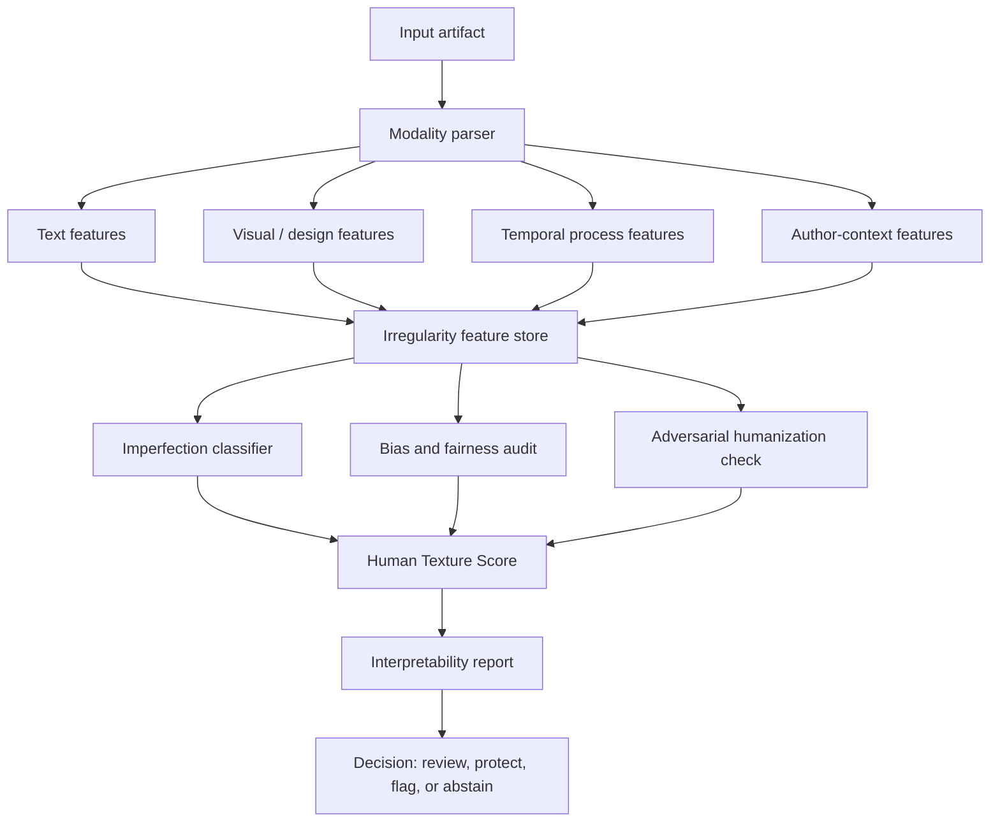
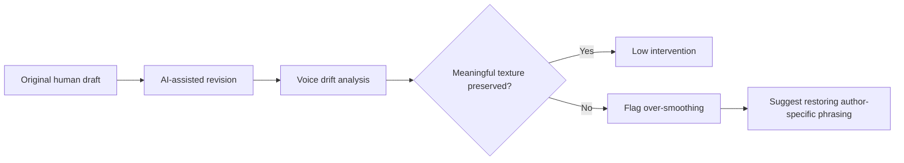

## The idea I kept coming back to

The first version of this idea was not really about AI detection.

It was about **humanity showing up through error**.

As AI systems get better at pattern recognition, style transfer, summarization, imitation, and optimization, a strange thing happens: the work becomes more polished, but not always more alive. Large language models are extremely good at rebuilding the expected pattern. They can produce the professional paragraph, the safe essay, the frictionless brand voice, the well-structured answer, the acceptable slide deck.

But a lot of what humans actually value is not located inside the cleanest version of the pattern.

It sits in the break.

The odd phrase. The over-specific metaphor. The sentence that bends because the writer is bilingual. The hand-painted line that is not perfectly symmetrical. The hesitation before a claim. The joke that only works inside a local social context. The mistake that survives because removing it would remove the person.

That was the original provocation behind this project:

> If AI is trained to recognize and rebuild patterns, can we design a system that recognizes the pattern-breakers?

Not a detector that simply says, “this was AI-generated.” That category is already too brittle.

A better project is an **imperfection-aware authenticity system**: a system that studies when irregularity is meaningful, when it is random noise, when it is cultural residue, and when it has been artificially injected to mimic humanness.

## Why “AI detection” is the wrong center

Most AI detectors are built around a narrow question:

> Was this made by AI?

That is useful in some settings, but it is not enough.

The question assumes authorship is the main issue. In practice, the real issue is **trust, context, and expressive integrity**. A human can write generic filler. An AI system can generate something weird. A non-native English speaker can be misclassified because their writing follows different statistical patterns. A student can use AI for grammar correction without outsourcing the underlying thought. A company can use AI to generate content that is technically disclosed but strategically manipulative.

The binary label collapses too much.

A stronger system would ask several questions at once:

1. Does the work contain stylistic irregularity?
2. Are those irregularities meaningful or random?
3. Do the irregularities match the author’s historical voice or community context?
4. Is the work over-smoothed in ways typical of optimization systems?
5. Has artificial imperfection been added as camouflage?
6. Would a detector disproportionately penalize dialect, multilingual cadence, disability-related writing patterns, or non-standard grammar?

That last point is not theoretical. Stanford HAI summarized a 2023 study finding that several GPT detectors were unreliable and could falsely flag non-native English writing as AI-generated. That makes blunt AI detection dangerous in education, hiring, publishing, immigration, and workplace review contexts. A system meant to protect human work can end up punishing the very forms of human variation it should protect.

## The cultural intuition: imperfection as humility, not failure

The personal spark for this idea came from a broader aesthetic intuition: in many traditional South Asian craft contexts, mistakes and asymmetries are not always treated as defects. They can be part of the object’s moral and human texture.

The exact explanation varies by tradition, region, material, and maker. This should not be flattened into a fake universal claim. But the pattern exists across many handmade cultures: perfect reproducibility is not the same as beauty.

You see related ideas in:

- South Asian textiles, folk painting, handwork, and devotional craft;
- Japanese wabi-sabi aesthetics;
- visible mending;
- hand-thrown pottery;
- analog film grain;
- live music timing drift;
- handwritten marginalia;
- traditional architecture where small asymmetries make the structure feel inhabited.

The point is not that mistakes are automatically beautiful.

That is lazy romanticism.

The point is sharper:

> Some imperfections are evidence of human process.

A system that treats every deviation from smoothness as a flaw will gradually erase forms of expression that are locally meaningful, culturally specific, or creatively important.

That is the risk this project studies.

## The project concept

The project can be framed as a research prototype called:

> **The Human Imperfection Signal Lab**

Its goal is not to create another plagiarism detector. Its goal is to create a measurement framework for **expressive irregularity**.

The system would classify content into more useful categories than “human” and “AI.”

| Category | Description | Why it matters |
|---|---|---|
| Smooth synthetic | Polished, predictable, low-friction AI-like output | Common in generic AI-generated writing |
| Human generic | Human-written but formulaic or institutionally flattened | Important because humans can also sound automated |
| Human irregular | Natural variation, hesitation, local language, personality | Core authenticity signal |
| Deliberate craft imperfection | Intentional asymmetry, stylized error, creative disruption | Strong signal of artistic agency |
| Random degradation | Typos, low-quality noise, incoherence | Must not be confused with creativity |
| Adversarial humanization | Artificially injected weirdness to evade detection | Main robustness challenge |

This reframing matters because the interesting line is not simply machine versus human. The interesting line is **meaningful irregularity versus statistical camouflage**.

## A possible system architecture



The most important box is the final one: **abstain**.

A serious authenticity system should be able to say, “I do not know.”

That is not a weakness. That is a guardrail.

## The Human Texture Score

The central metric could be a composite score, not a single magic number.

Let:

- `L` = linguistic irregularity score
- `S` = semantic surprise score
- `R` = rhythm variance score
- `C` = cultural/contextual specificity score
- `P` = process trace score
- `A` = adversarial artificiality penalty
- `B` = bias risk penalty

Then:

$$
HTS = \sigma(w_L L + w_S S + w_R R + w_C C + w_P P - w_A A - w_B B)
$$

Where:

- `HTS` = Human Texture Score
- `σ` = logistic scaling function
- weights are learned or manually calibrated by domain
- the output is not “human probability,” but a signal of meaningful irregularity

This distinction matters. Calling it “probability of human authorship” would overclaim. The system is not reading the soul of the author. It is measuring patterns of texture.

## What features would actually matter?

For text, the system could examine:

| Feature family | Example signals | Risk |
|---|---|---|
| Lexical rhythm | burstiness, sentence length variance, phrase recurrence | Can punish formal writers |
| Semantic movement | topic jumps, unresolved tensions, locally meaningful references | Can confuse bad structure with creativity |
| Editing trace | revision history, undo patterns, drafting tempo | Requires consent and privacy controls |
| Dialect and multilingual cadence | code-switching, syntax transfer, idioms | High bias risk if mishandled |
| Over-smoothing | generic transitions, symmetrical paragraphs, excessive hedging | Could flag professional writing incorrectly |
| Cultural specificity | references that require situated knowledge | Hard to model without stereotyping |

For images/design artifacts, the system could examine:

| Feature family | Example signals |
|---|---|
| Symmetry drift | local asymmetries, edge variation |
| Stroke/texture variation | pressure, irregularity, material traces |
| Repetition breaks | deviations in recurring motifs |
| Layout friction | non-template visual decisions |
| Artifact history | file metadata, layer history, process screenshots |

For code, the equivalent is not “messiness.” Bad code is not human authenticity. The better signal is whether the code shows design reasoning, local constraints, historical decisions, and purposeful tradeoffs rather than generic boilerplate.

## A small exploratory prototype

This is not the full system. It is a small sketch of how one could begin measuring text irregularity without pretending it solves authorship detection.

```python
import re
import numpy as np
from collections import Counter


def sentence_lengths(text):
    sentences = re.split(r"(?<=[.!?])\s+", text.strip())
    lengths = [len(re.findall(r"\w+", s)) for s in sentences if s]
    return np.array(lengths) if lengths else np.array([0])


def lexical_repetition(text):
    words = re.findall(r"\b\w+\b", text.lower())
    if not words:
        return 0
    counts = Counter(words)
    repeated = sum(c for c in counts.values() if c > 1)
    return repeated / len(words)


def rhythm_variance(text):
    lengths = sentence_lengths(text)
    if len(lengths) < 2:
        return 0
    return float(np.std(lengths) / (np.mean(lengths) + 1e-6))


def abruptness_score(text):
    # Placeholder heuristic: counts discourse breaks that often mark human movement.
    # A production version should use embeddings and discourse parsing.
    break_markers = ["but", "still", "except", "actually", "weirdly", "honestly", "because"]
    words = re.findall(r"\b\w+\b", text.lower())
    if not words:
        return 0
    return sum(w in break_markers for w in words) / len(words)


def human_texture_proxy(text):
    rv = rhythm_variance(text)
    rep = lexical_repetition(text)
    abrupt = abruptness_score(text)

    # This is a toy proxy, not a detector.
    score = 0.45 * rv + 0.25 * abrupt + 0.30 * (1 - abs(rep - 0.18))
    return max(0, min(1, score))


sample = "I thought the answer was obvious. It was not. That is usually where the real problem starts."
print(human_texture_proxy(sample))
```

This code should not be sold as a detector. It is a portfolio-scale demonstration of the kind of feature thinking the project would require.

The research version would need embeddings, authorship baselines, multilingual corpora, adversarial testing, human annotation, and fairness audits.

## The hard research problem

The hard part is not building a classifier.

Anyone can build a classifier.

The hard part is defining the label.

What counts as meaningful imperfection? Who decides? Is a grammar “mistake” a mistake, a dialect feature, a second-language trace, an artistic choice, or an accessibility-related pattern? Is a strange metaphor creative or incoherent? Is a perfectly structured essay AI-like, or just written by a trained student?

This project would need a human annotation protocol that separates:

1. **mechanical error** — accidental typos, broken syntax, formatting errors;
2. **expressive irregularity** — unusual but meaningful phrasing;
3. **cultural or dialectal variation** — non-standard but systematic language;
4. **process trace** — signs of drafting, revision, or embodied labor;
5. **adversarial artifacts** — weirdness inserted to game detection;
6. **institutional smoothness** — human writing shaped by templates and professional norms.

Without this taxonomy, the model will learn lazy proxies.

And lazy proxies are exactly how these systems become harmful.

## Evaluation plan

A serious version of the project would need multiple evaluation layers.

| Evaluation layer | Question | Metric |
|---|---|---|
| Authorship robustness | Can the system distinguish synthetic smoothness from human irregularity? | AUROC, F1, abstention rate |
| Bias testing | Does performance degrade across dialect, native language, or education level? | subgroup false positive rates |
| Adversarial testing | Can simple paraphrasing or injected typos fool it? | attack success rate |
| Human agreement | Do annotators agree on meaningful imperfection? | Krippendorff’s alpha / Cohen’s kappa |
| Interpretability | Can the system explain the source of the score? | feature attribution quality |
| Harm audit | Could it penalize vulnerable writers? | qualitative review + disparity metrics |

The model should also include a **do-not-decide zone**.

For example:

```python
if confidence < 0.65 or bias_risk > 0.30:
    decision = "abstain_and_request_human_review"
elif human_texture_score > 0.75:
    decision = "high_meaningful_irregularity"
elif adversarial_score > 0.60:
    decision = "possible_artificial_humanization"
else:
    decision = "low_confidence_pattern_report_only"
```

That design choice is crucial. In high-stakes settings, a weak detector should not become a silent judge.

## Where this becomes a portfolio project

This could become a strong data science / AI safety project because it combines:

- NLP feature engineering;
- multilingual fairness testing;
- adversarial evaluation;
- human annotation design;
- model interpretability;
- cultural theory;
- responsible AI governance;
- product thinking around educational and workplace risk.

A good portfolio implementation would not try to “solve AI detection.” That market is already crowded and legally fragile.

A better demo would show:

1. a small corpus of human, AI, edited, and adversarially humanized samples;
2. a feature dashboard showing rhythm, burstiness, semantic drift, and over-smoothing;
3. subgroup fairness checks;
4. an abstention-based classifier;
5. an interpretability report;
6. a written argument for why detection should be used only as weak evidence.

The strongest artifact would be a **risk-aware detector interface** that refuses to overclaim.

## Product framing

The product should not be marketed as:

> “Catch students using AI.”

That is the weakest and most ethically exposed version.

A better positioning:

> “A research tool for studying authorship texture, linguistic diversity, AI smoothing, and expressive irregularity.”

Possible users:

| User | Use case |
|---|---|
| Writing researchers | Study AI smoothing and stylistic homogenization |
| Educators | Understand drafting process without punitive automation |
| Publishers | Evaluate AI-assisted content risk with human review |
| AI governance teams | Audit synthetic content pipelines |
| Cultural researchers | Study how models flatten regional or multilingual expression |
| Creative tool builders | Preserve human texture during AI-assisted editing |

The best commercial angle may not be detection. It may be **creative preservation**.

Imagine a writing assistant that does not just improve grammar. It tells you when it has over-smoothed your voice.

That is more defensible.

## The core warning

The danger of AI is not only that machines will imitate humans.

The quieter danger is that humans will start editing themselves into machine-legible shapes.

Students will remove linguistic markers because they fear being flagged. Writers will flatten their sentences because the model suggests it. Companies will standardize every customer interaction into the same polished tone. Researchers will sound more fluent but less situated. Creative work will become cleaner and less specific.

That is not a sci-fi problem. It is a design problem.

The goal of this project is to protect the rough edge, not because roughness is always good, but because some forms of roughness are where human meaning lives.

## Related project extensions

This idea connects naturally to several larger systems:

- **AI safety benchmarking:** evaluate whether models erase linguistic diversity during rewriting;
- **creative testing:** measure whether outputs become less original after optimization;
- **AI governance:** require disclosure when systems alter voice, style, or cultural markers;
- **education technology:** replace punitive AI detection with process-aware review;
- **Aegis-style audit systems:** track how AI systems transform human decision artifacts over time.

A future version could include a “voice preservation audit” for AI writing tools:



That is the actual product insight: not “detect AI,” but **detect what AI removed**.

## References and source anchors

- Stanford HAI. “AI-Detectors Biased Against Non-Native English Writers.” 2023. [https://hai.stanford.edu/news/ai-detectors-biased-against-non-native-english-writers](https://hai.stanford.edu/news/ai-detectors-biased-against-non-native-english-writers)
- Liang et al. “GPT detectors are biased against non-native English writers.” Patterns, 2023. [https://www.cell.com/patterns/fulltext/S2666-3899(23)00130-7](https://www.cell.com/patterns/fulltext/S2666-3899(23)00130-7)
- NIST. “AI Risk Management Framework.” [https://www.nist.gov/itl/ai-risk-management-framework](https://www.nist.gov/itl/ai-risk-management-framework)
- Kirchenbauer et al. “A Watermark for Large Language Models.” 2023. [https://arxiv.org/abs/2301.10226](https://arxiv.org/abs/2301.10226)
- Kuditipudi et al. “Robust Distortion-free Watermarks for Language Models.” 2023. [https://arxiv.org/abs/2307.15593](https://arxiv.org/abs/2307.15593)
- Fleisig et al. “Linguistic Bias in ChatGPT: Language Models Reinforce Dialect Discrimination.” 2024. [https://arxiv.org/abs/2406.08818](https://arxiv.org/abs/2406.08818)

## Related posts and project links

- Related: `Aegis AI Governance and Responsible Adoption`  
- Related: `Creative Testing and AI Benchmarking`  
- GitHub project placeholder: `github.com/ChinmayA301/human-imperfection-signal-lab`
