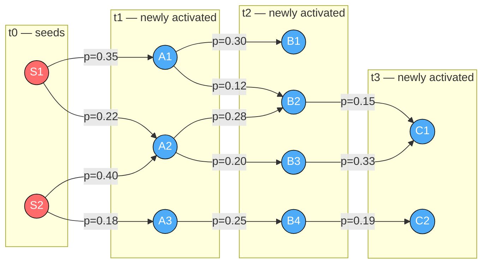
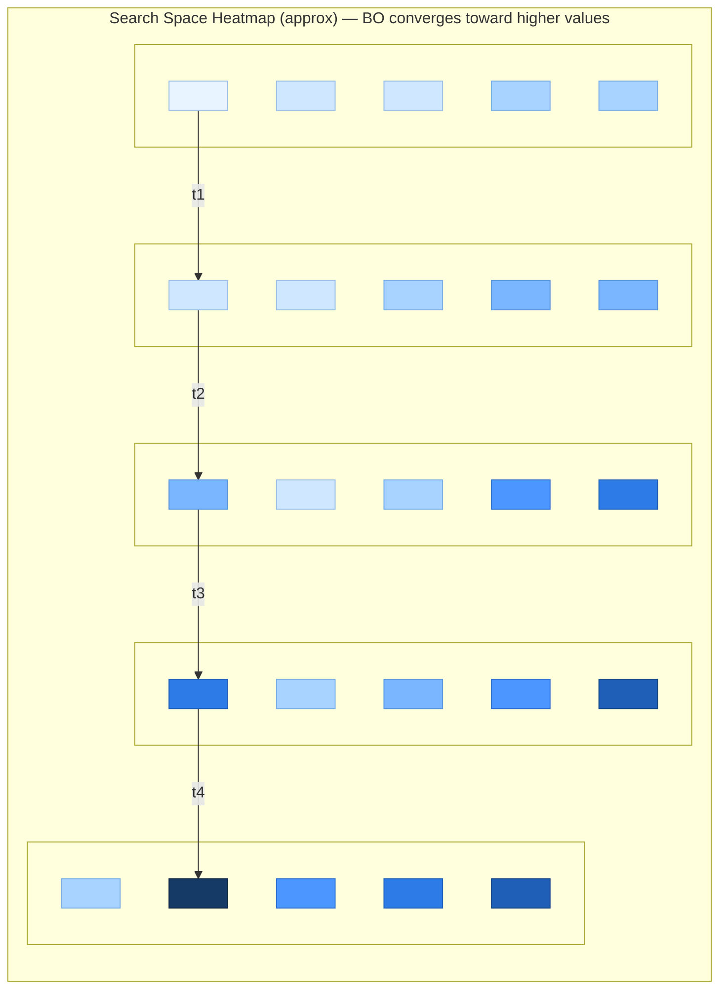
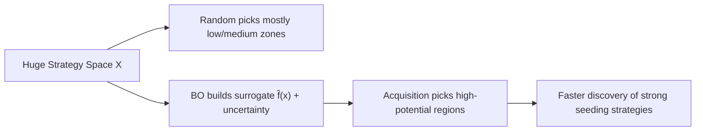

## The Core Question

Most AI systems ask:

> *Can we predict what will go viral?*

Prediction assumes trends are passive — something we observe after they emerge.

But trends are not passive.

They are shaped by decisions:

- who sees content first  
- when it is posted  
- how it is amplified  
- where visibility expands  

So the real question becomes:

> **Can we optimize the conditions under which trends emerge?**

This is where Bayesian Optimization (BO) enters.

---

## The Big Idea

Instead of treating virality as a prediction problem, we treat it as a **black-box optimization problem**.

### Traditional pipeline:

Data → Model → Prediction

### New pipeline:

Decision → Propagation → Feedback → Optimization → Better Decision

The shift is subtle — but profound.

We move from observing trends to engineering them.

---

## Trends as Propagation Systems

A trend doesn’t appear instantly. It propagates through stages.

### 1. Engagement Initiation

Early signals emerge:

- likes  
- comments  
- shares  
- watch time  

These become a feature vector:

'x ∈ ℝ^d'

---

### 2. Amplification

Influencers and network structure drive spread:

- resharing velocity  
- high-degree nodes  
- algorithmic boosts  

Amplification introduces uncertainty — exactly what BO exploits.

---

### 3. Visibility Expansion

Algorithms increase exposure:

- explore pages  
- trending feeds  
- recommendations  

This stage determines whether content dies or explodes.

---

### 4. Virality

Sustained exponential spread occurs across the network.

This becomes the optimization target.

---

## The Optimization Problem

Instead of predicting virality directly:

'max_{x ∈ X} f(x)'


Where:

- x = trend seeding strategy  
- f(x) = influence spread (unknown)

We cannot write this function analytically.

We can only evaluate it.

That makes it a perfect black-box optimization problem.

---

## Influence Spread as the Objective

We evaluate f(x) using the **Independent Cascade (IC) model**.

### Independent Cascade Simulation

1. Seed nodes activate.  
2. Activated nodes attempt to activate neighbors with probability \(p_{uv}\).  
3. Process repeats until no new activations occur.

Expected influence:

'f(x) = E_IC[Reach(S_x)]'


Estimated using Monte Carlo simulations.

Each evaluation is expensive — which is exactly where BO shines.

---

## Bayesian Optimization Core

### Surrogate Model

'f(x) ~ GP(μ(x), k(x, x'))'

Gaussian Processes model:

- predicted influence  
- uncertainty over unknown regions  

---

### Acquisition Function


'a(x) = μ(x) + κ σ(x)'

This balances:

- exploitation (high-performing strategies)  
- exploration (uncertain but promising strategies)

---

### Sequential Loop

1. Evaluate initial strategies  
2. Train GP surrogate  
3. Optimize acquisition function  
4. Test new strategy  
5. Update model  
6. Repeat  

Optimization becomes intelligent exploration.

---

## Visualizing the Process

### IC Spread Simulation



---

### Acquisition Function Evolution

How BO decisions evolve over iterations:

- uncertainty decreases  
- exploration shifts toward promising regions  

---

### Search Space Trajectory



---

## Performance vs. Random Seeding (Why BO Wins)

A simple baseline for trend seeding is **random selection**:

- pick seed users randomly (or randomly choose strategy knobs like time/hashtags/influencer tier)
- run the propagation simulation (IC / Monte Carlo)
- record reach / engagement / virality

This is appealing because it is easy and unbiased — but it is extremely inefficient in large combinatorial spaces.

Bayesian Optimization (BO) improves over random by **learning from every evaluation** and deciding where to test next using a surrogate model + acquisition function. In high-noise propagation problems, this often yields stronger performance under a fixed evaluation budget.

---

### What we compare

Assume the objective is expected reach:

\[
f(x) = \mathbb{E}_{IC}[\text{Reach}(S_x)]
\]

We compare two methods under the same budget \(N\):

- **Random**: sample \(x_1, x_2, \dots, x_N\) uniformly from the strategy space
- **BO**: adaptively choose \(x_{t+1} = \arg\max a(x)\) after each evaluation

---

### Metrics used for comparison

1. **Best-So-Far Influence (Simple & Strong)**  
   Measures progress as optimization proceeds:

\[
\text{BestSoFar}(t) = \max_{i \le t} f(x_i)
\]

BO should rise faster and reach higher values with fewer evaluations.

2. **Area Under the Best-So-Far Curve (AUBC)**  
   A single-number summary of sample efficiency:

\[
\text{AUBC} = \sum_{t=1}^{N} \text{BestSoFar}(t)
\]

Higher AUBC means you achieved strong performance earlier and consistently.

3. **Regret (Optimization Lens)**  
   If we assume the true optimum is \(f(x^*)\), the simple regret is:

\[
r_N = f(x^*) - \max_{t \le N} f(x_t)
\]

BO should yield lower regret under equal budgets.

4. **Stability Under Noise (Propagation Variance)**  
   Since MCST is stochastic, compare variance:

\[
\text{Var}(f(x)) \approx \frac{1}{K-1}\sum_{k=1}^{K}\left(\text{Reach}_k(S_x) - \overline{\text{Reach}}(S_x)\right)^2
\]

BO can incorporate uncertainty and avoid being misled by noisy single samples.

---

### 1) Convergence: Best-So-Far Reach vs Iterations

This diagram shows the typical qualitative behavior: BO climbs faster than random.

```mermaid
xychart-beta
    title "Best-So-Far Influence: BO vs Random"
    x-axis "Iteration" 1 2 3 4 5 6 7 8 9 10
    y-axis "Best-So-Far Reach" 0 --> 100
    line "Random" 10 18 22 28 31 34 38 40 41 43
    line "BO" 10 25 40 55 65 73 80 86 90 92
```

⸻

### 2) Budget Efficiency: Same Budget, Different Outcome

With a fixed evaluation budget (e.g., 20 simulations), BO typically discovers a higher-performing strategy.

```mermaid
xychart-beta
    title "Fixed Budget Outcome (N evaluations)"
    x-axis "Method" ["Random","BO"]
    y-axis "Best Reach Found" 0 --> 100
    bar "Best Reach" 55 85
```

⸻

3) Why Random Fails: Search Space Explosion

Random sampling wastes many evaluations in low-performing regions.



---

Under the same evaluation budget (N),
	•	BO should achieve higher BestSoFar reach
	•	higher AUBC
	•	lower simple regret
	•	and often more stable improvement under Monte Carlo noise.

A realistic target framing for synthetic IC experiments:
	•	BO improves best reach by ~20–50% vs random under tight budgets (e.g., 20–50 evaluations), depending on:
	•	network structure
	•	seed set size
	•	noise level (number of MC rollouts per evaluation)
	•	dimensionality of strategy space

## Performance vs Random Seeding (Figures)

### Best-so-far convergence (mean ± 95% CI)


### Fixed-budget outcome (bar chart)


### Distribution of best reach (violin plot)


---

## Why This Is Innovative

Bayesian Optimization is commonly used for:

- protein synthesis  
- material discovery  
- hyperparameter tuning  

This work applies BO to:

**Social influence optimization**

Key innovation:

- trends become optimization landscapes  
- virality becomes an objective function  
- strategy becomes a decision variable  

---

## Why Not Reinforcement Learning?

RL works best when:

- dense rewards exist  
- continuous interaction is available  

Here:

- evaluations are expensive  
- rewards are delayed  
- sample efficiency matters  

BO provides better uncertainty-aware exploration.

RL becomes a future extension.

---

## Challenges & Limitations

No idea is perfect.

Key challenges include:

- high evaluation noise from Monte Carlo simulations  
- local traps in optimization space  
- high-dimensional strategy vectors  
- GP scalability limitations  

These motivate future research directions.

Notes / Caveats 
	•	BO can be misled by noise if (K) is too small (not enough MC rollouts).
	•	BO may fall into local traps if exploration is too low.
	•	Random can look competitive in extremely high noise or poorly specified search spaces.

So comparisons will include:
	•	confidence intervals over multiple runs (repeat experiments with different random seeds)
	•	optionally varying (K) (MC rollouts) to show robustness.
  
---

## The Deeper Insight

### Traditional view

BO optimizes vectors.

### New view

BO navigates complex social decision spaces.

This reframes social systems as:

- structured optimization landscapes  
- sequential experimentation environments  

---
## The Mathematical Engine Behind Trend Optimization

At the heart of this system is a precise mathematical framework that turns social propagation into an optimization problem. Below is a conceptual breakdown of each core equation and how it connects to virality engineering.

---

### 1. Estimating Influence Spread

$$
E_{IC}[\text{Reach}(S_x)] \approx \frac{1}{K} \sum_{k=1}^{K} \text{Reach}_k(S_x)
$$

This equation approximates the **expected influence spread** under the Independent Cascade (IC) model.

- \(S_x\) = seed set selected by strategy \(x\)
- \(\text{Reach}_k(S_x)\) = number of activated nodes in simulation \(k\)
- \(K\) = number of Monte Carlo simulations

Because influence propagation is stochastic, we simulate it multiple times and average the results. This gives us a stable estimate of expected virality.

Each evaluation is computationally expensive — making Bayesian Optimization ideal.

---

### 2. Constructing the Virality Score

$$
\text{ViralityScore}(x) = \sum_i w_i \cdot f_i(x)
$$

Virality is not a single signal — it is a weighted combination of measurable engagement features:

- \(f_i(x)\) = engagement feature (e.g., share velocity, clustering coefficient, watch-time retention)
- \(w_i\) = learned importance weight

This linear aggregation transforms raw social signals into a structured objective function.

---

### 3. Learning Optimal Feature Weights

$$
L(w) = - \sum_{t=1}^{T} \left( y_t - \sum_i w_i f_i(x_t) \right)^2
$$

This loss function learns weights \(w_i\) that best align predicted virality with observed viral outcomes.

- \(y_t\) = observed virality outcome at time \(t\)
- \(x_t\) = strategy used
- \(T\) = number of training instances

The negative squared error formulation allows us to optimize weights using Bayesian Optimization itself, refining how virality is computed.

---

### 4. Acquisition Functions (Decision Rule)

Bayesian Optimization does not optimize the true function directly. It optimizes a *surrogate model* and uses acquisition functions to choose the next evaluation.

#### Expected Improvement (EI)

$$
a_{EI}(x) = E[\max(0, f(x) - f(x^+))]
$$

- \(f(x^+)\) = best observed value so far

EI chooses strategies expected to outperform the current best — balancing exploration and exploitation.

---

#### Upper Confidence Bound (UCB)

$$
a_{UCB}(x) = \mu(x) + \kappa \sigma(x)
$$

- \(\mu(x)\) = predicted mean
- \(\sigma(x)\) = uncertainty
- \(\kappa\) = exploration parameter

UCB explicitly trades off:

- Exploitation (high predicted influence)
- Exploration (high uncertainty)

---

### 5. Strategy Selection

$$
x^* = \arg\max_{x \in X} a(x)
$$

The next strategy tested is the one that maximizes the acquisition function.

This is the core decision-making step in Bayesian Optimization.

---

### 6. Gaussian Process Kernel Functions

The surrogate model uses kernels to measure similarity between strategies.

#### Radial Basis Function (RBF)

$$
k_{RBF}(x, x') = \exp\left(-\frac{\|x - x'\|^2}{2\ell^2}\right)
$$

- Smooth, infinitely differentiable
- Assumes gradual changes in influence landscape
- Controlled by length-scale \(\ell\)

---

#### Matérn Kernel

$$
k_{Matern}(x, x') =
\frac{2^{1-\nu}}{\Gamma(\nu)}
\left(\frac{\sqrt{2\nu}\|x-x'\|}{\ell}\right)^\nu
K_\nu\left(\frac{\sqrt{2\nu}\|x-x'\|}{\ell}\right)
$$

- More flexible than RBF
- Better suited for noisy, less smooth social systems
- Controlled by smoothness parameter \(\nu\)

---

### 7. Edge Activation Probability

$$
p_{uv}
$$

This represents the probability that an activated node \(u\) activates neighbor \(v\) in the Independent Cascade model.

These probabilities encode:

- strength of connection
- historical interaction frequency
- platform-specific influence likelihood

---

## Why This Matters

These equations collectively transform:

- engagement signals  
- network structure  
- uncertainty  
- propagation randomness  

into a **sequential optimization framework**.

Rather than predicting trends passively, this framework:

1. Models uncertainty over virality  
2. Selects promising strategies  
3. Learns from outcomes  
4. Improves future decisions  

The mathematics is not just descriptive — it is prescriptive.

It enables AI to navigate social systems intelligently.

---

## Future Directions

Where this research can go next:

- Graph Neural Network surrogates  
- RL-based adaptive strategies  
- Multi-fidelity Bayesian Optimization  
- Dynamic, evolving social graphs  
- Real-time autonomous trend engineering  

This is where sequential decision-making and BO begin to merge.

---

## The Big Idea — Final Thought

Most systems try to predict trends after they happen.

This work asks something different:

**What if AI could learn how to create them?**

By combining influence propagation models with Bayesian Optimization, we move from passive forecasting toward active, uncertainty-aware decision making.

Sometimes optimization isn’t about finding the answer.

It’s about learning how to move through the space.

---

## References

- Kempe et al. (2003). *Maximizing the Spread of Influence through a Social Network*  
- Snoek et al. (2012). *Practical Bayesian Optimization*  
- García-Hernández et al. (2022). *Bayesian Optimization for Influence Maximization*  
- Liang (2024). *Bayesian Optimization of Functions over Node Subsets in Graphs*  

---

## Author Note

Written as part of my exploration in **AI for Sequential Decision Making**  
MS Data Science — University of Minnesota
