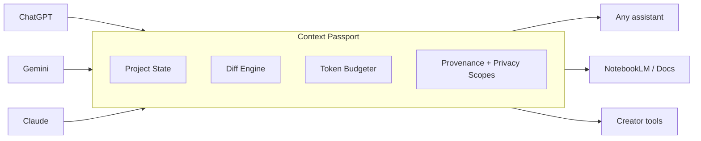

# Claude Memory changes the game — but the real unlock is portable, user-owned memory

There’s a quiet tax every power user pays in 2026:

You don’t use one chatbot.  
You use **ChatGPT**, **Gemini**, **Claude** (and a rotating cast of “LLM-adjacent” tools like NotebookLM, Perplexity-style research flows, and creator tools).

And every time you switch, you re-pay the same fee:

- Re-explain the goal  
- Re-assert constraints  
- Re-list decisions already made  
- Rebuild definitions and context  
- Reconstruct “where we left off”

Claude’s latest move is a direct attack on that tax — and it’s a strong signal the industry is pivoting from **sessions** to **workstreams**.[verge-claude-memory-import]

---

## TL;DR

- **Claude Memory** being available broadly (including free users) + a **memory import flow** from other chatbots reduces switching friction massively.[verge-claude-memory-import]  
- If you’re technical, you can already approximate portability with **MCP servers**, a **NotebookLM vault**, or disciplined “source-of-truth docs” — but it’s still a hassle.[mcp-spec]  
- What’s still missing is a **universal, user-owned memory layer** that works across assistants and tools with:
  **provenance**, **diffs**, **privacy scopes**, and **token-budgeted context packs**.  
- That gap is what I’m building: **Context Passport** (project-state transfer, not transcript transfer).

---

## 1) What Claude just did — and why it matters

Anthropic essentially made two statements:

1) **“Memory shouldn’t be premium-only.”**  
2) **“Switching shouldn’t require re-training your assistant from scratch.”**

Claude now supports:
- **Persistent memory** across conversations (preferences, ongoing projects, continuity)
- A **migration/import workflow** that helps bring your context from other assistants into Claude (implemented today via a guided prompt/export-and-paste flow)[verge-claude-memory-import]

This matters because it acknowledges the real unit of value isn’t a chat — it’s a **long-running project**.

### The “continuity shift”
The next adoption curve is not:
> “Which model is smartest?”

It’s:
> “Which workflow keeps state without me babysitting it?”

Claude’s Memory feature is a major leap toward that future.[verge-claude-memory-import]

---

## 2) The technical reality: you *can* do portability today… if you’re strong technically

If you’re technically proficient, you can already make “memory portability” *mostly* manageable:

### Option A — Build an MCP server as your memory layer
MCP (Model Context Protocol) is an open protocol aiming to standardize how LLM apps connect to tools and context sources.[mcp-spec]  
In practice, you can:
- store your “project state” in your own system
- expose it as an MCP resource/tool
- have your agent/client fetch it on demand

If you’re already living inside agent stacks, MCP is the closest thing to “USB-C for context.”[mcp-spec]

### Option B — Use NotebookLM as a manual memory vault
NotebookLM is great as a “source-of-truth” hub when you’re disciplined:
- you paste summaries
- you store canonical docs
- you keep a running context pack

And if you’re on NotebookLM Enterprise, there are APIs for managing notebooks and sources programmatically.[notebooklm-api-notebooks][notebooklm-api-sources]  
On the consumer side, NotebookLM also supports discovering/adding sources directly in-product.[notebooklm-help-sources]

### Option C — “Perplexity-style” research + canonical docs
This is the common power-user workaround:
- research tool for sourcing
- a doc for decisions/tasks
- manually paste the “current state” into whichever assistant you’re using

It works… but it’s operational overhead.

**Bottom line:**  
Portability is possible today — but it requires you to become a part-time **context logistics engineer**.

Claude’s move is important because it productizes a chunk of that burden for mainstream users.[verge-claude-memory-import]

---

## 3) What Claude Memory solves — and what it doesn’t (yet)

### What it solves well
- **Continuity inside Claude:** preferences and long-running threads become smoother  
- **Onboarding/migration:** importing context lowers the “switching cost” from other assistants[verge-claude-memory-import]

### What’s still missing (the bigger gap)
Claude is solving memory **inside Claude**.

But the real world is multi-assistant and multi-tool. The missing pieces are:

1) **Universal interoperability**
   - Memory that is portable across ChatGPT ↔ Gemini ↔ Claude ↔ tools (NotebookLM, creator tooling, internal copilots)

2) **Provenance**
   - *Where did this memory come from?*
   - Which conversation, which turn, which artifact?

3) **Diffs**
   - *What changed since last time?*
   - Without diffs, users keep re-sending the same giant block of context

4) **Token-budgeting**
   - Different models and destinations have different context limits and “sweet spots”
   - You need budget-aware packing: short / medium / long

5) **Privacy scopes**
   - “Never export these fields”
   - “State-only vs transcript”
   - Redaction before transfer

Claude’s import flow today (as described publicly) is a big step, but it’s not a full cross-ecosystem continuity layer.[verge-claude-memory-import]

---

## 4) The idea I’m building: Context Passport (project-state transfer, not transcript transfer)

**Context Passport** is a universal, user-owned memory layer.

Not “move the transcript.”  
Move the *state*.

### The core abstraction: “Project State”
A project has:
- **Objective**
- **Constraints** (non-negotiables)
- **Decisions** (and why)
- **Tasks** (open loops + acceptance criteria)
- **Glossary/entities** (definitions)
- **Artifacts** (links, files, code blocks)
- **Assumptions** (flagged + expirable)
- **Provenance** (source pointers)

Then the product does three jobs:

1) **Capture**
   - user-triggered save from any assistant UI or API workflow

2) **Compile**
   - convert raw chat into an editable structured context pack

3) **Inject**
   - generate a destination-specific prompt with the right budget + diffs + privacy filters

---

## 5) A simple mental model (diagram)

## 6) Why this is a market gap (and why Claude validates it)

Claude’s new **Memory + “import from other chatbots”** flow is the loudest signal yet that “context switching costs” are now a top-tier UX problem worth shipping product for. The import tool is explicitly designed to help users carry preferences/history over from rivals, so they don’t have to “retrain” Claude from scratch.[verge-claude-memory-import]

That validates three things:

- **The multi-assistant reality is mainstream.** People actively jump between ChatGPT ↔ Gemini ↔ Claude and expect continuity.[verge-claude-memory-import]
- **Continuity is becoming a primary differentiator.** The assistant that preserves your “working state” wins long-running workflows.[verge-claude-memory-import]
- **Migration/onboarding across assistants is valuable enough to ship.** Import is now a feature, not a hack.[verge-claude-memory-import]

### The deeper gap: memory inside an assistant vs memory you own

Claude’s Memory is a big step — but it’s still largely **assistant-native continuity**.

A **user-owned memory layer** goes one level deeper:

- **Not tied to one vendor** (Claude/ChatGPT/Gemini won’t be your only surfaces forever)
- **Not trapped in one UI** (web apps, IDE copilots, research tools, creator tools)
- **Compatible with emerging standards like MCP** — where “memory” can become an addressable, portable resource rather than a platform feature.[mcp-spec]

That is the “Context Passport” thesis:

> Don’t move chats. Move *project state*.

---

## 7) Technical breakdown: Context Passport (project-state transfer, not transcript transfer)

If you’re technical, you can approximate portability today by:

- running an MCP server as your “context hub”, or  
- maintaining a disciplined NotebookLM / docs vault, or  
- doing Perplexity-style research + manually curating a “source-of-truth” brief.

It works — but it’s operational overhead and doesn’t scale across tools or teams.

Context Passport’s design goal is to make this frictionless by building a **portable project-state layer** with:

- **schema + provenance**
- **diffs + versioning**
- **privacy scopes**
- **token-budgeted injection**
- **adapter support** (Chat UIs now; APIs later; MCP everywhere)[mcp-spec]

### 7.1 The core abstraction: “Project State”

Instead of storing “one big summary”, store a set of typed objects that represent the **minimum sufficient state** to continue work anywhere.

**Canonical object types (schema v0.1):**
- `Objective` (what we’re doing)
- `Constraint` (non-negotiables; pinned)
- `Decision` (what we chose + why)
- `Task` (open loops + acceptance criteria)
- `Glossary/Entity` (definitions; only what matters)
- `Artifact` (links, code blocks, files, diagrams)
- `Assumption` (unknowns; can expire)
- `Preference` (format, tone, structure)
- `Provenance` (where each item came from)

#### Why this matters

When things break, they rarely break because “the summary wasn’t long enough.”  
They break because the assistant lost:

- the constraints
- the rationale behind decisions
- the current task list
- definitions and naming
- or what changed since last time

Project State keeps the “spine” of the work intact.

---

### 7.2 Capture layer: getting data out of chat surfaces safely

**MVP reality:** consumer ChatGPT/Gemini/Claude UIs are not designed for programmatic exports via public APIs in a consistent way. So the practical MVP is a **browser extension** that performs **user-triggered capture**.

**Capture steps:**
1. User clicks **Save to Passport**
2. Content script extracts the last **N** turns + visible artifacts (code blocks, links)
3. Store raw capture encrypted locally
4. Run compilation to update Project State

**Key security posture:**
- **User-triggered only** (no silent scraping)
- **Least privilege** (site-scoped permissions)
- **Local-first encrypted vault** (default)

> Later: API-native capture becomes possible when users run chats through your own multi-model UI that routes to provider APIs.

---

### 7.3 Compiler layer: turning messy text into structured state

The compiler is a **pipeline**, not a single prompt.

**Pipeline sketch:**
1. **Segmentation**  
   - break capture into turns, detect code blocks/artifacts  
2. **Extraction**  
   - detect constraints, decisions, tasks, glossary entities  
3. **Normalization**  
   - dedupe repeated items, merge similar tasks/constraints  
4. **Scoring & confidence**  
   - confidence per item (high for explicit “we will do X”, low for inferred)  
5. **Human-in-the-loop editing**  
   - allow quick correction (critical to avoid “summary drift”)

**Why not just summarize?**  
Summaries don’t preserve:
- what changed
- what’s pinned
- what must never be shared
- where a claim came from

---

### 7.4 Provenance: making memory debuggable

Every item in Project State should have a provenance pointer:

- platform: `chatgpt` / `gemini` / `claude`
- capture timestamp
- turn range
- hash of raw excerpt (to detect changes)
- optional “source artifact” link

**Benefits:**
- You can trace contradictions.
- You can answer “why is this in memory?”
- You can safely prune without losing accountability.

This is what most “context transfer” tools miss — and why they eventually feel unreliable.

---

### 7.5 Diff engine: “what changed since last time?”

When you switch assistants, you don’t want to paste the same 800-word pack repeatedly.  
You want:

- new decisions
- updated constraints
- newly created/closed tasks
- refined definitions

So Context Passport maintains:

- `diff_since_last_save`
- `diff_since_last_injection(to=Claude)`
- `diff_since_last_injection(to=ChatGPT)`
- etc.

This matters because it:
- reduces token waste
- reduces “stale re-anchoring”
- and makes the system feel fast + intentional

---

### 7.6 Privacy scopes: memory that doesn’t leak

Context portability is also a privacy problem.

Passport needs field-level controls:

- `private:never_export`
- `private:never_inject`
- `state_only` vs `state+excerpt`
- per-destination allowlists (e.g., allow to Claude but not to a tool)

This is a product moat because it changes the user’s relationship with memory:  
**from accidental → explicitly governed.**

---

### 7.7 Token budgeter: packing context for different models and surfaces

Different models (and even different “modes” inside the same product) have different:

- effective context windows
- sensitivity to long prompts
- and best practices

So Passport has a budgeter that produces:

- **S / M / L** context packs  
- plus an optional “excerpt tail” (last 3–8 turns)

**Packing priority order:**
1. pinned constraints  
2. recent decisions (+ pinned)  
3. open tasks (+ acceptance criteria)  
4. glossary/entities (only referenced items)  
5. key facts (ranked by recency/usage)  
6. tail excerpt (optional)  

If over budget: drop tail excerpt first, then non-pinned facts.

---

### 7.8 MCP compatibility: memory as a portable resource

MCP is the path to ecosystem-level portability.[mcp-spec]

Instead of “paste this into the next chatbot,” you want tools to request:

- `get_context_pack(project_id, budget=S|M|L, destination=...)`
- `diff_since(project_id, timestamp)`
- `list_artifacts(project_id)`
- `get_item(item_id)` (with provenance)

MCP’s spec emphasizes standardized schemas and security considerations for tool/data access paths, which fits Passport’s “memory as a governed resource” direction.[mcp-spec]

---

### 7.9 The failure mode to avoid (what most tools do wrong)

A lot of “context transfer” tools output:

- a giant summary blob
- no provenance
- no diffs
- no privacy scopes
- no token discipline

It feels helpful… until it breaks:

- you lose the “why” behind decisions
- you can’t trace contradictions
- you leak something sensitive
- you burn the context window on irrelevant fluff

**Passport’s response:** treat context as *state*, not text.

---

### 7.10 The Context Pack checklist (the version I actually want)

A usable pack should always include:

- Constraints (pinned)
- Decisions (recent + pinned)
- Open tasks (with acceptance criteria)
- Definitions/glossary (only what matters)
- Diffs since last injection
- Provenance pointers
- Budget control (S/M/L)

---

## 8) Practical prompt templates (copy-paste friendly)

### A) “Continue this project” (destination injection)

Use this when moving work from one assistant to another:

> You are continuing an ongoing project.  
> Use the Context Pack below as the source of truth.  
> If something is uncertain, ask one targeted question, then proceed with best effort.  
> Do not re-litigate past decisions unless flagged.

**Context Pack:**
- Objective: …
- Constraints: …
- Decisions: …
- Open tasks: …

**Changes since last time:**
- …

**Now do:**
- (your next instruction)

---

### B) “Extract project state from this chat”

This is the pattern behind many migration flows (including Claude’s import UX as described publicly): export key memory-like information from one assistant and bring it into another.[tomsguide-chatgpt-to-claude]

> Extract the following from our conversation so far:
> 1) Objective (1–2 lines)  
> 2) Constraints (bullets)  
> 3) Decisions made (bullets + rationale)  
> 4) Open tasks (bullets + acceptance criteria)  
> 5) Glossary/entities (if any)  
> 6) Assumptions/unknowns  
> Keep it under 400 words.

---

## 9) Where this goes next

Claude Memory is step one: assistant-native continuity.[verge-claude-memory-import]

The next step is cross-ecosystem continuity:

- assistants
- research tools
- notebooks
- creator pipelines
- internal copilots

That’s why standards like MCP matter: they create a path where “memory” becomes an addressable, portable resource instead of a platform feature.[mcp-spec]

### NotebookLM as a “memory hub” (optional but powerful)

NotebookLM Enterprise exposes APIs to create/manage notebooks and add/manage sources programmatically — meaning Passport can publish a “Project Brief” and keep it updated as a living source of truth.[notebooklm-api-notebooks]

---

## Open questions (the fun part)

- Should portable memory be local-first by default (encrypted vault), or cloud-synced?
- What’s the right UX for privacy scopes so users don’t accidentally leak info during transfers?
- How do we quantify “continuation quality” beyond vibes?
  - task completion rate
  - rework rate
  - contradiction rate
  - token waste

---

## Closing thought

Claude’s Memory + import flow is a big deal because it makes an implicit truth explicit:

> In the agent era, intelligence is table stakes. Continuity is the product.

And yes — if you’re technical enough, you can brute-force continuity today with MCP servers and notebook vaults.

But it shouldn’t require bespoke workflows.

The next wave is the tool that makes context portability feel like:

**“Continue where I left off” — anywhere.**

---

## References

- Claude Memory upgrade + import workflow coverage: [verge-claude-memory-import]
- Model Context Protocol (MCP) specification: [mcp-spec]
- NotebookLM Enterprise APIs (notebooks + sources): [notebooklm-api-notebooks], [notebooklm-api-sources]
- Claude import walkthrough example: [tomsguide-chatgpt-to-claude]
- NotebookLM sources/help: [notebooklm-help-sources]

---

<!-- Reference-style link definitions (GitHub Pages friendly) -->

[verge-claude-memory-import]: https://www.theverge.com/ai-artificial-intelligence/887885/anthropic-claude-memory-upgrades-importing
[mcp-spec]: https://modelcontextprotocol.io/specification/2025-11-25
[notebooklm-api-notebooks]: https://docs.cloud.google.com/gemini/enterprise/notebooklm-enterprise/docs/api-notebooks
[notebooklm-api-sources]: https://docs.cloud.google.com/gemini/enterprise/notebooklm-enterprise/docs/api-notebooks-sources
[notebooklm-help-sources]: https://support.google.com/notebooklm/answer/16215270
[tomsguide-chatgpt-to-claude]: https://www.tomsguide.com/ai/you-can-move-your-chatgpt-memory-to-claude-in-60-seconds-heres-how
