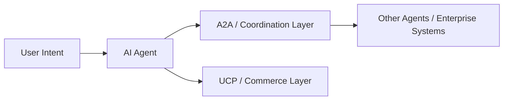

## 1) Why This Matters: The Internet Is Moving from Retrieval to Action

For most of the modern web, the dominant flow was simple:

1. a human searches or navigates  
2. a page or app responds  
3. the user clicks, fills, submits, buys, or leaves  

That model created enormous businesses, but it assumed that the **human** was the operational bridge between systems.

Agentic software changes that assumption.

As AI systems become better at planning, tool use, memory, and delegated execution, the bottleneck is no longer just model intelligence. The bottleneck is whether these systems can **find each other, understand capabilities, exchange tasks, authenticate permissions, and pay for actions** across organizational and technical boundaries. Google introduced A2A in April 2025 specifically to let agents built by different vendors and frameworks collaborate across enterprise systems, while the Linux Foundation formalized the project on June 23, 2025 under neutral governance. :contentReference[oaicite:0]{index=0}

That is the deeper story behind newer protocol efforts such as **A2A**, **ACP**, **UCP**, and **ATXP**. They are early attempts to define the grammar of the **agent web**: not just how software exposes endpoints, but how autonomous or semi-autonomous systems coordinate and transact. UCP was launched by Google on January 11, 2026 for “agentic commerce,” while ATXP emerged in September 2025 around agent-native payments and micropayment workflows. :contentReference[oaicite:1]{index=1}

A useful way to frame the shift is:

\[
\text{Old Web Value} \approx f(\text{content}, \text{UI}, \text{search}, \text{human clicks})
\]

\[
\text{Agent Web Value} \approx f(\text{capability discovery}, \text{context exchange}, \text{delegation}, \text{trust}, \text{payments})
\]

In other words: the browser era optimized **information access**.  
The agent era is beginning to optimize **machine-mediated action**.

---

## 2) The Core Problem: Today’s Agent Ecosystem Is Fragmented

Most current agent systems are still highly local.

They may work well inside a single vendor stack, a single application, or a single orchestration framework. But once agents need to cross those boundaries, things break down. Different frameworks serialize tasks differently. Different runtimes carry different assumptions about state, tool invocation, authentication, memory, and response handling. IBM described ACP as a lightweight, HTTP-native protocol precisely because agents were increasingly being built in isolation across frameworks, languages, and infrastructures. :contentReference[oaicite:2]{index=2}

This fragmentation creates at least four structural gaps:

### 2.1 Discovery gap
An agent must know that another agent or service exists, what it can do, and how to interact with it.

### 2.2 Communication gap
Agents need a shared way to send tasks, stream intermediate status, return outputs, and support long-running operations.

### 2.3 Trust gap
Once software can act on behalf of users, permissions, authentication, and provenance become central infrastructure problems rather than optional add-ons.

### 2.4 Economic gap
If agents are to use premium tools, purchase services, or complete commerce flows, they need payment primitives that work at machine speed and at machine granularity.

We can think of agent usefulness as constrained by the weakest protocol layer:

\[
U_{\text{agent}} \propto \min(D, C, T, P)
\]

Where:

- \(D\) = discovery quality  
- \(C\) = communication interoperability  
- \(T\) = trust / permission robustness  
- \(P\) = payment / transaction capability  

If any one of these approaches zero, the practical value of a multi-agent ecosystem collapses.

---

## 3) A2A: The Coordination Layer for Agents

**A2A (Agent2Agent Protocol)** is the clearest attempt so far to define a broad interoperability layer for AI agents.

Google’s A2A announcement described it as an open standard to enable AI agents from different vendors and frameworks to collaborate and exchange information across enterprise platforms. Later, Google transferred the protocol specification, SDKs, and tooling into a Linux Foundation-hosted project formed with companies including AWS, Cisco, Microsoft, Salesforce, SAP, and ServiceNow. That move matters because it shifts A2A from being “a Google thing” toward becoming a more vendor-neutral interoperability layer. :contentReference[oaicite:3]{index=3}

### 3.1 Why A2A matters conceptually

A2A treats external systems not merely as dumb tools, but as **agent peers**.

That distinction is important. A tool is something an agent invokes unilaterally. A peer agent is something it coordinates with. This is closer to how real organizations work: procurement systems, support systems, compliance systems, knowledge systems, scheduling systems, and analytics systems all carry their own logic and state.

So A2A is really about this transition:

\[
\text{Tool Calling} \rightarrow \text{Agent Coordination}
\]

That means the protocol must support more than request-response mechanics. It must support discovery, task passing, structured interaction, and trusted communication across boundaries. The Linux Foundation’s launch language explicitly frames A2A around “trusted agent communication across systems and platforms.” :contentReference[oaicite:4]{index=4}

### 3.2 Why this is bigger than enterprise plumbing

If A2A succeeds, it could do for agents what HTTP did for documents and what common API conventions did for services: lower integration friction enough that ecosystems can grow without bespoke bilateral engineering for every relationship.

A rough way to describe the integration burden is:

\[
\text{Custom Pairwise Integrations} = \frac{n(n-1)}{2}
\]

For \(n\) agent systems, direct bespoke integrations grow quadratically.

A common protocol changes the cost profile toward something closer to:

\[
\text{Standardized Integration Burden} \approx n
\]

That is not mathematically exact in practice, but it captures why shared protocols matter economically. They reduce combinatorial integration cost.

---

## 4) ACP: A Sign That the Market Is Already Converging

**ACP (Agent Communication Protocol)** emerged with a very similar goal: make agent communication portable across frameworks, languages, and runtime environments.

IBM Research described ACP as an open standard for seamless communication between AI agents, lightweight and HTTP-native. The ACP documentation also explained the broader fragmentation problem directly, emphasizing that modern agents were often built in isolation and that this slowed meaningful collaboration. :contentReference[oaicite:5]{index=5}

But the most important thing about ACP now is not just what it proposed. It is what happened next.

Both IBM’s ACP page and the ACP documentation now state that **ACP is now part of A2A under the Linux Foundation**, with migration guidance for users. :contentReference[oaicite:6]{index=6}

### 4.1 Why that matters

This is an early sign of protocol consolidation.

In emerging technology markets, many protocols appear at once because the design space is still fluid. Over time, some disappear, some merge, and some become layers inside larger stacks. ACP’s absorption into the A2A path suggests the ecosystem is already recognizing that too many competing communication standards would slow enterprise adoption.

That convergence matters because interoperability standards only create value if enough parties share them.

A stylized adoption condition looks like this:

\[
V_{\text{protocol}} \propto N \times I \times T
\]

Where:

- \(N\) = number of participating ecosystems  
- \(I\) = interoperability depth  
- \(T\) = trust in neutral governance  

ACP strengthened the design conversation. A2A appears to be absorbing more of the ecosystem momentum.

---

## 5) UCP: Commerce Becomes Agent-Readable

If A2A is about general coordination, **UCP (Universal Commerce Protocol)** is about a narrower but economically powerful domain: commerce.

Google launched UCP on **January 11, 2026** as a new open standard for agentic commerce spanning discovery, buying, and post-purchase support. Google’s developer materials describe it as an open-source standard that creates a common language and functional primitives between consumer surfaces, businesses, and payment providers. The protocol is built to work with existing retail infrastructure and is compatible with A2A, MCP, and AP2-style payment infrastructure. :contentReference[oaicite:7]{index=7}

### 5.1 Why UCP is structurally important

Historically, commerce on the internet assumed that the website or app was the main commercial surface.

UCP suggests a different future: **the shopping interface may increasingly be an agent**, while the merchant exposes structured commerce capabilities underneath.

That changes the optimization target for retailers:

\[
\text{Legacy Commerce Optimization} = f(\text{storefront}, \text{ads}, \text{conversion UI})
\]

\[
\text{Agentic Commerce Optimization} = f(\text{catalog semantics}, \text{availability}, \text{offer logic}, \text{identity}, \text{checkout interoperability})
\]

Google explicitly says that with UCP, businesses can surface offerings across AI interfaces like AI Mode in Search and Gemini while still owning business logic and remaining the **Merchant of Record**. That is an important governance and market-structure detail: the protocol aims to let merchants participate in agentic commerce without fully surrendering the customer relationship to the interface layer. :contentReference[oaicite:8]{index=8}

### 5.2 Why UCP looks like a bridge protocol

UCP does not try to do everything itself. Google describes it as compatible with **A2A**, **MCP**, and **AP2**. That suggests a layered stack is emerging rather than a single monolithic standard. :contentReference[oaicite:9]{index=9}

A useful abstraction is:

\[
\text{Agent Commerce Stack} =
\{
\text{Discovery/Coordination},
\text{Context/Tools},
\text{Commerce Semantics},
\text{Payments}
\}
\]

UCP sits primarily in the **commerce semantics** layer.

### 5.3 The March 19, 2026 update matters too

Google’s March 19, 2026 UCP update added practical capabilities such as cart operations, real-time catalog access, and identity linking for loyalty-style experiences. Those details are easy to dismiss as product polish, but they are actually signs that UCP is moving from conceptual standard to operational commerce rail. :contentReference[oaicite:10]{index=10}

---

## 6) ATXP: The Payment Layer for Autonomous Software

If UCP standardizes commercial interaction, **ATXP** targets an even more missing piece: letting agents actually pay.

Circuit & Chisel launched ATXP in September 2025 alongside a **$19.2 million** seed round. Company and investor materials describe ATXP as a protocol for **instant, nested, delegated, and low-cost micropayments** between AI agents—something legacy payment rails struggle to support well. Samsung Next described ATXP as designed for transactions that are “nested, delegated, and composable,” while ATXP’s own developer docs emphasize per-tool-call pricing, signed payment authorization, and tool access without managing API keys or vendor accounts. :contentReference[oaicite:11]{index=11}

### 6.1 Why existing payment rails are awkward for agents

Traditional internet payments assume a human-centered event:

- a person sees a checkout  
- approves a purchase  
- uses a card or wallet  
- pays a relatively chunky amount  

But an agent may need to:

- pay for one report  
- pay for one inference call  
- chain several microservices together  
- delegate spending authority to a sub-agent  
- buy only one temporary capability for one task  

That makes the economic unit much smaller and more dynamic.

A simple expression of the problem is:

\[
\text{Legacy Payment Fit} \downarrow \text{ as } \text{transaction size} \downarrow \text{ and } \text{delegation depth} \uparrow
\]

In plainer terms: cards and subscriptions are clunky when software needs frequent, tiny, delegated purchases.

### 6.2 The ATXP model

ATXP docs position the protocol around agents discovering and paying for MCP tools, often on a per-call basis. The documentation highlights reduced friction, pay-as-you-go cost control, security benefits from signed payments rather than shared keys, and composability across multiple paid MCP servers. :contentReference[oaicite:12]{index=12}

That implies an economic function like:

\[
\text{Agent Service Cost} = \sum_{i=1}^{k} p_i \cdot q_i
\]

Where:

- \(p_i\) = price per tool call or capability  
- \(q_i\) = usage volume for that capability  

This is a better fit for agent ecosystems than flat subscription logic when usage is fragmented across many specialized tools.

### 6.3 Why this could matter beyond one company

Even if ATXP itself evolves, the category it represents is likely durable: **machine-native payments**.

An agent web without agent-friendly payments would look like an API economy forced to use physical store checkout metaphors. That is why payment protocols may end up being as strategically important as coordination protocols.

---

## 7) These Protocols Are Not the Same Thing

One of the easiest mistakes is to treat every protocol acronym as though it is competing in the exact same lane.

They are not.

### 7.1 A simplified layer map

- **A2A** → general agent coordination and interoperability :contentReference[oaicite:13]{index=13}
- **ACP** → early agent communication standard, now folded into A2A’s path :contentReference[oaicite:14]{index=14}
- **UCP** → commerce workflow standard across consumer surfaces, merchants, and payment providers :contentReference[oaicite:15]{index=15}
- **ATXP** → payment and wallet layer for agent-native transactions and paid tool usage :contentReference[oaicite:16]{index=16}

### 7.2 The layered interpretation

A better mental model is:

\[
\text{Agent Internet Stack} =
\begin{cases}
L_1: \text{Discovery and coordination} \\
L_2: \text{Context and capability exchange} \\
L_3: \text{Commerce semantics} \\
L_4: \text{Payments and settlement}
\end{cases}
\]

Different protocols may dominate different layers.

That means the “protocol war” may not be winner-take-all. It may instead be a battle over which groups define each critical layer of the future stack.

---

## 8) Security, Consent, and Trust Become Protocol Problems

The exciting version of the agent web is that software becomes genuinely useful across boundaries.

The dangerous version is that poorly governed software chains can act across those same boundaries with too much autonomy and too little accountability.

This is why the trust layer is not optional.

### 8.1 Three trust requirements

#### Identity
Who is the acting party: the user, the agent, the agent vendor, the merchant, or some delegated sub-agent?

#### Authorization
What is this agent allowed to do, spend, access, or trigger?

#### Provenance
Can the system prove what happened, under whose authority, and with what constraints?

Google’s UCP materials emphasize secure identity and payments, while A2A is repeatedly framed around secure and trusted communication. ATXP, meanwhile, leans on signed payments and wallet-based authorization rather than long-lived shared keys. :contentReference[oaicite:17]{index=17}

A stylized trust score for an agent interaction could be thought of as:

\[
T = f(I, A, P, O)
\]

Where:

- \(I\) = identity assurance  
- \(A\) = authorization clarity  
- \(P\) = provenance / auditability  
- \(O\) = observability / monitoring  

Low \(T\) means high systemic risk, even if the user-facing demo looks impressive.

---

## 9) What This Means for Business Strategy

The business implication is not merely “adopt AI.”

It is that companies may increasingly need to become **machine-legible** in a richer sense.

### 9.1 In the browser era, firms optimized for:
- page ranking
- search visibility
- mobile UX
- conversion funnels
- API exposure

### 9.2 In the agent era, firms may need to optimize for:
- capability discoverability
- protocol compatibility
- machine-readable offers and constraints
- permission handling
- trusted execution
- agent-mediated checkout and support

Retailers are already being pushed this way by UCP. Enterprise software vendors are being pushed this way by A2A-style interoperability expectations. Tool builders are being pushed this way by payment layers like ATXP that make per-use monetization more natural. :contentReference[oaicite:18]{index=18}

A practical readiness frame could be:

\[
R_{\text{agent-ready}} = w_1C + w_2S + w_3T + w_4E
\]

Where:

- \(C\) = capability exposure readiness  
- \(S\) = standards compatibility  
- \(T\) = trust and control infrastructure  
- \(E\) = economic execution readiness  

This is not a formal industry metric, but it is a useful operational lens for evaluating whether a business is ready for agent-mediated ecosystems.

---

## 10) What Happens Next

The most likely near-term future is not one universal protocol ruling everything.

It is a messy but increasingly structured stack.

### 10.1 Likely pattern
- **A2A** becomes a broad coordination standard with growing institutional support  
- **ACP** becomes part of that history and convergence path  
- **UCP** gains importance in commerce where platforms and merchants need a shared interaction layer  
- **ATXP** or similar systems push payments toward machine-native flows  

### 10.2 The bigger shift

The larger transition is this:

\[
\text{Web of Pages} \rightarrow \text{Web of Platforms} \rightarrow \text{Web of Agents}
\]

The first web connected documents.  
The second web connected services.  
The emerging third layer is about connecting **software actors**.

That is why these protocols matter.

Not because every acronym launched in the agent era will survive.  
But because together they mark a real architectural turn: the internet is being rebuilt so software can do more than fetch information. It can increasingly **coordinate, decide, buy, and act**.

That is not just an AI product trend.  
It is the beginning of a protocol transition.

---

## 11) Suggested Figures for the Post

**Figure idea:**  
A four-layer diagram:

- Layer 1: Discovery / Coordination → **A2A**
- Layer 2: Agent Communication → **ACP → A2A convergence**
- Layer 3: Commerce Semantics → **UCP**
- Layer 4: Payments / Settlement → **ATXP**

---

**Figure idea:**  
A left-to-right transition graphic:

- **Browser Web**: human → page → click → checkout  
- **API Web**: app → API → service  
- **Agent Web**: user → agent → agent(s) / merchant / paid tools → action  

---

## 12) Simple Mermaid Figure (optional, if your setup supports it)

13) Closing Thought

The biggest internet businesses of the last two decades were built on controlling attention, interfaces, and distribution.

The next wave may be built on controlling something quieter but even more powerful:

the rails through which agents discover, trust, transact, and act.

That is what makes A2A, ACP, UCP, and ATXP worth watching now—while they still look like protocol acronyms rather than obvious economic infrastructure.

## Sources

- Google Developers Blog — A2A announcement / Linux Foundation transition  
- Linux Foundation — Agent2Agent project launch  
- IBM Research / ACP docs — ACP overview and migration into A2A  
- Google Developers Blog / Google Blog — Universal Commerce Protocol launch and updates  
- ATXP docs / Samsung Next / PR Newswire — ATXP and agent-native payments  

### Primary references used for this article

- [Google Developers Blog — A2A: A new era of agent interoperability](https://developers.googleblog.com/en/a2a-a-new-era-of-agent-interoperability/)
- [Linux Foundation — Launches the Agent2Agent Protocol Project](https://www.linuxfoundation.org/press/linux-foundation-launches-the-agent2agent-protocol-project-to-enable-secure-intelligent-communication-between-ai-agents)
- [IBM Research — Agent Communication Protocol](https://research.ibm.com/projects/agent-communication-protocol)
- [ACP Docs — Quickstart / migration note](https://agentcommunicationprotocol.dev/introduction/quickstart)
- [Google Developers Blog — Under the hood: Universal Commerce Protocol (UCP)](https://developers.googleblog.com/under-the-hood-universal-commerce-protocol-ucp/)
- [Google Blog — Agentic commerce: AI tools and protocol updates for retailers and platforms](https://blog.google/products/ads-commerce/agentic-commerce-ai-tools-protocol-retailers-platforms/)
- [Google Blog — UCP updates](https://blog.google/products-and-platforms/products/shopping/ucp-updates/)
- [ATXP Docs — Build agents](https://docs.atxp.ai/developers/build-agents)
- [Samsung Next — Why we invested in Circuit and Chisel](https://www.samsungnext.com/blog/why-we-invested-in-circuit-and-chisel)
- [PR Newswire — Circuit & Chisel secures $19.2 million and launches ATXP](https://www.prnewswire.com/news-releases/circuit--chisel-secures-19-2-million-and-launches-atxp-a-web-wide-protocol-for-agentic-payments-302562331.html)
    D --> E[Merchant Systems]
    A --> F[ATXP / Payment Layer]
    F --> G[Paid Tools / Wallet / Settlement]
