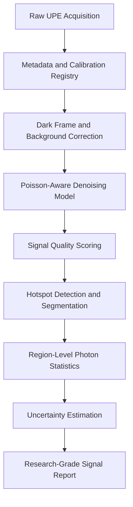
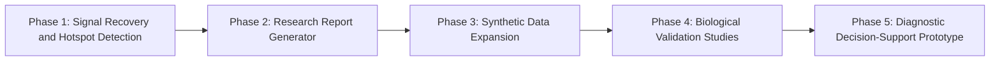

> **Key takeaways**
> - Ultra-weak Photon Emission is not standard RGB computer vision; it is a photon-limited biomedical signal-processing problem.
> - UPE data is extremely low-intensity and heavily affected by Poisson shot noise, dark current, background noise, and acquisition instability.
> - The safest MVP is not a diagnostic classifier. It is a **signal quality and hotspot audit tool**.
> - The first technical priority should be Poisson-aware denoising and spatial hotspot localization.
> - Generative modeling and agentic reporting are useful, but only after the signal recovery pipeline is scientifically reliable.

## 1) Why Ultra-weak Photon Emission Is an Interesting AI Problem

Most computer vision systems are built for the visible world.

Faces. Roads. Products. Documents. Sports highlights. Medical scans.

Ultra-weak Photon Emission, or UPE, sits at the opposite end of that spectrum.

It is not a normal image. It is not a clean video. It is not standard RGB vision. It is a faint biological signal emitted by living systems, often linked to oxidative metabolic processes and reactive oxygen species.

The challenge is not simply detecting light. The challenge is separating extremely weak biological photon patterns from dark current, background noise, sensor artifacts, acquisition instability, and biological variability.

That makes UPE an ideal frontier for a different kind of biomedical AI pipeline: one that combines low-light signal processing, scientific computer vision, spatial diagnostics, and conservative interpretation.

This article lays out a technical roadmap for using AI to analyze UPE as a potential research layer for metabolic activity, oxidative stress, inflammation, and cellular state.

The framing is strictly scientific and biophysical. This is not an “aura” project. It is not metaphysical imaging. It is a signal-processing and biomedical AI problem.

## 2) What Is Ultra-weak Photon Emission?

Ultra-weak Photon Emission refers to extremely faint light emitted by biological systems. It is often discussed under terms such as biophoton emission, spontaneous ultra-weak emission, or biological chemiluminescence.

At a high level, UPE is associated with electronically excited species produced during oxidative metabolic reactions and oxidative stress processes. Reactive oxygen species are commonly discussed as one of the major contributors to these emissions.

Because oxidative metabolism, inflammation, mitochondrial activity, and stress response are deeply connected to health, UPE has attracted interest as a possible non-invasive biological readout.

But the key word is **possible**.

The science is promising, but difficult. UPE signals are weak, noisy, context-sensitive, and highly dependent on experimental setup. Before UPE can be treated as a reliable diagnostic signal, it needs rigorous measurement pipelines, reproducible acquisition protocols, validated statistical models, and careful biological interpretation.

That is where computer vision becomes useful.

Not as a magic classifier.

As a structured signal analysis layer.

## 3) Why UPE Is Not Standard Computer Vision

Most computer vision models assume that the input image contains strong visual structure. Edges, textures, shapes, objects, and colors are usually visible enough for a neural network to learn patterns.

UPE is different.

A UPE frame may look almost empty. The meaningful signal may be only slightly above background noise. The image formation process is closer to low-light astronomy or photon-limited microscopy than Instagram-style vision.

The main constraints are:

- extremely low photon counts;
- Poisson-distributed shot noise;
- dark current and sensor thermal noise;
- background leakage;
- long exposure requirements;
- biological movement or sample drift;
- sparse spatial hotspots;
- weak temporal dynamics;
- small datasets;
- high cost of ground-truth labeling.

In other words, the first problem is not classification.

The first problem is signal recovery.

A model that immediately tries to classify “healthy” versus “inflamed” from raw UPE frames risks learning acquisition artifacts instead of biology.

The correct roadmap should start with scientific denoising, calibration, spatial normalization, and uncertainty estimation.

## 4) The Core Product Idea: A UPE Signal Quality and Hotspot Audit Tool

The strongest early version of this project is not a disease diagnosis system.

It is a **UPE Signal Quality and Hotspot Audit Tool**.

The tool should answer:

- Is there a detectable signal above background?
- Where is the signal concentrated?
- How stable is it over time?
- How much confidence do we have in the recovered pattern?
- How does the signal compare with controls?
- What uncertainty remains?

The output should not be a simplistic prediction.

A useful research-facing output would look more like this:

> “This tissue region shows statistically elevated photon activity compared with calibrated background baselines. Hotspots are spatially clustered in regions A and C. Temporal behavior differs from the control profile. Model confidence is moderate due to low signal-to-noise ratio. Suggested next validation: compare against ROS or inflammation biomarker panels.”

That kind of output is more useful than:

> “Inflamed: 87%.”

The goal is not to overclaim.

The goal is to help researchers inspect, compare, and validate photon signatures responsibly.

## 5) Four Technical Tracks for the Project

The project can be divided into four technical tracks.

Each track is valuable, but they do not all have the same MVP priority.

### Track A: Signal Processing and Poisson-Aware Denoising

This is the foundation.

The model takes photon-limited UPE frames and separates meaningful emission patterns from noise. Because UPE data is dominated by low-count statistics, the model should not use generic image-denoising assumptions. It should include Poisson-aware loss functions, calibration frames, dark-frame subtraction, and uncertainty-aware reconstruction.

Possible model families include:

- U-Net variants;
- Noise2Noise or Noise2Void-style self-supervised denoising;
- Poisson likelihood-based reconstruction;
- Bayesian deep learning models;
- physics-informed neural networks;
- transformer-enhanced U-Net for spatiotemporal denoising.

The input is not just an image. It should include acquisition metadata:

- exposure time;
- sensor temperature;
- gain settings;
- dark-frame reference;
- background frame;
- sample type;
- stimulation condition;
- timestamp;
- wavelength band, if available.

This track creates the cleanest foundation for every other part of the system.

Without this, downstream detection, generation, and reporting become fragile.

### Track B: Generative Data for Synthetic UPE Hotspots

The cold-start problem is real.

Biomedical UPE datasets are likely to be small, expensive, and difficult to label. Generative modeling can help simulate metabolic hotspot patterns, sensor noise, biological variability, and experimental conditions.

Possible approaches include:

- conditional diffusion models;
- GAN-based synthetic image generation;
- simulation-first Poisson image synthesis;
- domain randomization;
- synthetic control and stress-response profiles;
- digital phantom generation.

But synthetic data must be treated carefully.

The model should not invent biological truth. It should generate training variation, stress-test algorithms, and augment known patterns. Synthetic data is useful for robustness, but it cannot replace experimental validation.

This track is powerful, but it should come after the basic signal-processing pipeline is stable.

### Track C: Agentic Pipeline and Scientific Reporting

This is the operational intelligence layer.

Once UPE data is processed, an agentic workflow can help organize the analysis:

1. ingest raw photonic data;
2. attach metadata and calibration files;
3. run denoising and background correction;
4. detect hotspots;
5. compare against controls;
6. retrieve relevant scientific literature;
7. generate a structured signal analysis report;
8. flag uncertainty, limitations, and next experiments.

This layer should not only produce model outputs. It should produce decision-ready documentation:

- signal quality report;
- preprocessing log;
- model confidence;
- hotspot maps;
- uncertainty notes;
- biological interpretation;
- relevant literature links;
- validation checklist;
- audit trail.

A modular workflow could allow each component to operate as a separate tool:

- image ingestion tool;
- denoising tool;
- hotspot detection tool;
- literature retrieval tool;
- report generation tool;
- validation checklist tool.

This is likely the most product-like layer, but it depends on the quality of the signal-processing layer.

### Track D: Localization and Hotspot Detection

Once clean UPE frames exist, the next step is spatial interpretation.

Where is photon activity concentrated?

Are hotspots diffuse, clustered, symmetric, asymmetric, transient, or persistent?

This track focuses on tissue-level or biological-surface localization. YOLO-family architectures, SAM-assisted segmentation, or custom blob-detection models could be used to detect biologically relevant emission regions.

Possible outputs include:

- hotspot bounding boxes;
- segmentation masks;
- cluster maps;
- photon intensity heatmaps;
- temporal persistence scores;
- region-wise emission statistics;
- spatial entropy;
- hotspot-to-background contrast ratios.

For an MVP, this track is extremely useful when combined with Track A.

Denoising tells us whether the signal exists.

Localization tells us where the signal is biologically interesting.

## 6) MVP Recommendation: Start with Track A + Track D

The highest-ROI MVP should combine:

> Track A: Poisson-aware denoising  
> Track D: spatial hotspot localization

This gives the project a focused and scientifically defensible first product.

The MVP should not begin with a full diagnostic claim.

It should begin with a UPE Signal Quality and Hotspot Audit Tool.

That tool would answer:

- Is there a detectable signal above background?
- Where is the signal concentrated?
- How stable is it over time?
- How much confidence do we have in the recovered pattern?
- How does the signal compare with controls?
- What uncertainty remains?

This is the best MVP because it produces visible outputs, supports scientific review, and avoids premature clinical claims.

The agentic reporting layer can be added after the core signal pipeline works.

The generative data layer can be added once real acquisition patterns are better understood.

## 7) Proposed MVP Architecture

The initial system can be designed as a modular pipeline.



The key idea is simple: every output should be traceable.

A researcher should be able to move from the final report back to the denoised image, the corrected frame, the calibration file, and the original raw measurement.

## 8) Data Preparation Pipeline

The most important part of the MVP is not the model.

It is the dataset.

A poor dataset will produce a convincing but scientifically weak AI system.

The dataset should be organized around raw frames, calibration frames, biological labels, and acquisition metadata.

### 8.1 Raw Data Requirements

Each sample should include:

- raw photon-count frames;
- dark frames captured under the same sensor conditions;
- background frames;
- exposure time;
- sensor gain;
- sensor temperature;
- sample type;
- biological condition;
- stimulation condition, if any;
- acquisition timestamp;
- replicate ID;
- lab setup ID.

The system should preserve raw data, corrected data, and model output separately.

Never overwrite raw measurements.

### 8.2 Calibration Steps

Before training any model, the pipeline should perform:

1. dark-frame subtraction;
2. hot-pixel removal;
3. flat-field correction, if applicable;
4. background normalization;
5. exposure normalization;
6. temporal alignment;
7. region-of-interest registration;
8. photon-count scaling;
9. sensor artifact masking.

This stage should be logged automatically.

Every model output should be traceable back to the exact preprocessing version.

### 8.3 Labeling Strategy

For early-stage UPE data, labels may be weak or indirect.

Instead of forcing hard clinical labels, use layered annotations:

```text
Level 1: Technical labels
- background
- dark frame
- usable frame
- corrupted frame
- low-SNR frame

Level 2: Spatial labels
- hotspot present
- hotspot absent
- diffuse emission
- localized emission
- edge artifact
- sensor artifact

Level 3: Biological context labels
- control
- oxidative stress condition
- inflammation marker available
- treatment condition
- time after stimulation

Level 4: Research interpretation labels
- elevated relative to control
- uncertain
- requires replicate validation
```

This creates a more honest dataset.

It avoids pretending that every UPE frame has a definitive biological diagnosis.

## 9) Model Design

The MVP model should have two core modules.

### 9.1 Module 1: Poisson-Aware Denoising U-Net

The denoising model should take a raw or minimally corrected UPE frame and output:

- denoised photon map;
- uncertainty map;
- residual noise map;
- signal-to-background map.

A standard mean squared error loss may not be enough because photon-limited imaging is governed by count statistics. The model should include a Poisson-aware objective.

A simple starting loss could combine:

```text
Total Loss =
Poisson Negative Log Likelihood
+ Structural Similarity Loss
+ Background Consistency Loss
+ Temporal Stability Loss
```

In mathematical form:

$$
L_{\text{total}} =
L_{\text{Poisson}}
+ \lambda_1 L_{\text{SSIM}}
+ \lambda_2 L_{\text{background}}
+ \lambda_3 L_{\text{temporal}}
$$

The goal is not to make the image look pretty.

The goal is to preserve biologically meaningful photon structure while suppressing noise.

### 9.2 Module 2: Hotspot Detection and Spatial Clustering

After denoising, the system should detect spatially meaningful photon activity.

For the first MVP, it may be better to start with classical and hybrid methods before jumping directly to YOLO.

Possible first-pass methods include:

- adaptive thresholding;
- connected components;
- Gaussian blob detection;
- DBSCAN clustering;
- watershed segmentation;
- SAM-assisted region extraction;
- YOLO fine-tuning after sufficient labels exist.

The hotspot module should produce:

- hotspot coordinates;
- bounding boxes;
- segmentation masks;
- mean photon intensity;
- peak photon intensity;
- hotspot area;
- cluster density;
- temporal persistence;
- background contrast ratio.

This makes the output interpretable for researchers.

## 10) Evaluation Metrics

Scientific rigor requires more than accuracy.

For this project, evaluation should happen at three levels:

1. image reconstruction quality;
2. signal detection reliability;
3. biological validity.

### 10.1 Reconstruction Metrics

These evaluate whether the denoising model preserves the true signal.

Use:

- PSNR;
- SSIM;
- Poisson deviance;
- mean absolute error on photon counts;
- residual noise distribution;
- background stability;
- signal-to-noise ratio improvement.

The key question:

> Did the model improve visibility without hallucinating structure?

### 10.2 Detection Metrics

These evaluate hotspot localization.

Use:

- precision;
- recall;
- F1 score;
- Intersection over Union;
- centroid localization error;
- false hotspot rate;
- missed hotspot rate;
- cluster stability across frames.

The key question:

> Are detected hotspots real, repeatable, and spatially meaningful?

### 10.3 Scientific Validity Metrics

These evaluate whether the UPE patterns correlate with biological context.

Use:

- correlation with ROS markers;
- correlation with inflammation biomarkers;
- control versus stress-condition separability;
- replicate consistency;
- temporal response consistency;
- effect size;
- confidence intervals;
- calibration curves;
- uncertainty estimates.

The key question:

> Does the recovered photon signal track a biologically meaningful condition?

This is where the project must stay conservative.

A model can detect patterns before those patterns are clinically useful.

That distinction matters.

## 11) Why Not Start with the Agentic Pipeline First?

The agentic pipeline is attractive because it produces polished reports and product-like workflows.

But if the signal foundation is weak, the agent will simply summarize weak outputs beautifully.

That is dangerous.

The first milestone should be:

> Can we reliably recover and localize UPE signal above background?

Only after that should the system generate higher-level metabolic health reports.

The recommended sequence is:



This keeps the project scientifically grounded.

## 12) Suggested Technical Stack

A practical stack could look like this:

### Data and Scientific Computing

- Python
- NumPy
- SciPy
- OpenCV
- scikit-image
- Astropy
- pandas
- xarray for multidimensional imaging data

### Deep Learning

- PyTorch
- PyTorch Lightning
- MONAI, if medical imaging abstractions become useful
- custom Poisson-aware loss functions
- optional CUDA kernels for high-throughput preprocessing

### Computer Vision

- U-Net variants
- SAM for segmentation support
- YOLO-family models for later hotspot detection
- DBSCAN or HDBSCAN for early spatial clustering

### Agentic and Reporting Layer

- FastAPI backend
- vector database for research papers and protocol notes
- RAG-based literature synthesis
- modular tool orchestration
- structured report generation
- audit logs and preprocessing lineage

### Visualization

- photon heatmaps
- uncertainty maps
- hotspot overlays
- temporal emission curves
- region-level comparison dashboards
- control versus stress-condition plots

## 13) The First MVP Deliverable

The first MVP should be a research-facing dashboard or notebook pipeline titled:

> UPE Signal Quality and Hotspot Audit Tool

It should allow a researcher to upload or select a UPE acquisition set and receive:

1. raw frame preview;
2. dark-frame corrected image;
3. denoised photon map;
4. uncertainty map;
5. detected hotspots;
6. hotspot-level statistics;
7. signal quality score;
8. comparison against control/background;
9. downloadable audit report.

This is practical, visual, and scientifically cautious.

It does not claim diagnosis.

It claims structured analysis.

That is the right first step.

## 14) Long-Term Vision

If validated, UPE analysis could become part of a broader class of non-invasive metabolic sensing systems.

The long-term vision is not just to detect faint light.

It is to build a responsible AI framework for biological signal auditing.

That means combining:

- low-light imaging;
- biomedical signal processing;
- spatial AI;
- uncertainty estimation;
- literature-grounded interpretation;
- reproducible validation protocols;
- conservative clinical translation.

This is exactly the kind of problem where AI should not replace scientific judgment.

It should make scientific judgment easier to inspect, reproduce, and challenge.

## 15) Final Positioning

The strongest version of this project is not:

> “AI can diagnose disease from biophotons.”

That is too broad and too risky.

The stronger framing is:

> “We are building a scientifically auditable computer vision pipeline for ultra-weak photon emission data, designed to recover low-intensity biological signals, localize metabolic hotspots, quantify uncertainty, and support future validation against oxidative stress and inflammation markers.”

That framing is defensible.

It is technical.

It is ambitious without being careless.

A good biomedical AI system should not simply make predictions. It should help researchers audit weak signals more carefully, understand uncertainty more honestly, and decide what needs to be validated next.

## 16) Future Directions

The most interesting extensions from here include:

- temporal UPE sequence modeling;
- multimodal fusion with ROS biomarkers or inflammatory markers;
- diffusion-based synthetic photon-limited data generation;
- tissue-specific hotspot pattern libraries;
- uncertainty-aware biomedical reporting;
- cross-lab calibration benchmarks;
- controlled stimulation-response experiments;
- open research datasets for photon-limited biological imaging.

A production-level system could eventually offer:

- UPE signal quality dashboards;
- automated preprocessing reports;
- hotspot localization overlays;
- uncertainty maps;
- control versus stress-condition comparisons;
- biological validation checklists;
- research-grade exportable reports.

## 17) Final Thought

The opportunity in UPE is not just detecting faint light.

It is building a careful bridge between weak biological signals and interpretable computational evidence.

That bridge has to be built slowly: calibration first, signal recovery second, biological correlation third, and clinical interpretation last.

That is the right order.

## References

- Ives, J. A., van Wijk, E. P. A., Bat, N., Crawford, C., Walter, A., Jonas, W. B., & van Wijk, R. (2014). "Ultraweak Photon Emission as a Non-Invasive Health Assessment: A Systematic Review." *PLOS ONE.*
- Cifra, M., & Pospíšil, P. (2014). "Ultra-weak photon emission from biological samples: Definition, mechanisms, properties, detection and applications." *Journal of Photochemistry and Photobiology B: Biology.*
- Pospíšil, P., Prasad, A., & Rác, M. (2014). "Role of reactive oxygen species in ultra-weak photon emission in biological systems." *Journal of Photochemistry and Photobiology B: Biology.*
- Salari, V., Valian, H., Bassereh, H., Bókkon, I., Barkhordari, A., & others. "Imaging Ultraweak Photon Emission from Living and Dead Mice and from Plants under Stress." *Scientific Reports.*
- Frontiers in Physiology. "Ultra weak photon emission — a brief review."
- Lehtinen, J., Munkberg, J., Hasselgren, J., Laine, S., Karras, T., Aittala, M., & Aila, T. (2018). "Noise2Noise: Learning Image Restoration without Clean Data." *Proceedings of the 35th International Conference on Machine Learning.*
- Krull, A., Buchholz, T.-O., & Jug, F. (2019). "Noise2Void: Learning Denoising from Single Noisy Images." *Proceedings of the IEEE/CVF Conference on Computer Vision and Pattern Recognition.*
- Ronneberger, O., Fischer, P., & Brox, T. (2015). "U-Net: Convolutional Networks for Biomedical Image Segmentation." *MICCAI.*

## Related Work

- [Segmentation for Public Sector DX](/blog/segmentation-ai-link/)
- [Bayesian Optimization for Trend Forecasting Systems](/blog/bayesian-optimization-trend-forecasting/)
- [Interactive Cultural Timeline Map](/blog/interactive-cultural-timeline-map/)
