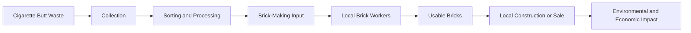
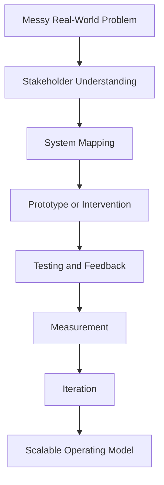

## Project Restub: Turning Cigarette Waste into Bricks Through Social Entrepreneurship

Before my work moved deeper into data science, AI governance, decision intelligence, and applied research, one of the most important parts of my undergraduate journey came through **Enactus SRM**.

Enactus gave me an early space to think about entrepreneurship not only as business creation, but as a way to solve practical social problems.

One of the projects I brainstormed and led during this period was **Project Restub** — an initiative focused on using **cigarette butt waste** as a potential input for **brick-making**, while involving **local brick workers** in the process.

At its core, Restub asked a simple but powerful question:

> Can a waste material that is usually ignored become part of a local production economy?

That question shaped the project.

It forced us to think across sustainability, waste collection, material reuse, informal labor, community participation, and the practical realities of making something usable outside a classroom or pitch competition.

---

## The Problem: Cigarette Butt Waste Is Small, Common, and Easy to Ignore

Cigarette butts are one of those waste materials that often disappear into the background.

They are small enough to be ignored individually, but common enough to become a large environmental problem collectively. They are found near streets, tea stalls, campuses, public places, offices, transport hubs, and markets.

Unlike plastic bottles or visible piles of garbage, cigarette butts often do not create immediate urgency. They are normalized as everyday litter.

That made the problem interesting.

It sat at the intersection of:

- environmental neglect,
- behavioral normalization,
- difficult collection,
- low public awareness,
- and unclear reuse pathways.

Project Restub began from the belief that this overlooked waste stream could potentially be redirected into something useful.

---

## The Idea: Convert Cigarette Butt Waste into Brick-Making Material

The central idea behind Project Restub was straightforward:

> Collect cigarette butt waste, process it safely, and explore its use as an input or additive in brick-making.

The goal was not to create a futuristic lab-only solution. The goal was to think about a sustainability model that could connect with existing local production systems.

That is why **local brick workers** were central to the idea.

Instead of imagining recycling as something that only happens in a specialized facility, Restub explored whether waste reuse could be connected to people already working in brick production.

The project was built around a practical question:

> Could cigarette butt waste be integrated into brick-making in a way that creates environmental value while also involving local workers?

This framing mattered because many sustainability projects fail when they ignore the people who would actually have to collect, process, produce, sell, or use the final product.

Restub was one of my earliest lessons in designing with the operating environment in mind.

---

## Why Local Brick Workers Mattered

One of the strongest parts of Restub was the decision to involve local brick workers.

This was not just a community engagement point. It was central to whether the idea could work.

Brick workers understand the practical realities of brick-making: material behavior, curing, handling, production constraints, cost pressures, and quality expectations.

That kind of knowledge is difficult to capture from theory alone.

By involving them, the project moved away from being only a student-led sustainability concept and became more grounded in implementation.

Instead of asking:

> Can we make something interesting from waste?

The better question became:

> Can this be made in a way that fits real production constraints?

That shift changed the nature of the project.

It made Restub less about an isolated prototype and more about a possible operating model.

---

## The Restub System

Project Restub was not just about creating a brick.

It was about thinking through the full loop: where the waste comes from, how it is collected, how it is processed, who produces the output, and how the final product could create value.

This loop was important because social entrepreneurship depends on repeatability.

A one-time prototype can show creativity.

A repeatable system can create impact.

---

## Project Restub as an Early Systems Thinking Exercise

Looking back, Restub was one of my earliest experiences with what I now understand as **systems thinking**.

The problem was not only that cigarette waste existed.

The system included multiple layers:

| System Layer | Design Question |
|---|---|
| Waste Source | Where are cigarette butts generated and collected from? |
| Collection | How can collection happen consistently and safely? |
| Processing | How should the waste be cleaned, treated, or prepared? |
| Production | Can local brick workers incorporate it into the process? |
| Quality | Will the bricks remain usable, durable, and safe? |
| Adoption | Who would trust and buy this product? |
| Impact | Does the model reduce waste while creating local economic value? |

This kind of layered thinking became relevant to my later work in data science, public-sector research, AI implementation, and governance.

A model, product, or solution is never only the technical idea.

It is the full chain around it.

Restub helped me understand that early.

---

## The Social Entrepreneurship Lens

The most valuable part of Enactus was that it made us think about solutions through a social entrepreneurship lens.

That means a project could not only be environmentally positive. It also had to make sense for people.

For Restub, that meant thinking about:

- whether local brick workers could realistically participate,
- whether cigarette butt waste could be collected consistently,
- whether processing could be done safely,
- whether the production process could be repeated,
- whether the bricks could be trusted by buyers,
- and whether the environmental impact could be measured honestly.

This is where Restub became more than a recycling idea.

It became a small ecosystem design problem.

---

## What I Learned from Project Restub

### 1. A good idea needs an operating model

It is easy to come up with an interesting concept.

It is much harder to make the concept operational.

Restub forced me to think about collection, processing, labor, production, adoption, and measurement together.

That lesson still shows up in my current work, especially when thinking about AI implementation, organizational readiness, and governance.

A technical solution is only useful if the surrounding workflow can absorb it.

---

### 2. Local knowledge matters

The involvement of brick workers was not secondary. It was essential.

They had practical knowledge that could not be replaced by assumptions.

That changed how I thought about expertise.

Expertise is not only academic or technical. It also lives in workers, operators, community members, and people who interact with the problem every day.

This lesson carried into my later work with public-sector digital experience, customer segmentation, and applied AI strategy.

---

### 3. Sustainability has to survive friction

A sustainability idea must work under real-world constraints.

Can the waste be collected?  
Can it be processed safely?  
Can the product be made consistently?  
Can people trust it?  
Can the model scale without becoming too expensive?

Restub made me realize that sustainability is not only about intention.

It is about execution.

---

### 4. Impact needs measurement

Even at an early stage, Restub raised important measurement questions.

How much cigarette waste could be diverted?  
How many bricks could be produced?  
How many workers could be involved?  
What would the cost difference be?  
What environmental benefit could be claimed honestly?

These questions shaped how I later approached data science.

Impact cannot just be asserted.

It has to be evidenced.

---

## Other Enactus SRM Projects I Worked On

Project Restub was one part of my broader Enactus SRM journey.

During my time with Enactus, I also worked on projects that explored crisis logistics, digital marketplaces, and social-impact distribution.

---

## FlyLife: Drone-Aided Medicine Delivery During COVID

One of the other projects I worked on was **FlyLife**, a drone-aided local medicine delivery concept developed during the COVID period.

The idea responded to a very real problem:

> How can essential medicines reach people when movement is restricted, delivery systems are under pressure, and physical access is limited?

FlyLife explored the use of drones to support local medicine delivery, especially in situations where contactless or rapid delivery could be valuable.

The project sat at the intersection of:

- healthcare access,
- emergency logistics,
- drone technology,
- local delivery networks,
- and pandemic response.

Even as a concept, it helped me think about technology as operational infrastructure during crisis situations.

It also introduced an important implementation challenge:

> The value of a technology depends on whether it can fit into real constraints around regulation, geography, safety, trust, and operations.

That lesson remains relevant in almost every applied AI or data science project I work on today.

---

## Enactus Marketplace: E-Commerce for Enactus India Products

Another project I contributed to was an **Enactus marketplace** — an e-commerce platform concept for products created across Enactus India initiatives.

The idea was to create a common platform where Enactus-produced products could be discovered, listed, and sold more effectively.

This addressed a different kind of problem.

Many student-led social entrepreneurship projects create useful products, but struggle with visibility, distribution, and repeatable sales channels.

The marketplace concept asked:

> Can we create a shared digital platform that helps social-impact products reach more buyers?

The value of the marketplace was not only e-commerce.

It was aggregation.

It could help connect:

- student-led ventures,
- social-impact products,
- local producers,
- buyers,
- and Enactus communities across India.

This project helped me think about platform design, product discovery, trust, and digital distribution.

It was an early version of a question I still care about:

> How do you turn scattered initiatives into a structured ecosystem?

---

## Connecting These Projects Together

Restub, FlyLife, and the Enactus marketplace may look like separate projects, but they were connected by a common pattern.

Each project tried to convert an overlooked gap into a practical system.

| Project | Core Problem | Proposed System |
|---|---|---|
| Project Restub | Cigarette butt waste and limited reuse pathways | Waste-to-brick model involving local brick workers |
| FlyLife | Medicine access during COVID restrictions | Drone-aided local medicine delivery |
| Enactus Marketplace | Limited visibility and distribution for Enactus products | E-commerce platform for Enactus India products |

The common thread was not just entrepreneurship.

It was **translation**.

Taking a real-world problem and translating it into a possible operating model.

That translation process became a foundation for how I now approach data science, AI strategy, product development, and governance.

---

## From Social Entrepreneurship to Applied Data Science

Project Restub was not a data science project in the traditional sense.

There was no complex model.  
No dashboard.  
No machine learning pipeline.

But it was deeply connected to the kind of applied problem-solving that data science requires.

It involved:

- defining a real-world problem,
- identifying stakeholders,
- understanding constraints,
- designing a measurable intervention,
- thinking about repeatability,
- and connecting technical feasibility with human adoption.

That is why I see Restub as part of my larger journey.

It was an early example of the same pattern I now use in more technical domains.

The tools changed over time.

The thinking stayed consistent.

---

## How Enactus Shaped My Later Work

My later work has moved into areas like AI governance, public-sector digital transformation, financial AI tools, logistics automation, and decision intelligence.

But the mindset behind those projects started much earlier.

Enactus taught me to ask:

- Who is affected by this problem?
- Who needs to be involved in the solution?
- What resources already exist locally?
- What would make the model sustainable?
- What does adoption actually require?
- How do we measure whether this worked?
- What happens after the prototype?

Those questions are still central to how I build.

Whether I am thinking about AI readiness for organizations, customer segmentation for public services, or automation tools for finance and logistics, the underlying philosophy is similar:

> A solution is only meaningful when it fits the system it is trying to improve.

---

## Why Project Restub Still Matters to Me

Project Restub matters to me because it represents an early attempt to build something practical, local, and impact-oriented.

It was not about creating a perfect solution on paper.

It was about noticing a neglected problem and trying to design a pathway from waste to value.

That is still the kind of work I care about:

- work that starts with real friction,
- work that respects local knowledge,
- work that creates usable systems,
- work that connects impact with implementation,
- and work that can be measured honestly.

Restub, FlyLife, and the Enactus marketplace were undergraduate projects, but they shaped how I think about entrepreneurship, technology, and responsibility.

They taught me that the best ideas are not always the most complicated.

Sometimes they start with a simple question:

> What are we currently throwing away — materially, socially, or operationally — that could become useful if we redesigned the system around it?

That question has followed me into almost every project since.

---

## Closing Reflection

My Enactus SRM experience gave me an early foundation in building for impact.

**Project Restub** showed me how sustainability ideas need local execution.  
**FlyLife** showed me how technology can support access during crisis.  
**The Enactus marketplace** showed me how platforms can create visibility for distributed social-impact products.

Together, these projects helped shape my approach to applied innovation.

They were not just undergraduate activities.

They were early experiments in the kind of work I continue to pursue today: building systems that are practical, measurable, human-centered, and designed for real-world adoption.

---

## Related Projects

- [Aegis AI Strategy & Audit](/projects/aegis-ai-strategy-audit/)
- [Public Sector Digital Experience & AI Governance](/projects/hennepin-county-dx-ai-governance/)
- [FinBizInfo: Financial Document Intelligence](/projects/finbizinfo/)
- [Decision Intelligence Frameworks](/blog/success-directory-decision-intelligence/)

## Relevant Links

- [My GitHub](https://github.com/ChinmayA301)
- [My Portfolio](https://app.chinmayarora.com/)
- [LinkedIn](https://www.linkedin.com/in/chinmay-arora/)
