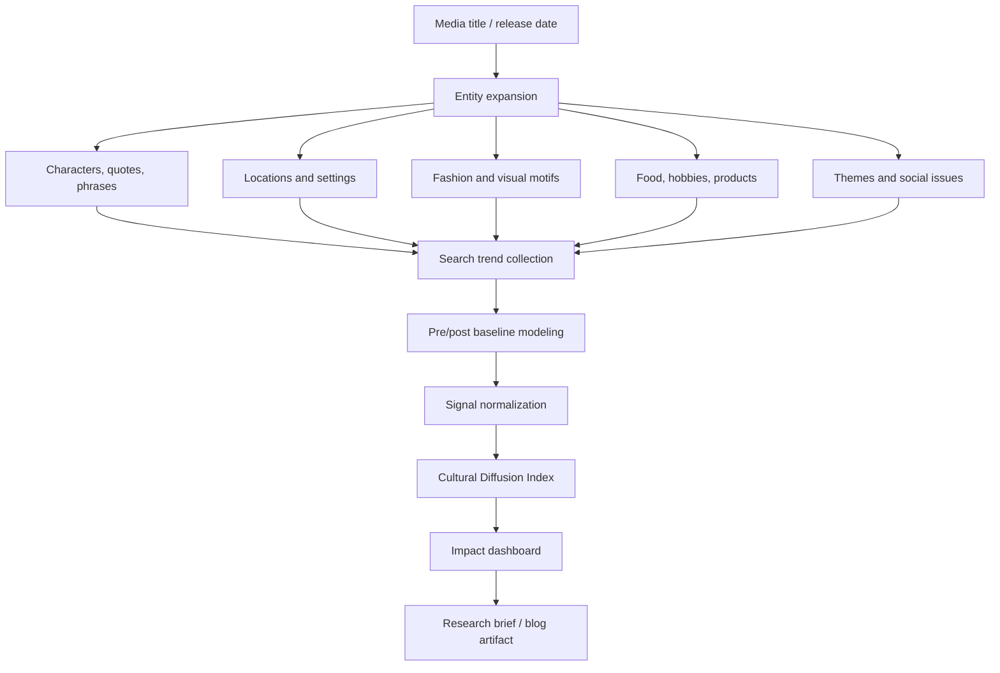

## Views are not cultural impact

A show can be watched by millions and leave almost no trace.

Another show can be watched by fewer people and permanently change how people dress, speak, travel, decorate their rooms, joke online, order food, or think about a place.

That difference is the starting point of this project.

The original idea was simple:

> Can we build a data science project that measures the cultural impact of popular movies and shows through lingo, fashion, conversation choices, social media behavior, holiday spots, restaurants, and opinions on topics?

That question is more interesting than a standard entertainment analytics dashboard.

Most media analytics focuses on performance:

- box office;
- streaming hours;
- completion rates;
- retention;
- critic scores;
- audience ratings;
- social mentions.

Those are useful, but they mostly answer:

> Did people consume it?

The better cultural question is:

> Did the media change behavior outside the screen?

That is harder to measure. It is also where the interesting data science lives.

## The research exploration

The project can be framed as:

> **Cultural Impact of Media: A Diffusion Analytics System**

The goal is to estimate how a piece of media spreads into culture across several channels:

1. **Language:** catchphrases, slang, quotes, memes, naming patterns.
2. **Fashion:** clothing styles, colors, accessories, makeup, haircuts.
3. **Tourism:** searches and visits to filming locations, themed travel, restaurants, hotels.
4. **Food and restaurants:** dish popularity, cuisine searches, reservation spikes, product demand.
5. **Social conversation:** topic framing, online discourse, sentiment shifts.
6. **Consumer behavior:** books, games, merchandise, hobbies, collectibles.
7. **Public opinion:** issue salience, identity discourse, political or social framing.

The output is not a single “popularity score.”

The output is a **cultural diffusion map**.

## A real example: The Queen’s Gambit and chess

A clean example is *The Queen’s Gambit*.

After the Netflix show premiered in 2020, chess became more visible in mainstream culture. Variety reported that in the three weeks after release, U.S. chess set unit sales rose 87%, while chess book sales rose 603%. That does not prove the show caused every new purchase, especially because pandemic-era indoor hobbies were already rising, but it is a strong cultural signal.

The more interesting part is not that people watched the show.

It is that the show appeared to move behavior in adjacent markets:

- chess sets;
- chess books;
- online chess interest;
- fashion aesthetics;
- social media discussion;
- women-in-chess discourse;
- retro interior moodboards.

That is the kind of signal this project should detect.

## What counts as cultural impact?

Cultural impact is not one thing.

It is a family of traces.

| Impact type | Observable signal | Example data source |
|---|---|---|
| Linguistic diffusion | phrase frequency, quote reuse, meme templates | Reddit, X, TikTok captions, YouTube comments, Google Trends |
| Fashion diffusion | garment/color/style mentions, product searches | Pinterest, Instagram, Google Shopping, resale platforms |
| Tourism diffusion | searches for locations, bookings, reviews | Google Trends, TripAdvisor, Airbnb, tourism boards |
| Hobby adoption | search and purchase spikes | Google Trends, Amazon ranks, public sales reports |
| Food diffusion | recipe searches, restaurant reviews, menu mentions | Google Trends, Yelp/Google reviews, recipe sites |
| Opinion diffusion | topic sentiment and framing shifts | news, social media, surveys |
| Identity diffusion | communities adopting characters, symbols, aesthetics | hashtags, fan forums, creator content |

The goal is to combine these into one exploratory framework without pretending every correlation is causal.

That caveat is critical.

A spike after a show is not automatically caused by the show. The analysis needs baselines, comparison terms, pre/post windows, and ideally external controls.

## A Cultural Diffusion Index

A useful prototype metric could be the **Cultural Diffusion Index**.

Let each media title `m` have impact signals across dimensions `d`:

- `Z_lang` = normalized language diffusion
- `Z_fashion` = normalized fashion diffusion
- `Z_tourism` = normalized tourism diffusion
- `Z_food` = normalized food/restaurant diffusion
- `Z_market` = normalized product or hobby adoption
- `Z_opinion` = normalized public discourse shift
- `Q` = quality/confidence score for data reliability
- `C` = causality caution penalty

Then:

$$
CDI_m = Q_m \times \sum_{d=1}^{D} w_d Z_{m,d} - C_m
$$

Where:

- `w_d` can be equal weights at first;
- later weights can be learned from expert annotation or downstream outcomes;
- `C_m` penalizes cases with weak attribution or obvious confounders;
- `Q_m` increases when multiple independent data sources point in the same direction.

The result should be interpreted as:

> “How strongly does this title appear to diffuse into culture across observable channels?”

Not:

> “This show caused culture to change by X percent.”

That second claim would be fake precision.

## System architecture



The most important step is **entity expansion**.

A show does not spread only under its title. It spreads through fragments: character names, outfits, locations, memes, objects, recipes, quotes, aesthetics, and social debates.

For example, a project on *Emily in Paris* should not only track “Emily in Paris.” It should track Paris travel searches, berets, specific restaurants, French-girl fashion, filming locations, and social discourse around cliché, luxury, work culture, and American fantasy.

## The data science problem

This project is not just scraping social media and making a dashboard.

The hard parts are:

1. **entity resolution** — mapping a phrase or product to the media title;
2. **baseline estimation** — knowing what would have happened without the media event;
3. **lag modeling** — some effects happen immediately, others peak weeks later;
4. **cross-platform normalization** — TikTok, Google Trends, Reddit, and news behave differently;
5. **causal humility** — avoiding overclaiming when confounders exist;
6. **cultural context** — knowing that the same symbol can mean different things in different communities.

A good portfolio project should show this tension rather than hide it.

## Exploratory analysis code

Here is a simple template for analyzing pre/post search interest. It assumes you have a weekly Google Trends-style dataset with columns:

- `week`
- `term`
- `interest`
- `release_date`

```python
import pandas as pd
import numpy as np


def pre_post_lift(df, term, release_date, pre_weeks=8, post_weeks=8):
    data = df[df["term"] == term].copy()
    data["week"] = pd.to_datetime(data["week"])
    release_date = pd.to_datetime(release_date)

    pre = data[(data["week"] >= release_date - pd.Timedelta(weeks=pre_weeks)) &
               (data["week"] < release_date)]
    post = data[(data["week"] >= release_date) &
                (data["week"] < release_date + pd.Timedelta(weeks=post_weeks))]

    pre_mean = pre["interest"].mean()
    post_mean = post["interest"].mean()

    lift = (post_mean - pre_mean) / (pre_mean + 1e-6)
    z_lift = (post_mean - pre_mean) / (pre["interest"].std() + 1e-6)

    return {
        "term": term,
        "pre_mean": pre_mean,
        "post_mean": post_mean,
        "relative_lift": lift,
        "z_lift": z_lift
    }
```

For a stronger version, add controls:

```python
def difference_in_differences(df, treated_term, control_term, release_date, window=8):
    release_date = pd.to_datetime(release_date)
    df = df.copy()
    df["week"] = pd.to_datetime(df["week"])
    df = df[df["term"].isin([treated_term, control_term])]
    df = df[(df["week"] >= release_date - pd.Timedelta(weeks=window)) &
            (df["week"] < release_date + pd.Timedelta(weeks=window))]

    df["post"] = (df["week"] >= release_date).astype(int)
    means = df.groupby(["term", "post"])["interest"].mean().unstack()

    treated_change = means.loc[treated_term, 1] - means.loc[treated_term, 0]
    control_change = means.loc[control_term, 1] - means.loc[control_term, 0]

    return treated_change - control_change
```

This is still exploratory. A real causal analysis would require better controls, robustness checks, and sensitivity analysis.

## NLP layer: tracking language diffusion

The language side of the project can be built with a phrase and embedding pipeline.


The model should track not only exact quotes, but paraphrases and meme mutations.

For example:

- exact quote reuse;
- altered quote templates;
- character-name references;
- catchphrase fragments;
- hashtags;
- audio-caption reuse;
- jokes that no longer mention the original show.

That last category is the most interesting. A phrase has truly entered culture when people use it without needing to cite the source.

## Visual/fashion layer

Fashion impact is harder than text because it requires visual understanding.

Possible signals:

- Pinterest board title frequency;
- TikTok outfit hashtags;
- resale marketplace listing language;
- Google Shopping trend data;
- color palette extraction from show frames;
- Instagram caption terms;
- magazine trend articles;
- product page search terms.

A simple computer vision extension could extract dominant colors and motifs from promotional stills, then track how those terms appear in fashion content.

Example feature table:

| Media title | Visual motif | Observable proxy |
|---|---|---|
| The Queen’s Gambit | 1960s mod coats, chessboard patterns | fashion article mentions, Pinterest boards |
| Barbie | pinkcore, plastic-fantasy aesthetics | pink clothing searches, Barbiecore hashtags |
| Squid Game | tracksuits, white slip-on shoes | costume sales, sneaker searches |
| Emily in Paris | Parisian tourism/fashion fantasy | travel searches, outfit posts |
| Chef’s Table | artisan plating and restaurant discovery | restaurant reservations, food search trends |

The project becomes stronger when each proxy has a confidence level.

## Dashboard design

A clean dashboard could include:

1. **Title selector:** choose a film/show/game.
2. **Release timeline:** pre-release, launch, peak, decay.
3. **Impact radar:** language, fashion, tourism, food, market, opinion.
4. **Top diffused entities:** phrases, places, products, outfits, topics.
5. **Causality confidence:** weak, moderate, strong.
6. **Evidence cards:** links to trend spikes, articles, datasets, charts.
7. **Comparable titles:** similar release windows or genre baselines.

The dashboard should avoid ranking culture like a vanity leaderboard. The better output is a **research brief** explaining where the evidence is strong and where it is speculative.

## A possible Cultural Diffusion dashboard schema

```python
impact_schema = {
    "media_title": "The Queen's Gambit",
    "release_date": "2020-10-23",
    "signals": {
        "language": {"score": 0.62, "confidence": "medium"},
        "fashion": {"score": 0.58, "confidence": "medium"},
        "tourism": {"score": 0.22, "confidence": "low"},
        "hobby_adoption": {"score": 0.91, "confidence": "high"},
        "public_discourse": {"score": 0.68, "confidence": "medium"}
    },
    "evidence": [
        "reported chess set sales increase",
        "reported chess book sales increase",
        "Google Trends lift for chess-related terms",
        "increase in online chess discussion"
    ],
    "causality_warning": "Pandemic-era hobby adoption is a major confounder."
}
```

This kind of schema makes the project useful for both technical and editorial work.

It can power charts, but it can also power narrative explanation.

## Where this becomes a serious research project

The strongest version of this project would compare several media titles across different types of impact.

For example:

| Title | Primary impact hypothesis | Best data sources |
|---|---|---|
| The Queen’s Gambit | hobby adoption and chess aesthetics | sales reports, Google Trends, chess platform activity |
| Squid Game | costume/fashion and meme diffusion | search trends, retail/costume data, social hashtags |
| Barbie | fashion/color/aesthetic diffusion | retail, social media, fashion coverage |
| White Lotus | tourism and luxury travel discourse | travel search, hotel interest, tourism reports |
| Succession | workplace/business language and status discourse | LinkedIn, X, news, meme pages |
| Chef’s Table | restaurant discovery and food aesthetics | restaurant reviews, reservations, food media |

The analytical question becomes:

> Which titles create narrow spikes, and which titles reshape behavior across multiple cultural channels?

That is a more useful media question than “what got the most views?”

## Portfolio positioning

This project is a strong data analyst/data science portfolio piece because it can show:

- NLP pipeline design;
- trend analysis;
- causal inference awareness;
- dashboarding;
- entity extraction;
- time-series analysis;
- data storytelling;
- skepticism around noisy social data;
- product thinking for media intelligence.

The weak version is a pretty dashboard with scraped tweets.

The strong version is a **measurement system for cultural diffusion with uncertainty labels**.

That distinction matters.

Anyone can count mentions. Fewer people can explain whether those mentions mean anything.

## Product framing

Possible users:

| User | Use case |
|---|---|
| Streaming platforms | Understand downstream cultural impact beyond watch time |
| Studios | Identify which motifs become culturally valuable |
| Tourism boards | Detect media-driven destination demand |
| Fashion brands | Track emerging aesthetics from media |
| Publishers | Study adaptation impact on book or hobby demand |
| Researchers | Analyze media-driven social diffusion |
| Journalists | Build evidence-backed cultural trend stories |

The product should not claim perfect causality. Its value is structured evidence.

A realistic positioning:

> “A cultural analytics engine that tracks how media properties move through language, consumer behavior, tourism, fashion, and public discourse — with confidence scores instead of hype.”

## The deeper point

Culture is not just what people watch.

Culture is what people repeat.

It is what they buy, quote, wear, visit, cook, remix, imitate, debate, and turn into identity.

That is why this project is interesting. It treats media not as content inventory, but as a diffusion system.

A good film or show does not end at the credits.

It leaks into the world.

This project is about measuring the leak.

## References and source anchors

- Variety. “The Queen’s Gambit Spurs Boom in Sales of Chess Sets, Books.” 2020. [https://variety.com/2020/digital/news/queens-gambit-chess-sets-books-sales-1234839925/](https://variety.com/2020/digital/news/queens-gambit-chess-sets-books-sales-1234839925/)
- Reuters. “Spanish chess board sales soar after Queen’s Gambit cameo.” 2021. [https://www.reuters.com/lifestyle/oddly-enough/spanish-chess-board-sales-soar-after-queens-gambit-cameo-2021-02-16/](https://www.reuters.com/lifestyle/oddly-enough/spanish-chess-board-sales-soar-after-queens-gambit-cameo-2021-02-16/)
- Cardoso et al. “Film induced tourism: a systematic literature review.” Tourism & Management Studies, 2017. [https://www.tmstudies.net/index.php/ectms/article/view/1021](https://www.tmstudies.net/index.php/ectms/article/view/1021)
- Kim. “Chronicles of Film Tourism: An Integrative Review and Scientometric Analysis.” 2026. [https://journals.sagepub.com/doi/abs/10.1177/10963480241305762](https://journals.sagepub.com/doi/abs/10.1177/10963480241305762)
- Google Trends. [https://trends.google.com](https://trends.google.com)
- pytrends unofficial API. [https://github.com/GeneralMills/pytrends](https://github.com/GeneralMills/pytrends)

## Related posts and project links

- Related: `The Success Directory: Decision Intelligence for Ambiguous Choices`  
- Related: `Media Worlds and Experience Rooms`  
- GitHub project placeholder: `github.com/ChinmayA301/cultural-diffusion-index`
