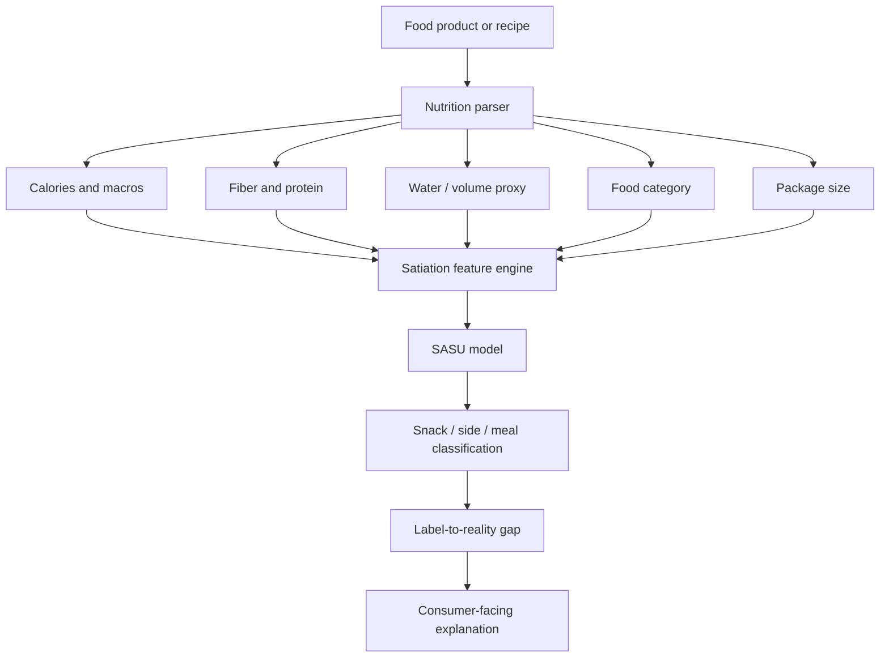

## Serving size is not the same as a meal

Nutrition labels often look precise.

They are not always useful.

A serving size can be legally correct and practically misleading at the same time.

That is the gap this project starts from.

The original idea was to build a system that reconfigures food products away from idealized nutrient-label serving sizes and toward **actual satiation and meal sizes for regular adult individuals**.

That matters because most people do not eat according to label logic. They eat according to hunger, convenience, habit, packaging, fullness, time pressure, social context, and meal expectations.

A label might say one serving is 30 grams. But if a normal adult routinely eats 75 grams before feeling satisfied, the label is technically true while still failing the user.

The project asks:

> What if food labels showed not just a serving size, but a satiation-adjusted eating unit?

Not “what is the recommended portion?”

Not “what amount did regulation assign?”

But:

> How much of this food behaves like a realistic snack, side, or meal for an adult body?

## The current serving-size problem

In the U.S., serving sizes are tied to Reference Amounts Customarily Consumed, or RACCs. The FDA updated parts of the Nutrition Facts label rule in 2016, noting that amounts people consume had changed and that reference amounts needed adjustment.

That is a practical improvement. But it still leaves a deeper issue:

> “Customarily consumed” is not the same as “satiating.”

A serving size can reflect consumption norms without telling the user whether the food will function as a meal, a snack, or a hunger trap.

Two foods can both be 250 calories. One may keep someone full for hours. The other may barely register.

That difference is not captured well by serving-size labels.

## The research concept

The project can be framed as:

> **Satiation-Adjusted Serving System**

Its goal is to build a data layer that translates nutrition facts into more realistic adult eating units.

Instead of only saying:

> “Serving size: 30g”

The system could say:

> “30g is a label serving. Estimated adult satiating snack unit: 65g. Estimated meal-equivalent unit: 180g when paired with protein/fiber.”

The exact numbers would depend on the food, the person, and the meal context. That is why this should be presented as an estimate, not medical prescription.

## Why satiety is different from calories

Calories measure energy.

Satiety describes fullness and reduced desire to continue eating.

They are related, but they are not the same.

A 240-calorie portion of boiled potatoes does not produce the same fullness response as a 240-calorie portion of a pastry. Holt, Brand Miller, Petocz, and Farmakalidis published a satiety index study in 1995 comparing 1000 kJ / 240 kcal portions of common foods and found major differences in satiety ratings across foods.

That research is old and limited, but it makes the important point: equal calories do not mean equal fullness.

Several food properties tend to influence satiety:

- protein;
- fiber;
- water content;
- volume;
- energy density;
- chewing effort;
- food matrix;
- glycemic response;
- palatability;
- meal context;
- individual physiology.

A label that ignores these differences gives users a thin view of eating behavior.

## The Satiation-Adjusted Serving Unit

A prototype metric could be called the **Satiation-Adjusted Serving Unit**, or `SASU`.

The idea is to estimate how many grams of a food are likely to function as a meaningful adult eating unit.

Let:

- `E` = calories per gram
- `P` = protein grams per 100g
- `F` = fiber grams per 100g
- `W` = water/volume proxy
- `D` = energy density penalty
- `S` = empirical satiety index if available
- `C` = context multiplier, such as snack, side, meal, dessert

A simple conceptual form:

$$
SatietyScore = \alpha P + \beta F + \gamma W + \delta S - \lambda D
$$

Then:

$$
SASU_{grams} = \frac{TargetFullness}{SatietyScore \times C}
$$

This is not a nutrition standard. It is a modeling framework.

The point is to generate more honest serving interpretations, such as:

| Label concept | What it tells you | Limitation |
|---|---|---|
| Serving size | Regulatory or customary amount | May not match fullness |
| Calories per serving | Energy in the label unit | Does not explain satiety |
| % Daily Value | Nutrient contribution | Not meal realism |
| Satiation-adjusted unit | Estimated realistic eating amount | Requires modeling and uncertainty |

The system should show uncertainty because satiety varies between people.

## Example output

For a food product, the interface might show:

```text
Product: Sweetened cereal
Label serving: 39g
Calories per label serving: 150
Estimated adult snack-satiating unit: 70–95g
Estimated breakfast meal unit if eaten alone: 100–130g
Meal recommendation: pair with high-protein dairy or fruit to improve satiety
Satiation risk: high palatability, low protein, low fiber
```

For another food:

```text
Product: Lentil soup
Label serving: 245g
Calories per label serving: 180
Estimated adult lunch-satiating unit: 350–500g
Meal recommendation: sufficient as light meal; stronger with grain or yogurt side
Satiation risk: moderate-low
```

That is the real value: the user sees the difference between **label serving** and **meal behavior**.

## Architecture



The most important output is the **label-to-reality gap**.

That gap answers:

> How far is the official serving size from the amount a normal adult may actually need to feel satisfied?

## Label-to-Reality Gap

Define:

$$
LRG = \frac{SASU_{grams} - LabelServing_{grams}}{LabelServing_{grams}}
$$

Where:

- `LRG = 0` means the label serving roughly matches the modeled satiating unit;
- `LRG = 1.0` means the satiating unit is estimated at 2x the label serving;
- `LRG = -0.25` means the label serving may be larger than the modeled satiating unit.

Example:

```python
label_serving_g = 30
sasu_g = 75
label_to_reality_gap = (sasu_g - label_serving_g) / label_serving_g
print(label_to_reality_gap)  # 1.5, meaning 150% larger than label serving
```

This metric would be immediately understandable for consumers:

> “The realistic snack amount is about 2.5 label servings.”

That is more useful than quietly showing calories per serving and letting users do mental math.

## Prototype code

Below is a simplified scoring function. It is not medically validated. It is a transparent prototype for portfolio exploration.

```python
import math


def satiety_score(calories_per_100g, protein_g, fiber_g, water_proxy=0.5, satiety_index=None):
    energy_density = calories_per_100g / 100

    protein_component = 0.35 * protein_g
    fiber_component = 0.30 * fiber_g
    water_component = 2.0 * water_proxy
    density_penalty = 0.65 * energy_density

    empirical_component = 0
    if satiety_index is not None:
        # Normalize around white bread = 100 in the Holt satiety index tradition.
        empirical_component = 0.02 * (satiety_index - 100)

    score = protein_component + fiber_component + water_component + empirical_component - density_penalty
    return max(score, 0.1)


def estimate_sasu_grams(calories_per_100g, protein_g, fiber_g, context="snack", water_proxy=0.5, satiety_index=None):
    score = satiety_score(calories_per_100g, protein_g, fiber_g, water_proxy, satiety_index)

    target_fullness = {
        "snack": 8,
        "side": 11,
        "light_meal": 16,
        "meal": 22
    }[context]

    grams = 100 * target_fullness / score
    return round(grams, 0)


# Example: low-fiber, low-protein snack food
print(estimate_sasu_grams(
    calories_per_100g=500,
    protein_g=6,
    fiber_g=2,
    context="snack",
    water_proxy=0.1
))

# Example: higher-fiber, higher-water food
print(estimate_sasu_grams(
    calories_per_100g=90,
    protein_g=5,
    fiber_g=5,
    context="light_meal",
    water_proxy=0.8
))
```

Again: this is a toy model. The point is to make the assumptions visible.

A production version would need validation against real satiety studies, food diaries, continuous glucose data where appropriate, and user-reported fullness.

## What data would power it?

A real version could combine:

| Data source | Use |
|---|---|
| USDA FoodData Central | nutrient composition |
| FDA RACC tables | official serving-size comparison |
| branded food datasets | packaged food parsing |
| satiety-index research | empirical satiety anchors |
| food diary datasets | real consumption patterns |
| recipe databases | meal context and pairings |
| user feedback | fullness after eating |
| wearable/app integrations | optional behavioral context |

USDA FoodData Central is especially useful because it provides structured nutrient data and an API for developers.

## The dashboard idea

The dashboard should be brutally simple.

For any product, show:

1. label serving size;
2. calories per label serving;
3. estimated snack satiation unit;
4. estimated meal unit;
5. label-to-reality gap;
6. satiety drivers: protein, fiber, water, energy density;
7. recommended pairing logic;
8. uncertainty band.

Example table:

| Product type | Label serving | Estimated snack unit | Label-to-reality gap | Main issue |
|---|---:|---:|---:|---|
| Chips | 28g | 65–90g | high | low protein/fiber, high palatability |
| Greek yogurt | 170g | 170–230g | low/moderate | strong protein |
| Cereal | 39g | 70–130g | high | low protein unless paired |
| Lentil soup | 245g | 350–500g meal | moderate | depends on meal context |
| Nuts | 28g | 30–50g | low | high energy density but satiating fats/protein |

This is more useful than a “healthy/unhealthy” score.

The goal is not moral judgment. The goal is portion realism.

## Why this matters for public health

A lot of nutrition tools fail because they assume users are behaving like spreadsheets.

Most people are not asking:

> “What percentage of my daily riboflavin is this?”

They are asking:

> “Will this actually keep me full?”

Or:

> “Why did I eat three servings when the label said one?”

The answer is often not lack of discipline. It is a mismatch between label units and lived eating units.

A satiation-adjusted system could make that mismatch visible.

That would help:

- consumers understand realistic portions;
- dietitians explain food choices without moralizing;
- food companies design more honest products;
- public health researchers study portion distortion;
- grocery apps provide better meal planning;
- people compare foods by fullness, not just calories.

## The hard problems

This project should not pretend satiety is simple.

The hard problems include:

1. **Individual variation:** age, body size, activity, medication, sleep, hormones, and health status matter.
2. **Meal context:** cereal alone is different from cereal with high-protein yogurt and fruit.
3. **Palatability:** highly rewarding foods can override fullness cues.
4. **Liquid calories:** beverages often behave differently from solid foods.
5. **Ultra-processed foods:** texture and food matrix matter beyond macros.
6. **Cultural eating patterns:** meal norms differ by cuisine and household.
7. **Risk of diet culture misuse:** the system must avoid becoming another shame-based food score.

The product must be designed carefully.

It should say:

> “Here is how this food may behave as a portion.”

Not:

> “Here is what you are allowed to eat.”

That distinction is non-negotiable.

## Evaluation plan

A rigorous version would evaluate predictions against actual satiety outcomes.

| Evaluation question | Possible metric |
|---|---|
| Does predicted SASU match reported fullness? | MAE/RMSE against fullness survey outcomes |
| Does LRG predict overeating risk? | correlation with consumed grams above label serving |
| Does the system improve meal planning? | user study, pre/post satisfaction and hunger |
| Does it work across food categories? | category-level error analysis |
| Does it avoid harmful dieting behavior? | qualitative safety review |
| Does it handle cultural meals? | subgroup review by cuisine/meal type |

A good research prototype could start with a small user study:

1. participants log foods and amounts;
2. they rate fullness at 0, 30, 60, 120 minutes;
3. the model predicts satiation-adjusted units;
4. errors are analyzed by food category and person-level variation.

That is realistic enough for a portfolio project and serious enough to show research maturity.

## Product framing

Possible product versions:

| Product | User |
|---|---|
| Browser extension for grocery websites | consumers |
| Dietitian dashboard | nutrition professionals |
| Grocery comparison app | meal planners |
| Food-label research tool | public health researchers |
| Product reformulation assistant | food companies |
| API for nutrition apps | health-tech platforms |

The strongest initial version is probably not a consumer weight-loss app. That space is crowded and ethically messy.

The stronger version is a **food-label intelligence layer**:

> “Translate label serving sizes into realistic adult snack and meal units.”

That is specific, useful, and technically defensible.

## Portfolio positioning

This project would signal:

- data modeling;
- public health understanding;
- nutrition data engineering;
- API usage;
- interpretable scoring systems;
- dashboard design;
- user-centered analytics;
- responsible health-tech framing.

The weak version is a calorie calculator.

The strong version is a **serving-size realism engine**.

It does not tell people what to eat. It tells them what the label is hiding.

## References and source anchors

- FDA. “Final Rules to Update the Nutrition Facts Label.” 2016. [https://www.fda.gov/files/food/published/Final-Rules-to-Update-the-Nutrition-Facts-Label.pdf](https://www.fda.gov/files/food/published/Final-Rules-to-Update-the-Nutrition-Facts-Label.pdf)
- FDA. “Reference Amounts Customarily Consumed.” [https://www.fda.gov/media/102587/download](https://www.fda.gov/media/102587/download)
- Federal Register. “Food Labeling: Serving Sizes of Foods That Can Reasonably Be Consumed At One Eating Occasion.” 2016. [https://www.federalregister.gov/documents/2016/05/27/2016-11865/food-labeling-serving-sizes-of-foods-that-can-reasonably-be-consumed-at-one-eating-occasion](https://www.federalregister.gov/documents/2016/05/27/2016-11865/food-labeling-serving-sizes-of-foods-that-can-reasonably-be-consumed-at-one-eating-occasion)
- Holt, S. H. A., Brand Miller, J. C., Petocz, P., & Farmakalidis, E. “A Satiety Index of Common Foods.” European Journal of Clinical Nutrition, 1995. [https://pubmed.ncbi.nlm.nih.gov/7498104/](https://pubmed.ncbi.nlm.nih.gov/7498104/)
- USDA FoodData Central API Guide. [https://fdc.nal.usda.gov/api-guide](https://fdc.nal.usda.gov/api-guide)
- USDA FoodData Central. [https://fdc.nal.usda.gov](https://fdc.nal.usda.gov)

## Related posts and project links

- Related: `Public Health Data Science and Food Systems`  
- Related: `Decision Intelligence for Everyday Choices`  
- GitHub project placeholder: `github.com/ChinmayA301/satiation-adjusted-serving-system`
