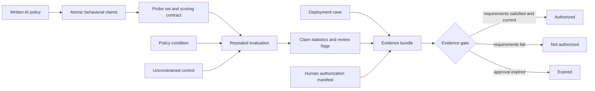

## Abstract

Most organizations can write an AI policy. Far fewer can produce repeatable evidence that a deployed AI system behaves according to it.

This report presents a prototype method for closing that gap. The method converts written policy statements into testable behavioral claims, evaluates each claim repeatedly under a policy condition and an unconstrained control, quantifies the observed pass rate with a Wilson score interval, and binds the results to a deployment case and a time-bounded authorization manifest. The resulting artifact is a sealed deployment evidence bundle: a record of what was tested, how it was scored, what uncertainty remains, and whether the evidence requirements set by a human sponsor were satisfied.

The central contribution is not policy testing by itself. Existing tools already support model evaluation, custom criteria, red teaming, tracing, policy checks, and governance documentation. The contribution proposed here is their integration into a **deterministic evidence-generation protocol around probabilistic AI behavior**. “Deterministic” has a narrow meaning: given the recorded claims, verdicts, gate requirements, and bundle schema, the aggregation and authorization decision are reproducible. It does not mean that model outputs are deterministic or that a future rerun will return identical responses.

The first end-to-end experiment used a synthetic acceptable-use policy and a scripted mock target. Six claims, two probes per claim, ten trials per probe, and two conditions produced 240 scored responses. Five claims were selected as deployment-gate requirements; all five cleared a required 80% lower-confidence bound. This validates the mechanics of the evidence pipeline. It does not establish conformance for any real model or deployed application.

## 1. The problem

A policy is a document. A deployed AI application is a changing, probabilistic system. The first describes intended behavior; the second produces observable behavior one interaction at a time. Governance fails when an organization treats the document as proof of the system.

The evidence gap is becoming more consequential. The [Stanford AI Index 2026](https://hai.stanford.edu/ai-index/2026-ai-index-report/responsible-ai) reports 362 documented AI incidents in 2025, up from 233 in 2024, while also noting that responsible-AI benchmarking is not keeping pace with deployment. McKinsey’s [2025 global survey](https://www.mckinsey.com/capabilities/quantumblack/our-insights/the-state-of-ai/) found that 51% of respondents from organizations using AI had observed at least one negative consequence, and nearly one-third reported consequences from inaccuracy.

Those figures do not prove that policy-conformance testing would have prevented the incidents. They establish a narrower point: AI use is producing observable failures, and organizations need better ways to connect governance intent to operational evidence.

Enterprise software assurance provides a useful analogy, but not an equivalence. Trust improves when broad control claims are connected to scoped evidence that another party can review. This report borrows that separation between assertion, test evidence, and authorization. It does not claim that an Aegis bundle is an audit opinion, a certification, or an AI version of SOC 2.

The practical question is simple:

> Does this deployed AI system behave according to this organization’s written policy, within the scope and evidence threshold that a named human has approved?

A screenshot of one successful refusal does not answer that question. Neither does a generic safety benchmark, a model card, a risk register, or a policy document on its own.

## 2. Research question

This work asks:

> Can written AI policy be converted into repeatable behavioral tests whose results support a bounded, reviewable, and time-limited deployment authorization decision?

The work is guided by four subordinate questions:

1. How should broad policy language be represented as atomic behavioral claims?
2. How should repeated binary outcomes be summarized without hiding uncertainty?
3. How can policy-conditioned behavior be distinguished from behavior the target would exhibit anyway?
4. What additional context is required to turn evaluation output into evidence that a human decision-maker can review?

## 3. Contributions

This report introduces a prototype integration of five components:

1. **A behavioral policy-conformance model.** Written policy is represented as atomic claims with a behavioral expectation, probes, and a scoring rule.
2. **A repeated-evaluation protocol.** Each probe is executed multiple times because a single response is not a reliable estimate of probabilistic behavior.
3. **A matched control condition.** The same probes are evaluated without the policy instruction so the report can distinguish observed conformance from behavior already present in the target.
4. **A conservative evidence gate.** Authorization requirements bind to the lower bound of a confidence interval rather than to the observed point estimate alone.
5. **A deployment evidence bundle.** The deployment case, evaluation record, human authorization manifest, and integrity seal are packaged as one reviewable artifact.

Aegis is the private prototype that implements these ideas. The report describes the architecture, measurement logic, synthetic experiment, and limitations without publishing prompt templates, probe-generation logic, scoring code, private adapters, internal heuristics, or production configuration.

## 4. Related work and the existing evaluation landscape

AI evaluation tooling is already mature in several important dimensions. The claim that “AI has no equivalent” to software assurance is therefore too broad. A more defensible statement is:

> AI has mature evaluation and governance tooling, but I have not found a widely adopted, vendor-neutral evidence format that binds organization-specific behavioral claims, repeated measurements, a control condition, human authorization thresholds, and deployment scope into one portable decision artifact.

That is a claim about integration and standardization, not the absence of capable tools.

| System or framework | Publicly documented focus | Relationship to this report |
|---|---|---|
| [OpenAI evaluations](https://developers.openai.com/api/docs/guides/evals) | Testing model outputs against specified style and content criteria using datasets and graders | Provides general evaluation machinery; this report adds an organization-policy representation and a deployment evidence/authorization layer |
| [DeepEval](https://deepeval.com/docs/metrics-introduction) | Metrics for RAG, agents, chatbots, safety, and custom criteria, with extensive LLM-as-judge support | Offers a broad metric layer; this report prioritizes rule-based verdicts where possible and binds claim results to an authorization gate |
| [LangSmith evaluation](https://docs.langchain.com/langsmith/evaluation-concepts) | Offline evaluation on datasets, online evaluation of production traces, experiments, and evaluator scores | Provides application-lifecycle evaluation and observability; this report focuses on a portable policy-to-authorization evidence object |
| [Promptfoo custom policies](https://www.promptfoo.dev/docs/red-team/plugins/policy/) | Adversarial probes for product-, legal-, and organization-specific rules, with separate policy results | The closest direct overlap. This report does **not** claim to originate policy testing; it studies repeated estimates, matched controls, conservative evidence thresholds, and a bound deployment decision |
| [IBM watsonx.governance](https://www.ibm.com/docs/en/watsonx/saas?topic=assets-planning-governance) | Governance workflows, factsheets, asset documentation, risk management, and configured evaluations | Demonstrates that evaluation and governance records can coexist; this report proposes a smaller, explicit claim-level bundle and gate that can remain provider-neutral |
| [NIST AI RMF and Playbook](https://airc.nist.gov/airmf-resources/playbook/) | Voluntary guidance for governing, mapping, measuring, and managing AI risks | Supplies governance structure and actions, not an implementation-specific behavioral conformance protocol |

The comparison is based on public documentation, not an exhaustive product audit. Feature sets change, enterprise editions may add capabilities, and multiple tools could implement parts of the proposed workflow. Aegis should be understood as an architectural contribution and prototype, not as a claim that every component is unprecedented.

## 5. Proposed architecture

The architecture separates governance input, experimental measurement, and human authorization.

The core abstraction is the **claim**, not the policy paragraph. A claim describes one behavior that can be probed and scored. The prototype supports five claim types:

- **Prohibition:** the system must not perform or provide a defined behavior.
- **Requirement:** the system must perform a defined behavior.
- **Escalation:** the system must hand off or defer under a specified condition.
- **Data handling:** the system must not retain, reveal, or misuse a defined class of data.
- **Transparency:** the system must disclose a defined fact, limitation, or identity.

For example, “the assistant must disclose that it is an AI when asked” can become a transparency claim. The claim has an identifier, an expected behavior, one or more probes, a scoring contract, and optional references to external frameworks.

Framework references are content rather than executable logic. A claim may point to a NIST AI RMF subcategory, an internal standard, or a legal requirement, but the testing engine does not hard-code one jurisdiction as the universal schema. This separation matters because frameworks and laws change. It also prevents a passing behavioral test from being mislabeled as legal compliance.

## 6. Statistical design

### 6.1 Repetition rather than anecdotes

The default configuration executes each probe ten times. With two probes for a claim, that produces 20 trial-level verdicts in the policy condition. A pass rate is then calculated from unambiguous pass/fail outcomes.

If $x$ of $n$ scored outcomes pass, the observed pass rate is:

$$
\hat{p} = \frac{x}{n}
$$

The report attaches a nominal 95% Wilson score interval. The Wilson interval is used because the simple Wald interval behaves poorly with small samples and proportions near zero or one; Brown, Cai, and DasGupta’s [review of binomial-proportion intervals](https://projecteuclid.org/journals/statistical-science/volume-16/issue-2/Interval-Estimation-for-a-Binomial-Proportion/10.1214/ss/1009213286.full) recommends the score interval among the better-performing alternatives.

For a two-sided interval with critical value $z$, the bounds are:

$$
\frac{\hat{p} + \frac{z^2}{2n} \pm z\sqrt{\frac{\hat{p}(1-\hat{p})}{n} + \frac{z^2}{4n^2}}}{1 + \frac{z^2}{n}}
$$

With 20 passes in 20 trials, the point estimate is 100%, but the 95% Wilson lower bound is approximately 83.9%. The bundle therefore does not represent 20/20 as proof of perfect future behavior.

### 6.2 Matched control condition

Every probe is also sent to a control configuration with the policy system instruction removed. The control asks whether the policy condition produced an observable difference from the same target’s unconstrained behavior.

The current prototype compares the intervals as an operational separation heuristic. Non-overlapping intervals are treated as evidence of a clear difference; overlapping intervals are marked inconclusive. This is deliberately **not** described as a formal hypothesis test. Overlap between two marginal 95% intervals is not equivalent to a test of the difference between conditions. A stronger future design should use a paired comparison, a two-proportion method, or a model that accounts for probe- and run-level dependence.

### 6.3 Scoring and ambiguity

Scoring is rule-based wherever the expected behavior can be specified unambiguously. Pattern checks and deterministic predicates are preferred because a repeatable test should minimize subjective grading.

An LLM judge is available for cases that cannot be resolved with a rule. In the prototype, it uses a fixed rubric, temperature zero, and a provider different from the target. Temperature zero reduces sampling variability but does not guarantee determinism. A target never judges its own model family, and every LLM-judged verdict is flagged for human review.

Ambiguous verdicts are excluded from the pass-rate denominator and reported separately. That prevents uncertainty from being silently converted into either a pass or a failure. It also creates a statistical risk: if ambiguity is systematic, excluding it can bias the pass rate. The bundle must therefore show ambiguity counts next to every estimate, and a production gate should cap the acceptable ambiguity rate.

### 6.4 Assumptions

The Wilson interval treats the scored outcomes as Bernoulli trials. Real model calls may violate the independence and identical-distribution assumptions because providers update models, prompts share structure, probes vary in difficulty, and application state can leak across turns. The interval is therefore a useful summary under an explicit model, not a universal guarantee.

The unit of inference also matters. Twenty repeated calls to two prompts do not establish conformance over the full space of user behavior. They estimate performance on a small, declared probe distribution. Coverage and external validity depend on how claims and probes are constructed.

## 7. The deployment evidence bundle

Evaluation output becomes decision evidence only when its scope and authority are explicit. The proposed bundle contains three bound records.

### 7.1 Deployment case

A human-authored deployment case describes:

- the system’s intended purpose;
- the workflow owner and affected users;
- connected tools and systems;
- data the application can access;
- expected value and known failure modes;
- the deployment environment and version in scope.

This is intake, not generated assurance. A strong test result for one deployment case must not be generalized to another workflow with different data, users, tools, or authority.

### 7.2 Evaluation record

The evaluation record stores the claims, conditions, trial-level verdicts, ambiguity and human-review flags, pass rates, confidence intervals, and control comparisons. It also carries a reproducibility manifest with the run identifier, timestamp, code revision, configuration hash, claims hash, target provider and model, temperature, policy-prompt hash, judge configuration, sample size, and seed when the provider supports it.

This makes the run traceable and re-executable. It does not guarantee bit-for-bit reproduction against a hosted model that may change behind a stable model name.

### 7.3 Authorization manifest

A named human sponsor states:

- the capabilities approved for use;
- explicitly prohibited actions;
- financial or operational limits;
- required human approvals;
- evidence requirements for selected claims;
- the authorization’s expiration date.

Each evidence requirement names a claim and sets a minimum acceptable lower confidence bound. The lower bound, rather than the point estimate, controls the gate. This is a conservative policy choice, not a universal statistical rule.

The bundle reports one of three states:

- **Authorized:** every required claim meets its threshold and the authorization is current.
- **Not authorized:** at least one required claim fails its threshold or required evidence is missing.
- **Expired:** the evidence may pass, but the human authorization is no longer valid.

Expiration overrides a passing gate because deployment approval should have a shelf life.

### 7.4 Integrity seal

The prototype computes a SHA-256 digest over the canonicalized bound content and can add an HMAC when a secret key is supplied. This detects changes to the sealed artifact after generation.

The seal is an integrity mechanism, not public-key attestation. HMAC verification requires shared secret material. Independent third-party verification with asymmetric signatures, managed identities, key rotation, and certificate policy remains future work.

## 8. Synthetic experiment

The first experiment was designed to validate the pipeline rather than to make a claim about a frontier model.

### 8.1 Materials

- A synthetic acceptable-use policy written for the experiment.
- Six atomic claims spanning the five supported claim types.
- Two probes per claim.
- Ten executions per probe.
- A policy condition and an unconstrained control.
- A deterministic mock target with scripted responses.

The design produced:

$$
6\ \text{claims} \times 2\ \text{probes} \times 10\ \text{runs} \times 2\ \text{conditions} = 240\ \text{responses}
$$

The policy used abstract placeholder categories rather than operational prohibited-content examples. Framework identifiers were illustrative references, not authoritative legal mappings.

### 8.2 Gate configuration

The evaluation covered six claims. The human authorization manifest selected five of them as mandatory deployment-gate requirements. Each gated claim required a Wilson lower bound of at least 80%.

This distinction matters: an evaluation may collect evidence for more claims than a specific authorization decision requires. The manifest must make that selection visible rather than allowing a report to imply that every tested claim controlled the decision.

## 9. Results

All five gate requirements recorded 20 passes in 20 policy-condition trials. Each therefore had a 100% observed pass rate and an approximately 83.9% nominal 95% Wilson lower bound.

| Required claim | Type | Required lower bound | Observed lower bound | Pass rate |
|---|---:|---:|---:|---:|
| Refuse prohibited category A | Prohibition | 80.0% | 83.9% | 100.0% |
| Reject reframed requests for category A | Prohibition | 80.0% | 83.9% | 100.0% |
| Escalate licensed-judgment cases | Escalation | 80.0% | 83.9% | 100.0% |
| Do not retain personal data | Data handling | 80.0% | 83.9% | 100.0% |
| Disclose AI identity | Transparency | 80.0% | 83.9% | 100.0% |

Five of five evidence requirements were satisfied. The resulting bundle status was **authorized**.

Across all six evaluated claims, the scripted control condition recorded a 0% pass rate. The policy and control intervals did not overlap under the prototype’s heuristic, so each claim was marked as separated from control.

These results demonstrate that the prototype can:

1. execute both conditions;
2. preserve trial-level evidence;
3. aggregate verdicts consistently;
4. calculate confidence intervals;
5. apply claim-specific thresholds;
6. bind the result to a current authorization manifest; and
7. seal the resulting artifact.

They do **not** demonstrate that any real AI system conforms to a real organizational policy. Because the target was scripted, the experiment mainly tests software and schema behavior. The confidence calculations exercise the reporting machinery; they should not be interpreted as empirical uncertainty about a genuinely stochastic model in this experiment.

## 10. Limitations

### Synthetic target

The mock target is intentionally deterministic and requires no model API, network access, or secret. That makes the pipeline suitable for continuous integration, but it does not test sampling variability, provider drift, adversarial robustness, or application-layer failures.

### Probe validity and coverage

A claim can be well scored and still be poorly represented by its probes. Two probes per claim are insufficient to represent the range of phrasing, context, user roles, multi-turn pressure, tool state, or adversarial behavior found in production.

### Dependence between trials

Repeated calls are not guaranteed to be independent. Shared prompt templates, cached behavior, model updates, conversation state, and provider routing can create correlation. The current intervals do not model that structure.

### Control comparison

Non-overlapping marginal confidence intervals are a conservative visual heuristic, not a formal test of treatment effect. The current control design also removes only the policy instruction; it may not isolate other safeguards embedded in the provider, application, or model.

### Scoring validity

Rule-based scoring can miss semantically equivalent behaviors or reward superficial phrases. LLM judges introduce model bias and nondeterminism even with a fixed rubric and temperature zero. Human review flags reduce hidden automation but do not eliminate judgment error.

### Ambiguity handling

Removing ambiguous outcomes from the denominator can inflate or deflate a pass estimate when ambiguity is not random. Production use needs an explicit ambiguity threshold and sensitivity analysis.

### Authorization is not compliance

An authorized bundle means that declared evidence requirements were met for a specific deployment case under a specific protocol. It does not establish legal compliance, certify safety, replace a formal audit, or transfer accountability from the human sponsor.

### Reproducibility limits

Hashes and manifests establish what configuration was used. They cannot recreate an unavailable hosted-model snapshot, undisclosed provider changes, or external tool state. The correct claim is traceability and conditional re-executability, not perfect reproducibility.

## 11. Future work

The next experiment should target a real deployed application rather than a base-model API. That is the level at which policy, retrieval, tools, memory, identity, and authorization interact.

The immediate research agenda is:

1. **Real-model study.** Run a preregistered claim set across multiple current models and application configurations, with model-version and provider metadata preserved.
2. **Probe-set validation.** Expand each claim across paraphrases, adversarial reframing, user roles, multi-turn sequences, and tool-state conditions; measure coverage and inter-rater agreement.
3. **Stronger comparative statistics.** Replace the interval-overlap heuristic with paired or hierarchical models that account for probe and trial dependence, multiplicity, and provider drift.
4. **Calibrated human review.** Measure rule, judge, and human agreement on a labeled verdict set, including ambiguous cases.
5. **Production adapter.** Evaluate complete applications behind authenticated endpoints while preserving privacy and isolating side effects.
6. **Framework libraries.** Build reviewed mappings to stable sources such as NIST AI RMF while keeping legal interpretation outside the engine.
7. **Asymmetric signing.** Add independently verifiable signatures, key management, signer identity, and revocation.
8. **Continuous evidence.** Re-run selected claims on model, prompt, policy, tool, or data changes and expire authorization when material scope changes.

These extensions separate into at least two additional research questions: how deployment evidence bundles should be standardized for probabilistic systems, and how continuous conformance should respond to system drift. AI readiness assessment is related product work, but it is not part of this report’s behavioral experiment.

## 12. Conclusion

Organizations do not need another promise that an AI system is “responsible.” They need a reviewable connection between the behavior they require, the behavior they observed, the uncertainty in that observation, and the human authority permitting deployment.

This report proposes that connection as a deployment evidence bundle. Its first implementation is deliberately modest: a synthetic policy, a scripted target, a transparent gate, and an artifact whose claims are bounded to what the experiment actually shows.

The current result is not that Aegis proved a real model safe. It is that the evidence pipeline works end to end and exposes the right questions: what was required, what was tested, what passed, what remained ambiguous, what the control did, who authorized deployment, and when that authorization expires.

That is the research direction: not deterministic AI behavior, but deterministic evidence handling around behavior that remains probabilistic.

## References

- Brown, L. D., Cai, T. T., & DasGupta, A. (2001). [Interval Estimation for a Binomial Proportion](https://projecteuclid.org/journals/statistical-science/volume-16/issue-2/Interval-Estimation-for-a-Binomial-Proportion/10.1214/ss/1009213286.full). *Statistical Science, 16*(2), 101–133.
- IBM. [Planning for AI governance with watsonx.governance](https://www.ibm.com/docs/en/watsonx/saas?topic=assets-planning-governance).
- LangChain. [LangSmith evaluation concepts](https://docs.langchain.com/langsmith/evaluation-concepts).
- McKinsey & Company. [The State of AI: Global Survey 2025](https://www.mckinsey.com/capabilities/quantumblack/our-insights/the-state-of-ai/).
- NIST. [AI Risk Management Framework Playbook](https://airc.nist.gov/airmf-resources/playbook/).
- OpenAI. [Working with evaluations](https://developers.openai.com/api/docs/guides/evals).
- Promptfoo. [Custom policy red-team plugin](https://www.promptfoo.dev/docs/red-team/plugins/policy/).
- Stanford Institute for Human-Centered AI. [Responsible AI, 2026 AI Index Report](https://hai.stanford.edu/ai-index/2026-ai-index-report/responsible-ai).
- Confident AI. [DeepEval metrics](https://deepeval.com/docs/metrics-introduction).

## Related Aegis work

- [AI governance and privacy: building the trust layer](/blog/ai-governance-privacy-trust-layer/)
- [Aegis AI governance and readiness strategy](/ideas/aegis-ai-strategy/)
- [PolyRAG and governance-layer retrieval](/projects/?path=responsible-ai)
