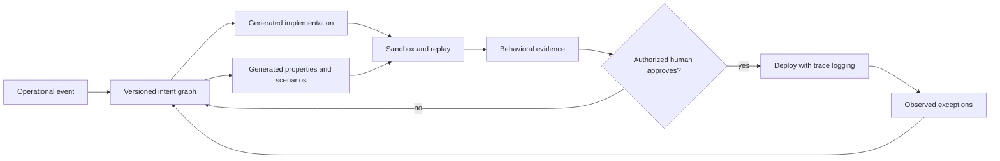
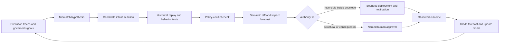

*The proposed interface begins where work happens: beside the pallets, exceptions, scanners, and people whose decisions the software will change. Illustration generated for this essay.*

## Seventeen pallets in Dallas

At 6:12 a.m., the warehouse floor smells of diesel and wet cardboard. A supervisor in a fluorescent vest taps a scanner against a pallet marked **DALLAS**. The screen says the shipment is blocked. The invoice cleared nine minutes ago.

She does not care which framework rendered the message. She wants seventeen pallets on the correct trailer before the bay door closes.

In the office above the loading floor, the request becomes a ticket: *Release a shipment when the invoice is approved, unless the customer is on credit hold or the temperature sensor reports an excursion.* A product manager rewrites it. An engineer turns it into branches, queries, and API calls. A tester invents examples. Weeks later, the supervisor points at the frozen screen and says, “That is not what I meant.”

The expensive part was not typing the code. It was transporting intent across the building without dropping a condition.

This essay explores a narrower claim than “AI will end programming.” Programming is likely to remain essential infrastructure. But source code may stop being the **primary interface** through which most people shape software. The human-facing artifact could instead be a living, inspectable model of intent: outcomes, constraints, exceptions, authority, and evidence connected as a graph.

Code would become one compiled representation of that model—not the only place where the truth is allowed to live.

## The same edit

At the customs desk, moving a documentation check from arrival to 72 hours before departure is an organizational change. It shifts who contacts the shipper, when work enters the queue, which exception reaches a supervisor, and what counts as complete. In the application upstairs, the same decision becomes a software change: a trigger, a threshold, a route, and a notification.

Today those changes travel through different rooms. An operations manager revises a procedure. A product manager writes a ticket. An engineer edits the system. A trainer updates a document. The pieces can disagree before the next pallet reaches the door.

[Melvin Conway’s 1968 paper](https://www.melconway.com/Home/Committees_Paper.html) argued that systems tend to reproduce the communication structures of the organizations that design them. The proposal here tests a partial inversion. For stable, rules-driven operations, what if changing the organization and changing its software became **one versioned edit to one operational artifact**?

The claim is deliberately bounded. A graph edit cannot reorganize trust, teach a new skill, settle a political disagreement, or make a reluctant team cooperate. But when an operating rule already has a digital execution path, the graph could become the shared place where the person who owns the outcome changes the rule, the machine generates an implementation, and reviewers inspect the consequences.

That hypothesis is falsifiable. If the operating procedure and executable behavior still require separate artifacts, separate owners, and manual reconciliation after the graph is introduced, then the “same edit” did not happen. The new interface merely added another document.

## Abstraction has already moved the work

Software creation has repeatedly shifted upward. Toggle switches gave way to assembly; assembly yielded ground to higher-level languages; frameworks absorbed common plumbing; managed services hid machines behind APIs. Each move kept the lower layer alive while changing who had to touch it every day.

AI coding agents continue that movement, but prompts alone are a weak destination. A paragraph in a chat window is easy to write and difficult to govern. It forgets which clause is mandatory, which person may approve an override, and which example settled an argument three months ago.

Current benchmarks already frame coding as a translation problem. [SWE-bench](https://proceedings.iclr.cc/paper_files/paper/2024/hash/edac78c3e300629acfe6cbe9ca88fb84-Abstract-Conference.html) gives a model a real repository and a GitHub issue, then asks it to produce a patch that passes tests. The benchmark is valuable precisely because the prose request is not enough: success is judged against executable behavior inside an existing system.

The interface proposed here keeps that lesson. It does not ask people to speak more eloquently to a chatbot. It gives intent a structure that can be inspected, diffed, tested, and challenged.

| Primary artifact | What a reviewer asks | Common failure surface |
|---|---|---|
| Source code | “Is this implementation correct?” | Domain intent is scattered across files, tickets, tests, and memory |
| Prompt or chat | “Did the model understand my sentence?” | Ambiguity, context loss, invisible assumptions, unstable regeneration |
| Intent graph | “Are these outcomes, constraints, exceptions, and authorities correct?” | A false sense of completeness if the graph is not tied to evidence |

Business-process notation already offers graphical models for workflows; the [Object Management Group’s BPMN standard](https://www.omg.org/bpmn/) is a mature example. NASA’s work on [Intent Specifications](https://ntrs.nasa.gov/citations/19990080916) treated intent as a human-centered design problem rooted in systems theory and cognitive work. The new pressure comes from generation: when an agent can alter thousands of lines in minutes, the gap between what a team meant and what the machine built grows more dangerous. Microsoft Research describes this as an [intent-formalization challenge for reliable AI-assisted coding](https://www.microsoft.com/en-us/research/publication/intent-formalization-a-grand-challenge-for-reliable-coding-in-the-age-of-ai-agents/).

The contribution here is not a new diagramming language. It is a proposed contract among an intent model, generated implementations, behavioral evidence, and human authority.

## This has been tried before

A reader familiar with model-driven engineering can point to the shelf behind the terminal and say, “We built this argument already.” They are right.

The Object Management Group established Model Driven Architecture as a base architecture in 2001. Its [current MDA overview](https://www.omg.org/mda/) separates business and application logic from platform technology through platform-independent models that can be transformed into implementations. The resemblance is not incidental: model as primary artifact, implementation as downstream representation, domain meaning insulated from technical churn.

The lesson is not that MDA failed and language models rescued it. The useful question is why model-first development remained concentrated in places where formalization and verification justified their cost.

Two costs deserve a new test.

First, **authoring cost may be lower**. UML, OCL, and domain-specific modeling languages often required specialists who stood between the domain expert and the formal artifact. Natural language, direct manipulation, numeric controls, and worked examples can now act as several views over one representation. Recent research does not establish that this problem is solved, but it does show active work across model generation, transformation, constraint production, and validation; a 2026 [systematic mapping study of LLMs in model-driven engineering](https://link.springer.com/article/10.1007/s10664-026-10921-4) analyzed 86 primary studies from 2022 through early 2026.

Second, **verification may be more operational**. A diagram can be internally consistent and still harm the loading floor. Event logs, process conformance, historical replay, and prospective experiments can test a proposed model change against observed cases. That still does not prove a counterfactual. It changes review from inspecting structure alone to inspecting structure plus measured behavioral evidence.

The older failure modes remain. Generated code can be hand-edited until the model lies. Large models can compile the same prose into different implementations. A thick modeling environment can move more slowly than the operation it describes. This proposal therefore needs three constraints:

1. The approved graph compiles to a deterministic, versioned workflow intermediate representation.
2. The frozen intermediate representation—not a fresh model response—is what executes.
3. Escape-hatch code is explicit, linked to an intent node, and treated as debt against the model rather than silent truth.

This is less romantic than “AI writes the software.” The model authors a proposal. The verification path tests it. A human approves the consequential change. The released artifact then executes deterministically until a new version passes the same path.

## Convergence from adjacent fields

Around the same warehouse table, several mature fields already hold pieces of this architecture. They do not establish the whole thesis, but they narrow the amount that must be invented.

| Field or system | What already exists | What remains open in this essay |
|---|---|---|
| Intent-based networking | Declarative outcomes, validated intent as a source of truth, drift detection between intended and operational state | Extending the loop from network state to organizational capability and accountable operational change |
| Process mining and organizational digital twins | Event-log discovery, conformance checking, operational views, constraint monitoring, and action patterns | Making the formal model a versioned control surface owned by the outcome owner |
| Model-driven architecture | Platform-independent models, transformations, and model interchange foundations | Lower-friction authoring plus behavioral review grounded in operational histories |
| Governed enterprise ontologies | Objects, links, actions, permissions, and shared human/agent operations | An open, portable intent representation and independent evidence for simulate-before-deploy claims |

[RFC 9315](https://datatracker.ietf.org/doc/rfc9315/) defines network intent as declarative operational goals and outcomes without prescribing implementation. It also describes validated intent as a single source of truth whose comparison with operational state reveals drift and supports corrective action. That is close to the loop proposed here, inside a narrower and better-specified domain.

From the event-log side, Park and van der Aalst’s [Digital Twin of an Organization work](https://vdaalst.com/publications/p1225.pdf) combines transparent operational and control views with monitored constraints and action patterns. Their feasibility study used an artificial order-handling system, an important boundary: it demonstrates an architecture, not validated organizational impact.

Palantir’s [public Ontology documentation](https://www.palantir.com/docs/foundry/ontology/overview) offers a documented implementation example in which objects, properties, links, actions, functions, security, and operational workflows share one layer. Its [action-type documentation](https://www.palantir.com/docs/foundry/action-types/overview) describes validated transactions that change linked organizational objects. These are vendor descriptions, not independent evidence that the counterfactual and behavioral-diff claims in this essay work.

The convergence matters because it changes the research posture. The question is not whether formal operational models can exist. They already do in several forms. The open question is whether a person who owns an outcome can safely edit such a model, inspect a predicted behavioral delta, and have the approved version drive deterministic execution without restoring the old translation chain.

## The intent graph

On a wall-sized display near the loading bays, each node would answer a concrete question.

- **Outcome:** What state should exist when the work succeeds?
- **Trigger:** Which observed event starts evaluation?
- **Constraint:** What must never be violated?
- **Exception:** When does the normal rule stop applying?
- **Authority:** Who can approve, pause, or override the action?
- **Evidence:** Which trace proves that the system behaved as intended?
- **Dependency:** Which data source or external service does the decision trust?

Edges make the relationships explicit. A credit-hold exception blocks the release outcome. A finance approval satisfies one prerequisite. A sensor alert routes the pallet to a human inspection station. The warehouse manager can trace the path with a finger before any code reaches production.



The loop matters more than the arrow into deployment. A living specification must absorb what happens on the floor: the damaged barcode, the late credit update, the refrigerated trailer that arrived with a broken sensor.

## What one node might contain

The following YAML is an interface sketch, not a proposed standard or executable policy language.

```yaml
intent: release_outbound_shipment
outcome: pallet.status == "released"

when:
  - invoice.status changes_to "approved"

requires:
  - customer.credit_hold == false
  - temperature.excursion == false

exceptions:
  - if: customer.tier == "emergency_medical"
    route_to: duty_manager_review

authority:
  normal_release: warehouse_system
  exception_release: [duty_manager, finance_controller]

evidence:
  - immutable_decision_trace
  - invoice_snapshot
  - sensor_snapshot
  - approving_identity

acceptance_scenarios:
  - approved invoice + clear account + safe temperature => release
  - approved invoice + credit hold => block and notify finance
  - stale sensor reading => request inspection; do not infer safety
```

A domain expert can dispute this object without reading an event handler. A security engineer can see that an exception requires two roles. A tester can generate boundary cases. An agent can compile the same intent into several implementations, but it cannot quietly remove the credit hold without changing the artifact the team reviews.

That is the desired shift: from reviewing the machine’s prose about its work to reviewing a durable object that constrains the work.

## Behavior is the release artifact

At a test bench, a green light should not mean “the code compiled.” It should mean the observed traces remained inside an allowed behavioral envelope.

Let $P$ be an implementation and $\mathcal{T}(P)$ the set of traces it can produce. Let $S$ define allowed traces, $\mathcal{T}_{allowed}(S)$. The ideal condition is:

$$
\mathcal{T}(P) \subseteq \mathcal{T}_{allowed}(S)
$$

No practical team can enumerate every trace of a nontrivial distributed system. The equation is a direction, not a certificate. Teams approximate it with static checks, model checking where feasible, property-based tests, simulations, production canaries, and replayed incidents. Each method illuminates a different patch of the dark warehouse.

The interface should therefore show **coverage and uncertainty**, not a theatrical check mark. Which constraints have executable tests? Which exception branches have never been observed? Which external dependency was mocked? Which result changed between versions?

A useful version-control diff might read:

| Change | Behavioral consequence | Required review |
|---|---|---|
| Sensor freshness: 10 min → 3 min | More pallets route to inspection during network delay | Warehouse operations + reliability |
| Add emergency-medical exception | Credit hold can enter a review path, never auto-release | Finance + duty manager |
| Replace carrier API | Same declared outcome; new timeout and retry traces | Engineering + operations |

Line diffs remain available to engineers. The operational meeting begins with this table.

## Three interfaces, not one magic screen

On the loading floor, the supervisor needs a causal path: *invoice approved → sensor stale → inspection requested*. In a terminal upstairs, the engineer needs generated code, logs, dependency versions, and failure traces. At an audit desk, a reviewer needs approvals and evidence that cannot be rewritten after the fact.

An intent-first system should not flatten those jobs into a universal no-code canvas. It should expose three linked views:

1. **Domain view:** outcomes, rules, exceptions, and examples in the language of the work.
2. **Engineering view:** generated implementation, interfaces, invariants, tests, telemetry, and escape hatches.
3. **Evidence view:** who approved what, which artifact ran, what the system observed, and how behavior changed.

The views share identifiers. Click the “stale sensor” constraint in one and the relevant test, log field, and approval history light up in the others.

## The missing intermediate representation

On one company’s screen, a shipment is an object with a route, document set, credit state, and release action. At the next company, the same concepts carry different field names, event sources, and approval roles. The intent may be similar while the bindings are not.

This review found standards for process notation, model interchange, intent-based network management, and object-centric event logs. It did **not** find a widely adopted open intermediate representation for operational intent that joins outcomes, constraints, authority, evidence, behavioral tests, and deployment bindings. Absence claims are fragile; this should be read as a finding from the sources reviewed for this essay, not proof that no related project exists.

A minimal operational-intent IR would need to keep meaning separate from local plumbing:

| Portable layer | Local binding |
|---|---|
| Outcome and invariant identifiers | Warehouse, ERP, or case-management fields |
| Triggers and decision nodes | Events, queues, APIs, and schedules |
| Authority and approval classes | Identities, roles, and access-control systems |
| Evidence requirements | Logs, snapshots, signatures, and retention stores |
| Behavioral scenarios | Fixtures, historical cases, and simulation adapters |
| Consequence classes | Local money, safety, policy, customer, and employment surfaces |

A freight documentation capability could then arrive as a typed template rather than a complete deployment. The second organization would bind `shipment.last_free_day` to its own system, replace the approval roles, and challenge every default against its operation. Portability would mean **rebind and revalidate**, not install and trust.

The research artifact should therefore be open before it is broad. A useful first release is not a universal ontology. It is a small schema for one exception-heavy capability, a deterministic reference interpreter, a semantic-diff format, and two independent bindings that expose where the supposed common model breaks.

## The bet, and the condition that defeats it

The prevailing technical bet is that models will become capable enough to operate from goals, context, tools, memory, and evaluation harnesses without a formal operational layer. Every additional schema imposes authoring cost and can freeze a changing organization into yesterday’s categories.

The counter-bet in this essay is narrower:

> Where operations are stable enough to name, consequential enough to verify, and recorded well enough to replay, a formal intent representation will cost less than repeatedly translating goals into tickets, code, tests, procedures, and audit explanations.

Non-deterministic generation is the sharpest objection. If the same intent produces different code on Tuesday and Thursday, the system has an unstable compiler. The proposed answer is architectural: generation happens at authoring time; the candidate compiles to a deterministic workflow IR; tests and simulation run against that frozen artifact; the approved artifact executes until it is intentionally replaced.

That answer can still lose. If a model can accept a vague operational goal, act correctly across enterprise systems for six months, adapt to exceptions, and produce a trustworthy audit afterward **without** a formal intermediate artifact, then the graph was overhead. If operators cannot keep it current, or if maintaining bindings costs more than maintaining code, the thesis also fails.

Those are not edge cases to explain away. They are the comparison conditions the research program should measure.

## From proposed intent to observed intent

At 9:40 a.m., the blocked-shipment counter on the wall climbs from six to nineteen. Two operators have already learned the workaround: they copy the shipment number into a second screen, refresh a customs feed, then return to the first screen. The intent graph still says the process is healthy. The concrete floor says otherwise.

The architecture has a missing leg. It can carry a human edit through generation, simulation, review, and deployment. It can show the trace after a failure. But someone still has to notice the cluster of failures, walk to the screen, and translate the pattern into a proposed graph change.

If intent becomes formal and machine-readable, observations can address it directly. Execution traces, exception counts, ticket clusters, repeated implementation patches, and carefully governed communication aggregates can point toward a node whose declared behavior no longer matches the work around it.

That does **not** make observed behavior identical to human intent. A workaround may reflect a broken tool, a bad incentive, a temporary shortage, or a rule people are improperly avoiding. Observation supplies evidence of a mismatch. It does not read the organization’s mind.

### Observation becomes another input modality

An operator could alter an intent graph by moving a control, editing a constraint, typing an example, or supplying a counterexample. An observation layer adds a fifth route. It reads declared sources, maps a recurring signal to the existing graph vocabulary, and submits a candidate mutation.

The last verb is the safety boundary: **submits**.



The observation layer should not deploy a complaint, summarize a rumor, or quietly rewrite a threshold. It should produce a hypothesis that must survive the same verification path as a human edit.

### The system may propose a change; it may not propose the evidence

Beside the customs desk, a useful proposal card would not say, *People seem frustrated with documentation.* It would say something closer to this:

> **Candidate change:** move the documentation-completeness check from arrival to 72 hours before departure.
>
> **Historical replay:** 640 shipments evaluated; estimated holds decreased; shipper outreach increased.
>
> **Verification:** 12 behavior scenarios passed; no declared policy conflict found.
>
> **Signal provenance:** exception cluster—strong; repeated code changes—moderate; aggregate communication pattern—weak.
>
> **Status:** estimated effect awaiting accountable-owner review.

The numbers above illustrate the interface; they are not empirical findings. Their labels matter. The observation layer generates the guess. Historical replay computes consequences under a model. Behavior tests check declared properties. A human sees the semantic change, the evidence trail, and the uncertainty before deciding.

A simulator cannot manufacture supporting evidence for its own suggestion. The proposal and the evaluation must remain separable enough to audit, reproduce, and challenge.

### Grounding is harder than generation

Writing a plausible change is the easy part. The hard part is taking a sentence such as “customs keeps stopping us” and locating its target: decision node `n5`, input `hours_to_last_free_day`, threshold `72`, and the policy constraint that forbids release without a document set.

That is an entity-resolution problem against a fixed operational vocabulary. It is still difficult, but the graph reduces the search space. The machine is not inventing a specification on an empty whiteboard; it is locating a possible mismatch inside an artifact the organization already reviews.

The signal ranking is less glamorous than the chatbot demonstration:

| Signal | Why it helps | Why it can mislead |
|---|---|---|
| Execution traces | Structured, attached to exact decisions and outcomes | Captures only instrumented behavior |
| Exceptions and tickets | Names repeated friction and operational impact | Lagging; biased toward what people report |
| Implementation churn | Repeated patches near one capability may expose unstable intent | Refactoring and maintenance can look like policy drift |
| Aggregate communication patterns | Contains friction not yet formalized elsewhere | Noisy, privacy-sensitive, vulnerable to rumor and volume bias |

A system that triggers on chat volume is a rumor amplifier. A system that begins with trace anomalies and uses governed aggregates only as corroboration behaves more like an instrument.

### The control boundary can come from the semantic diff

Let $G_t$ be the approved intent graph and $G_{t+1}^{*}$ a candidate version. The semantic diff

$$
\Delta_t = G_{t+1}^{*} \ominus G_t
$$

should identify more than added and removed text. It should state whether the candidate changes an outcome, policy, authority, money-moving action, employment decision, customer commitment, external integration, or a parameter already bounded by an approved envelope.

That makes the review tier partly computable:

| Tier | Change class | Required path |
|---|---|---|
| 0 | Reversible parameter move inside a pre-approved envelope | Bounded deployment, trace logging, and notification |
| 1 | Structural graph change such as a new node or route | Named human approval |
| 2 | Policy, money, legal obligation, employment, safety, or customer commitment | Accountable-owner approval; never automatic |
| 3 | New capability, external integration, or tool boundary | Human-initiated design and engineering |

This is a stronger argument for intent graphs than convenience. In a codebase, “Does this change alter a legal obligation?” may require an expert to reconstruct the obligation from control flow, configuration, and institutional memory. In an intent graph, the obligation should be a first-class field. The diff can route the question to the correct desk before the implementation moves.

Tier 0 still requires restraint. “Reversible” must include the real world, not merely a rollback button. A price shown to a customer, a message sent to an employee, or a pallet released into traffic cannot always be undone by restoring yesterday’s graph.

### A proposal queue should learn to become quieter

At the morning review table, a growing inbox of machine suggestions would soon become another alarm panel people ignore. Two feedback mechanisms can prevent that decay.

First, **rejections can write constraints**. If a manager rejects “contact the shipper earlier” because a contract prohibits unsolicited contact, the reason should become a visible constraint attached to the relevant node. The same proposal should not return next Tuesday with different wording. Institutional knowledge moves from one person’s refusal into the shared specification.

Second, **forecasts can be graded**. Every deployed change carries a predicted direction, magnitude, affected population, and uncertainty. When outcomes arrive, the system compares prediction with observation. A model that repeatedly forecasts fewer holds while real holds rise should lose authority, flag its affected assumptions, and require recalibration.

The grading metric must match the outcome—absolute error for a continuous operational quantity, calibration for a probability, and subgroup error where aggregate improvement may hide unequal harm. A simulator whose forecasts are never compared with the loading floor is a presentation device, not an instrument.

### What changes for operators and engineers

The operations manager does not disappear from the warehouse. Their job shifts toward owning the envelope: which parameters may move, within which bounds, under what evidence threshold, and whose signature is required when the graph touches a consequential commitment.

Engineering shifts too. Engineers maintain the runtime, constraint vocabulary, observability, verification tools, and integrations onto which the graph compiles. Novel capabilities, new system boundaries, performance failures, and incidents remain engineering work. The observation layer does not decide what the organization ought to become. It notices where declared behavior and observed work may have drifted apart.

### The observation layer creates new risks

The queue will optimize what the graph can measure. Quiet harms and undeclared goods may erode outside the instrumented field. Teams with clean ticket data may receive attention before teams surviving through invisible manual work. Automating detection also automates which problems reach the agenda.

Employee communication creates a sharper boundary. Works-council obligations, privilege, personal information, and the chilling effect of workplace surveillance cannot be handled as a product setting. If communication signals are used at all, the layer should retain only governed aggregates and provenance counts, not names or quoted messages. “Fourteen mentions across three channels over six weeks” may support corroboration; an employee’s sentence should not appear on the proposal card.

The simulator can also be wrong in a correlated way. Every candidate may pass because every candidate is judged by the same flawed model of demand, delay, or human response. Forecast grading detects the failure only after reality has absorbed it. That is why high-blast-radius changes remain human-approved even when a replay looks clean.

### The cold-start problem is a research problem

Nobody begins with two hundred accurate intent graphs. Existing configurations, workflow automations, standard operating procedures, ticket taxonomies, and change histories could draft a first version. That draft should enter as a candidate, not a discovered truth.

A wrong but specific node can still be useful. When an operator points to it and says, “We never release on invoice approval; we release when the carrier confirms capacity,” the correction captures knowledge that previously lived beside the loading door. The research question is whether correcting a concrete draft produces a more faithful specification than interviewing people over a blank page—and which groups the draft systematically misrepresents.

This essay does not claim that such an observation layer has been validated. It has not been deployed against a real operation over enough time to grade its forecasts. The section states what becomes testable once operational intent is formal enough to address, diff, simulate, and version.

## A research program, not a product mock-up

The first experiment can fit inside a taped-off corner of one operation. Choose a workflow with real exceptions but limited blast radius—perhaps shipment release in a sandbox fed by historical events. Give one team the existing ticket-and-code process and another an intent graph linked to generated tests. Ask both teams to implement the same sequence of rule changes.

Measure more than completion time.

- How many requirements survive from the operator’s account to deployed behavior?
- Can a domain expert locate the cause of a failed scenario without reading code?
- Do reviewers catch unauthorized exception paths before deployment?
- How often does generated code satisfy tests while violating an unstated expectation?
- Does the intent graph become stale, or does it remain the object people actually edit?
- Can a second implementation reproduce the same behavioral envelope?
- How often does the observation layer map a real exception to the correct graph node?
- What proportion of its proposals are rejected as noise, and do written constraints reduce repetition?
- Are impact forecasts calibrated against realized outcomes and affected subgroups?
- Do quiet teams and manual workarounds remain invisible to the signal pipeline?

The decisive metric is not “lines of code avoided.” It is **intent loss detected before contact with the real world**.

### The experiment that would settle the verification claim

The hardest dependency in the argument is the simulator. A replay that agrees with its own assumptions proves little. The next study should test whether a simulated behavioral delta predicts what later happens in the operation.

Start with one organization, one de-identified exception history, and two bounded capabilities. Hand-author the initial graphs with operators so the study does not confuse graph induction with simulation validity. Select only reversible changes inside an approved envelope, then preregister each predicted effect before field exposure.

| Phase | Artifact | Failure the phase can reveal |
|---|---|---|
| Retrospective fit | Graph, bindings, and historical replay | The representation cannot reconstruct known decisions |
| Locked forecast | Predicted direction, magnitude, interval, and affected groups | The simulator makes vague or unfalsifiable claims |
| Prospective rollout | Randomized or staggered deployment with a contemporaneous comparison | Historical replay confused correlation with intervention effect |
| Outcome audit | Realized effect, exceptions, subgroup effects, and operator accounts | The aggregate metric hid operational harm or a new workaround |
| Portability test | Second binding at another site | The “portable” graph encoded the first organization’s local assumptions |

Let $\widehat{\tau}_{sim}$ be the simulator’s predicted treatment effect and $\widehat{\tau}_{field}$ the prospectively estimated field effect. A simple predictive-error measure is:

$$
E_{pred} = \left|\widehat{\tau}_{sim} - \widehat{\tau}_{field}\right|
$$

The study should also test interval coverage, direction errors, calibration across repeated changes, and whether the effect reverses for a subgroup. One successful prediction would not validate the architecture. Repeated failure would directly weaken its central claim.

The publishable result can be negative. If the graph is coherent but its simulated deltas do not predict realized outcomes, then the representation may still help communication while remaining unfit as a deployment gate. That boundary is more useful than another polished prototype.

## An invitation to build the first comparison

I am looking for collaborators who can put this proposal in contact with a stubborn, exception-heavy workflow. The useful partnership is small enough to audit: one bounded process, its current tickets and tests, a sandbox, and operators willing to challenge the intent graph before engineers implement a rule change.

| Collaborator | First shared artifact |
|---|---|
| Software-engineering or programming-languages researcher | A minimal intent schema and behavioral-equivalence test plan |
| HCI researcher | A study of whether domain experts can inspect, correct, and trust the graph |
| Operations team in logistics, healthcare, public service, or finance | A de-identified workflow with real exceptions and approval boundaries |
| Developer-tooling team | A compiler prototype that links every generated change to an intent node and evidence trace |
| Observability or causal-inference researcher | A study of whether trace anomalies can be grounded to the correct intent node without confusing correlation for cause |

The initial result should be publishable even if it is negative: where the graph lost meaning, which exceptions resisted formalization, and whether code review caught defects that behavioral review missed. Researchers or industry teams interested in running that comparison can use this essay as the draft protocol, not as a requirement to adopt a platform.

## Where the proposal can fail

The glass board can become another stale requirements document. Teams may draw tidy nodes after decisions have already happened in Slack. A generated test suite can merely restate the graph’s blind spots. An agent can satisfy visible constraints while exploiting an unmodeled edge case. Formal notation can exclude the warehouse worker whose knowledge arrives as a gesture toward a dented pallet rather than a predicate.

There are also hard boundaries. Performance work, low-level systems, novel algorithms, incident response, and safety-critical verification still demand direct contact with code and machines. Some intent is discovered only while implementing. Some disagreements are political, not syntactic: “fast release” means one thing beside the loading bay and another at the finance desk.

The proposal should be rejected if teams cannot keep the intent artifact current; if domain experts understand it no better than code; if behavioral review misses more defects than existing practice; or if generated implementations become difficult to debug and own. A higher abstraction earns its place by reducing translation loss without hiding consequential detail.

## The quieter future of code

At 6:29 a.m., the Dallas pallets roll across the concrete. On the supervisor’s screen, the release path is visible: invoice approved, account clear, sensor current, trailer assigned. She can open the rule that made the decision and the evidence that supported it.

Somewhere below that surface, there are functions, queues, schemas, retries, and machine instructions. Engineers still tend them. Code has not vanished.

It has stopped demanding that every human intention arrive dressed as code.

### A narrow bridge to Aegis

This proposal stands on its own as an interface and software-engineering research direction. I also plan to carry one piece of it into [Aegis](/ideas/aegis-ai-strategy/): a versioned intent graph could connect a policy obligation to the generated control, behavioral test, approving person, and deployment evidence. That would improve Aegis by making governance requirements executable and traceable without turning this essay into an Aegis article.

## References

- Melvin E. Conway, [“How Do Committees Invent?”](https://www.melconway.com/Home/Committees_Paper.html), *Datamation*, 1968.
- Clemm et al., [RFC 9315: “Intent-Based Networking—Concepts and Definitions”](https://datatracker.ietf.org/doc/rfc9315/), IETF, 2022.
- Park and van der Aalst, [“Realizing a Digital Twin of an Organization Using Action-Oriented Process Mining”](https://vdaalst.com/publications/p1225.pdf), 2021.
- Object Management Group, [Model Driven Architecture overview](https://www.omg.org/mda/) and [MDA specifications and history](https://www.omg.org/mda/specs.htm).
- Zhang et al., [“Large Language Models in Model-Driven Engineering: A Systematic Mapping Study”](https://link.springer.com/article/10.1007/s10664-026-10921-4), *Empirical Software Engineering*, 2026.
- Palantir, [Ontology overview](https://www.palantir.com/docs/foundry/ontology/overview) and [Action Types overview](https://www.palantir.com/docs/foundry/action-types/overview), accessed August 2026. Vendor documentation is cited as an implementation description, not independent validation.
- Jimenez et al., [“SWE-bench: Can Language Models Resolve Real-World GitHub Issues?”](https://proceedings.iclr.cc/paper_files/paper/2024/hash/edac78c3e300629acfe6cbe9ca88fb84-Abstract-Conference.html), ICLR 2024.
- Object Management Group, [Business Process Model and Notation (BPMN)](https://www.omg.org/bpmn/).
- Leveson et al., [“Intent Specifications: An Approach to Building Human-Centered Specifications”](https://ntrs.nasa.gov/citations/19990080916), NASA Technical Reports Server, 1999.
- Microsoft Research, [“Intent Formalization: A Grand Challenge for Reliable Coding in the Age of AI Agents”](https://www.microsoft.com/en-us/research/publication/intent-formalization-a-grand-challenge-for-reliable-coding-in-the-age-of-ai-agents/).

## Related essays

- [Text-to-AR Utility Systems](/blog/text-to-ar-human-centered-standard/) asks how natural language can become a spatial interface without erasing human control.
- [Context Passport](/blog/context-passport/) treats context, provenance, and controlled diffs as portable infrastructure.
- [A New Protocol Stack for AI Agents](/blog/agent-protocol-stack/) examines the layers agents need when they act across systems.
