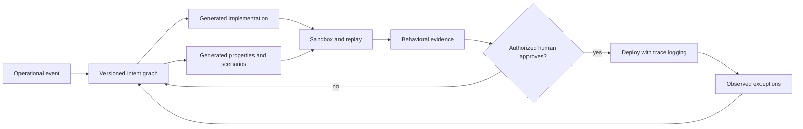

*The proposed interface begins where work happens: beside the pallets, exceptions, scanners, and people whose decisions the software will change. Illustration generated for this essay.*

## Seventeen pallets in Dallas

At 6:12 a.m., the warehouse floor smells of diesel and wet cardboard. A supervisor in a fluorescent vest taps a scanner against a pallet marked **DALLAS**. The screen says the shipment is blocked. The invoice cleared nine minutes ago.

She does not care which framework rendered the message. She wants seventeen pallets on the correct trailer before the bay door closes.

In the office above the loading floor, the request becomes a ticket: *Release a shipment when the invoice is approved, unless the customer is on credit hold or the temperature sensor reports an excursion.* A product manager rewrites it. An engineer turns it into branches, queries, and API calls. A tester invents examples. Weeks later, the supervisor points at the frozen screen and says, “That is not what I meant.”

The expensive part was not typing the code. It was transporting intent across the building without dropping a condition.

This essay explores a narrower claim than “AI will end programming.” Programming is likely to remain essential infrastructure. But source code may stop being the **primary interface** through which most people shape software. The human-facing artifact could instead be a living, inspectable model of intent: outcomes, constraints, exceptions, authority, and evidence connected as a graph.

Code would become one compiled representation of that model—not the only place where the truth is allowed to live.

## Abstraction has already moved the work

Software creation has repeatedly shifted upward. Toggle switches gave way to assembly; assembly yielded ground to higher-level languages; frameworks absorbed common plumbing; managed services hid machines behind APIs. Each move kept the lower layer alive while changing who had to touch it every day.

AI coding agents continue that movement, but prompts alone are a weak destination. A paragraph in a chat window is easy to write and difficult to govern. It forgets which clause is mandatory, which person may approve an override, and which example settled an argument three months ago.

Current benchmarks already frame coding as a translation problem. [SWE-bench](https://proceedings.iclr.cc/paper_files/paper/2024/hash/edac78c3e300629acfe6cbe9ca88fb84-Abstract-Conference.html) gives a model a real repository and a GitHub issue, then asks it to produce a patch that passes tests. The benchmark is valuable precisely because the prose request is not enough: success is judged against executable behavior inside an existing system.

The interface proposed here keeps that lesson. It does not ask people to speak more eloquently to a chatbot. It gives intent a structure that can be inspected, diffed, tested, and challenged.

| Primary artifact | What a reviewer asks | Common failure surface |
|---|---|---|
| Source code | “Is this implementation correct?” | Domain intent is scattered across files, tickets, tests, and memory |
| Prompt or chat | “Did the model understand my sentence?” | Ambiguity, context loss, invisible assumptions, unstable regeneration |
| Intent graph | “Are these outcomes, constraints, exceptions, and authorities correct?” | A false sense of completeness if the graph is not tied to evidence |

Business-process notation already offers graphical models for workflows; the [Object Management Group’s BPMN standard](https://www.omg.org/bpmn/) is a mature example. NASA’s work on [Intent Specifications](https://ntrs.nasa.gov/citations/19990080916) treated intent as a human-centered design problem rooted in systems theory and cognitive work. The new pressure comes from generation: when an agent can alter thousands of lines in minutes, the gap between what a team meant and what the machine built grows more dangerous. Microsoft Research describes this as an [intent-formalization challenge for reliable AI-assisted coding](https://www.microsoft.com/en-us/research/publication/intent-formalization-a-grand-challenge-for-reliable-coding-in-the-age-of-ai-agents/).

The contribution here is not a new diagramming language. It is a proposed contract among an intent model, generated implementations, behavioral evidence, and human authority.

## The intent graph

On a wall-sized display near the loading bays, each node would answer a concrete question.

- **Outcome:** What state should exist when the work succeeds?
- **Trigger:** Which observed event starts evaluation?
- **Constraint:** What must never be violated?
- **Exception:** When does the normal rule stop applying?
- **Authority:** Who can approve, pause, or override the action?
- **Evidence:** Which trace proves that the system behaved as intended?
- **Dependency:** Which data source or external service does the decision trust?

Edges make the relationships explicit. A credit-hold exception blocks the release outcome. A finance approval satisfies one prerequisite. A sensor alert routes the pallet to a human inspection station. The warehouse manager can trace the path with a finger before any code reaches production.



The loop matters more than the arrow into deployment. A living specification must absorb what happens on the floor: the damaged barcode, the late credit update, the refrigerated trailer that arrived with a broken sensor.

## What one node might contain

The following YAML is an interface sketch, not a proposed standard or executable policy language.

```yaml
intent: release_outbound_shipment
outcome: pallet.status == "released"

when:
  - invoice.status changes_to "approved"

requires:
  - customer.credit_hold == false
  - temperature.excursion == false

exceptions:
  - if: customer.tier == "emergency_medical"
    route_to: duty_manager_review

authority:
  normal_release: warehouse_system
  exception_release: [duty_manager, finance_controller]

evidence:
  - immutable_decision_trace
  - invoice_snapshot
  - sensor_snapshot
  - approving_identity

acceptance_scenarios:
  - approved invoice + clear account + safe temperature => release
  - approved invoice + credit hold => block and notify finance
  - stale sensor reading => request inspection; do not infer safety
```

A domain expert can dispute this object without reading an event handler. A security engineer can see that an exception requires two roles. A tester can generate boundary cases. An agent can compile the same intent into several implementations, but it cannot quietly remove the credit hold without changing the artifact the team reviews.

That is the desired shift: from reviewing the machine’s prose about its work to reviewing a durable object that constrains the work.

## Behavior is the release artifact

At a test bench, a green light should not mean “the code compiled.” It should mean the observed traces remained inside an allowed behavioral envelope.

Let $P$ be an implementation and $\mathcal{T}(P)$ the set of traces it can produce. Let $S$ define allowed traces, $\mathcal{T}_{allowed}(S)$. The ideal condition is:

$$
\mathcal{T}(P) \subseteq \mathcal{T}_{allowed}(S)
$$

No practical team can enumerate every trace of a nontrivial distributed system. The equation is a direction, not a certificate. Teams approximate it with static checks, model checking where feasible, property-based tests, simulations, production canaries, and replayed incidents. Each method illuminates a different patch of the dark warehouse.

The interface should therefore show **coverage and uncertainty**, not a theatrical check mark. Which constraints have executable tests? Which exception branches have never been observed? Which external dependency was mocked? Which result changed between versions?

A useful version-control diff might read:

| Change | Behavioral consequence | Required review |
|---|---|---|
| Sensor freshness: 10 min → 3 min | More pallets route to inspection during network delay | Warehouse operations + reliability |
| Add emergency-medical exception | Credit hold can enter a review path, never auto-release | Finance + duty manager |
| Replace carrier API | Same declared outcome; new timeout and retry traces | Engineering + operations |

Line diffs remain available to engineers. The operational meeting begins with this table.

## Three interfaces, not one magic screen

On the loading floor, the supervisor needs a causal path: *invoice approved → sensor stale → inspection requested*. In a terminal upstairs, the engineer needs generated code, logs, dependency versions, and failure traces. At an audit desk, a reviewer needs approvals and evidence that cannot be rewritten after the fact.

An intent-first system should not flatten those jobs into a universal no-code canvas. It should expose three linked views:

1. **Domain view:** outcomes, rules, exceptions, and examples in the language of the work.
2. **Engineering view:** generated implementation, interfaces, invariants, tests, telemetry, and escape hatches.
3. **Evidence view:** who approved what, which artifact ran, what the system observed, and how behavior changed.

The views share identifiers. Click the “stale sensor” constraint in one and the relevant test, log field, and approval history light up in the others.

## A research program, not a product mock-up

The first experiment can fit inside a taped-off corner of one operation. Choose a workflow with real exceptions but limited blast radius—perhaps shipment release in a sandbox fed by historical events. Give one team the existing ticket-and-code process and another an intent graph linked to generated tests. Ask both teams to implement the same sequence of rule changes.

Measure more than completion time.

- How many requirements survive from the operator’s account to deployed behavior?
- Can a domain expert locate the cause of a failed scenario without reading code?
- Do reviewers catch unauthorized exception paths before deployment?
- How often does generated code satisfy tests while violating an unstated expectation?
- Does the intent graph become stale, or does it remain the object people actually edit?
- Can a second implementation reproduce the same behavioral envelope?

The decisive metric is not “lines of code avoided.” It is **intent loss detected before contact with the real world**.

## An invitation to build the first comparison

I am looking for collaborators who can put this proposal in contact with a stubborn, exception-heavy workflow. The useful partnership is small enough to audit: one bounded process, its current tickets and tests, a sandbox, and operators willing to challenge the intent graph before engineers implement a rule change.

| Collaborator | First shared artifact |
|---|---|
| Software-engineering or programming-languages researcher | A minimal intent schema and behavioral-equivalence test plan |
| HCI researcher | A study of whether domain experts can inspect, correct, and trust the graph |
| Operations team in logistics, healthcare, public service, or finance | A de-identified workflow with real exceptions and approval boundaries |
| Developer-tooling team | A compiler prototype that links every generated change to an intent node and evidence trace |

The initial result should be publishable even if it is negative: where the graph lost meaning, which exceptions resisted formalization, and whether code review caught defects that behavioral review missed. Researchers or industry teams interested in running that comparison can use this essay as the draft protocol, not as a requirement to adopt a platform.

## Where the proposal can fail

The glass board can become another stale requirements document. Teams may draw tidy nodes after decisions have already happened in Slack. A generated test suite can merely restate the graph’s blind spots. An agent can satisfy visible constraints while exploiting an unmodeled edge case. Formal notation can exclude the warehouse worker whose knowledge arrives as a gesture toward a dented pallet rather than a predicate.

There are also hard boundaries. Performance work, low-level systems, novel algorithms, incident response, and safety-critical verification still demand direct contact with code and machines. Some intent is discovered only while implementing. Some disagreements are political, not syntactic: “fast release” means one thing beside the loading bay and another at the finance desk.

The proposal should be rejected if teams cannot keep the intent artifact current; if domain experts understand it no better than code; if behavioral review misses more defects than existing practice; or if generated implementations become difficult to debug and own. A higher abstraction earns its place by reducing translation loss without hiding consequential detail.

## The quieter future of code

At 6:29 a.m., the Dallas pallets roll across the concrete. On the supervisor’s screen, the release path is visible: invoice approved, account clear, sensor current, trailer assigned. She can open the rule that made the decision and the evidence that supported it.

Somewhere below that surface, there are functions, queues, schemas, retries, and machine instructions. Engineers still tend them. Code has not vanished.

It has stopped demanding that every human intention arrive dressed as code.

### A narrow bridge to Aegis

This proposal stands on its own as an interface and software-engineering research direction. I also plan to carry one piece of it into [Aegis](/ideas/aegis-ai-strategy/): a versioned intent graph could connect a policy obligation to the generated control, behavioral test, approving person, and deployment evidence. That would improve Aegis by making governance requirements executable and traceable without turning this essay into an Aegis article.

## References

- Jimenez et al., [“SWE-bench: Can Language Models Resolve Real-World GitHub Issues?”](https://proceedings.iclr.cc/paper_files/paper/2024/hash/edac78c3e300629acfe6cbe9ca88fb84-Abstract-Conference.html), ICLR 2024.
- Object Management Group, [Business Process Model and Notation (BPMN)](https://www.omg.org/bpmn/).
- Leveson et al., [“Intent Specifications: An Approach to Building Human-Centered Specifications”](https://ntrs.nasa.gov/citations/19990080916), NASA Technical Reports Server, 1999.
- Microsoft Research, [“Intent Formalization: A Grand Challenge for Reliable Coding in the Age of AI Agents”](https://www.microsoft.com/en-us/research/publication/intent-formalization-a-grand-challenge-for-reliable-coding-in-the-age-of-ai-agents/).

## Related essays

- [Text-to-AR Utility Systems](/blog/text-to-ar-human-centered-standard/) asks how natural language can become a spatial interface without erasing human control.
- [Context Passport](/blog/context-passport/) treats context, provenance, and controlled diffs as portable infrastructure.
- [A New Protocol Stack for AI Agents](/blog/agent-protocol-stack/) examines the layers agents need when they act across systems.
