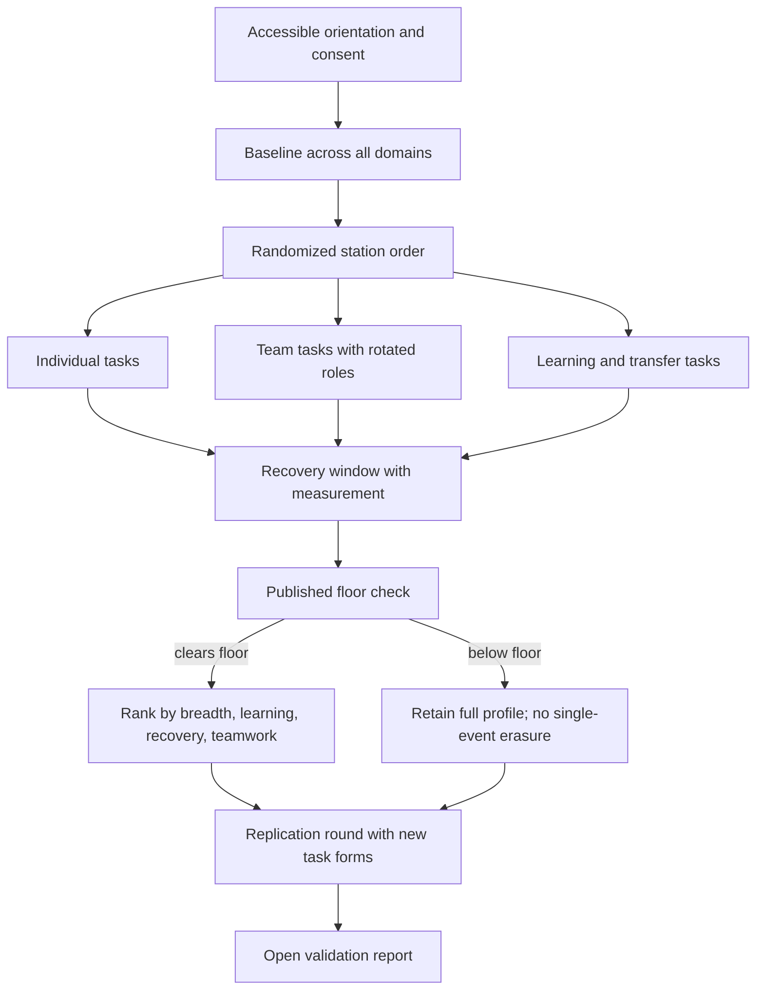
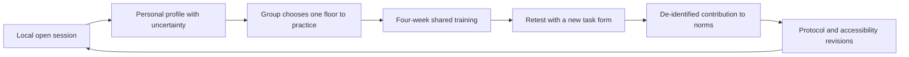

*A broad-capability test would need stations that interfere with one another: clear thinking after exertion, cooperation across difference, construction under time, and recovery before the next demand. Illustration generated for this essay.*

## The arena after midnight

The stadium lights are off except for six white rectangles on the floor. In one, a loaded stretcher rests beside a staircase. In another, radios, cables, and a damaged antenna lie across a workbench. A soundproof booth holds two chairs and a hostage-negotiation script. At the far end, a team stares at instructions written in a language none of them speaks.

There is no 100-meter final. No barbell under a spotlight. No quiz-show buzzer waiting to reward the fastest specialist.

The first competitor carries the stretcher upstairs. Her forearms shake. Without a recovery break, she enters the radio station and must diagnose why a hurricane shelter cannot reach the field team. Then she joins three strangers, one of whom has information the others do not possess. The clock stays visible.

What would this event measure?

Not “the best human.” That person does not exist outside the definition chosen by the organizer. The honest target is narrower: a published, repeatable standard for **broad capability under transfer, fatigue, cooperation, and uncertainty**.

This essay turns that idea away from spectacle and toward method. The central artifacts are an ontology, a scoring rule, an experimental protocol, and a public record of where the measurement fails.

## Specialists are real; the universal ranking is not

Sport solves a clean problem by narrowing the world. A track is flat. A bar has a known height. A clock reaches the thousandth of a second. Within those boundaries, excellence becomes visible.

Combined events already widen the aperture. World Athletics publishes [rules and scoring tables](https://worldathletics.org/download/download?filename=53f7d332-be0c-434c-8467-1d9078966147.pdf&urlslug=IAAF+Scoring+Tables+for+Combined+Events) for the decathlon and heptathlon, converting performances across different events into points. Yet these are still athletic constructs. A decathlete is not asked to repair a radio, calm a frightened teammate, or learn a novel symbol system between events.

Psychometric batteries approach another part of the problem. The [NIH Toolbox](https://nihtoolbox.org/assessments/) provides standardized assessment across cognition, motor function, sensation, and emotion, creating what the National Institute on Aging calls a [common currency](https://www.nia.nih.gov/research/resource/nih-toolbox) for comparison across studies. NASA’s [Task Load Index](https://humanfactors.arc.nasa.gov/groups/tlx/downloads/HFES_2006_Paper.pdf) measures perceived workload across dimensions such as mental, physical, and temporal demand.

None of these instruments claims to find the best person in the world. That restraint is worth copying.

## A capability ontology, version 0.1

On a folding table at the edge of the arena, the protocol should begin with a definition that anyone can mark in red ink.

| Domain | Candidate task in physical space | Measurement | Main confound |
|---|---|---|---|
| Physical resilience | Carry, climb, stabilize, then recover | Work completed, safety, heart-rate recovery | Body size, disability, training access |
| Analytical reasoning | Diagnose a failing water or communication system | Accuracy, calibration, time, information requested | Prior technical exposure |
| Social coordination | Complete a hidden-information team mission | Shared situational awareness, inclusion, team outcome | Language, culture, teammate composition |
| Creative construction | Build a working shelter, tool, or communication artifact | Function, constraint satisfaction, repairability | Craft familiarity, materials access |
| Learning speed | Infer a new rule system, then apply it after interference | Learning curve, retention, transfer | Education, test familiarity |
| Decision under uncertainty | Allocate scarce resources during a changing scenario | Regret, calibration, reversibility, ethical constraints | Values embedded in the scenario |

The memory excerpt proposed an additional **integrity** domain based on costly observed choices rather than reputation or self-report. The instinct is understandable: capability without conduct feels incomplete. The measurement is fragile. Once a participant knows a “secret” choice is an integrity test, the station changes. Cultural norms alter what counts as fair sacrifice. One-shot behavior has poor test–retest reliability.

For an initial protocol, integrity should therefore remain a **conduct and safety gate**, not a percentile score. Fraud, coercion, sabotage, or abuse can disqualify a result. The event should not pretend that a staged game reads moral character.

Likewise, wealth, credentials, fame, job title, and medals do not belong in the score. They are outcomes entangled with opportunity, geography, age, health, discrimination, and historical moment. If the framework wants to measure a person’s capacity to build, it should put materials on a bench, set a deadline, blind the evaluators, and observe the build.

## The floor before the crown

An additive score can hide a dangerous weakness. A participant at the 99th percentile in strength and the 10th percentile in coordination may still rank highly if the weights are generous. Calling that person “broadly capable” would be arithmetic theater.

The knowledge-transfer excerpt offered a better mechanic: separate a **Floor** from a **Composite**.

Let $p_{id} \in (0,1]$ be participant $i$’s normed percentile in domain $d$.

$$
F_i = \min_d p_{id}
$$

$F_i$ is the participant’s weakest measured domain. A round has a pre-published threshold $\tau_r$. Advancement requires:

$$
F_i \geq \tau_r
$$

Only participants who clear the floor are ranked by a breadth-sensitive composite. A weighted geometric mean prevents one spectacular result from fully compensating for a near-zero score:

$$
B_i = \exp\left(\frac{\sum_{d=1}^{D} w_d\ln(p_{id}+\epsilon)}{\sum_{d=1}^{D} w_d}\right)
$$

Here $w_d$ are preregistered domain weights and $\epsilon$ prevents a numerical collapse at zero. The weights are not facts. They are choices that must be published, sensitivity-tested, and revised only between protocol versions.

The scoreboard would show both numbers:

| Participant profile | Floor | Breadth composite | Interpretation |
|---|---:|---:|---|
| High specialist | 0.18 | 0.71 | Exceptional peak, but does not clear a broad-capability floor |
| Steady generalist | 0.58 | 0.64 | Clears the floor; few exposed weaknesses |
| Strong all-rounder | 0.72 | 0.79 | Clears the floor and ranks highly among survivors |

These values are illustrative, not results from human testing.

## Capability appears when tasks collide

At the workbench, a participant can solve the radio fault while rested. The harder question begins after the stretcher carry, when sweat darkens the paper schematic and a teammate insists on the wrong diagnosis.

Independent stations measure isolated peaks. The proposed tournament should also measure **interference**:

- reasoning after physical fatigue;
- communication after a personal error;
- learning a second system after mastering the first;
- leading, then following, with the same teammates;
- making a reversible choice before an irreversible one;
- repairing a failed artifact instead of receiving a clean restart.

This adds three longitudinal quantities to the domain scores:

- $L_i$: learning gain across repeated unfamiliar tasks;
- $R_i$: recovery after exertion, error, or stress;
- $T_i$: team contribution estimated across multiple randomized teams.

A provisional research score might be written as:

$$
S_i = B_i + \alpha L_i + \beta R_i + \gamma T_i
$$

No value for $\alpha$, $\beta$, or $\gamma$ should be announced from an armchair. Pilot data, reliability analysis, stakeholder review, and sensitivity tests must come first. A leaderboard that flips completely under small plausible weight changes is not stable enough to carry a grand title.

## Tournament flow

The format should resist the television instinct to remove the last-ranked participant after each dramatic event. Early single elimination magnifies task order, injury, teammate luck, and one bad station. Everyone should complete a broad baseline before any floor rises.



The “retain full profile” branch matters. A person who misses the competition threshold still contributes data to the scientific question, with consent, and receives a useful map of strengths and uncertainty. The format should not turn a weak day into a public identity.

## The validation program is the event

Inside a smaller university gym, the first trial should involve 50–100 consenting adults—not a world final. Preregister the hypotheses, task order, exclusions, scoring transformation, missing-data treatment, and stopping rule. Use multiple task forms so retesting does not merely reward memory.

The study should test:

1. **Reliability:** Do domain scores remain reasonably stable when the underlying capacity should be stable?
2. **Factor structure:** Do the proposed domains separate, or do nine labels collapse into three empirical factors?
3. **Measurement invariance:** Do items function comparably across language, sex, age, disability, and cultural groups?
4. **Convergent and discriminant validity:** Do scores relate to established measures where expected without becoming duplicates?
5. **Order and fatigue effects:** Does starting at the stairs versus the negotiation booth change who clears the floor?
6. **Team variance:** Does a participant’s social score survive rotation across teammates and roles?
7. **Sensitivity:** How much do rankings change under defensible alternative norms, weights, and floor schedules?

The [NIH Toolbox cognition battery validation work](https://pmc.ncbi.nlm.nih.gov/articles/PMC3662346/) provides one example of examining reliability and convergent validity across several instruments. A broad-capability protocol would need its own evidence rather than borrowing validity from the tools it combines.

Life outcomes—education, occupation, civic contribution, health, or later crisis performance—may be studied with separate consent, but they should remain **outside the score**. Otherwise the index validates itself against ingredients it already contains. A long follow-up could ask whether an early capability floor predicts later adaptation. It cannot quietly award points for the later outcome.

## A minimal analysis pipeline

At a laptop beside the timing desk, the analysis should be reproducible from de-identified data and a versioned protocol.

```python
# Method sketch. Real analysis needs preregistration and uncertainty estimates.
domains = normalize_with_reference_sample(raw_task_scores)
floor = domains.min(axis=1)

clears = floor >= published_floor
breadth = weighted_geometric_mean(domains, preregistered_weights)

report = {
    "reliability": estimate_test_retest(domains),
    "factor_models": compare_confirmatory_models(domains),
    "invariance": test_group_measurement_invariance(domains, groups),
    "order_effects": estimate_station_order_effects(domains, assignments),
    "ranking_sensitivity": perturb_norms_weights_and_floors(domains),
}
```

Every public result should carry the protocol version, reference population, accessible adaptation used, missing stations, and uncertainty interval. “82nd percentile” is meaningless if the comparison group and accommodation are hidden.

## An invitation to run the first honest pilot

I am looking for research and practice partners who can help test whether the ontology survives real people. The first collaboration is not an arena production. It is a preregistered pilot in a university gym, rehabilitation lab, training center, or public-service facility, with 50–100 consenting participants and enough time to retest them.

| Collaborator | First shared artifact |
|---|---|
| Psychometrician or quantitative psychologist | A measurement model, reliability targets, and ranking-sensitivity plan |
| Sports scientist or occupational physiologist | Safe interference and recovery protocols |
| Accessibility and disability researcher | Construct-linked task adaptations and rules for non-comparable scores |
| Team-science or organizational-behavior researcher | Rotated-role tasks and a model of teammate variance |
| Emergency, logistics, healthcare, or public-service team | De-identified scenarios where transfer and coordination matter in practice |
| Community organization | Multilingual cognitive interviews and a locally run open session |

The pilot should release its protocol, task forms where safe, de-identified analysis code, and null findings. A partner can challenge the floor rule, collapse domains, or recommend that no overall ranking be published. The purpose of collaboration is to discover what the construct can support—not to protect the headline.

## Fairness cannot be an appendix

At the staircase station, a wheelchair user should not be handed an improvised substitute ten minutes before the trial. Accessibility has to enter during construct design. The question is not “Can everyone perform the same movement?” It is “Can alternative tasks measure the intended capacity without importing a different one?”

That is difficult. A grip task, a wheeled propulsion task, and a loaded carry are not automatically equivalent. Translation changes negotiation cues. Familiar tools reward prior exposure. Wearable sensors behave differently across bodies. Team ratings reproduce bias. Public leaderboards invite shame and surveillance.

The protocol needs an accessibility panel, multilingual cognitive interviews, community review of scenarios, privacy-preserving publication, an appeal path, and explicit zones where cross-group ranking is not defensible. Some adaptations may support within-person progress while forbidding between-person comparison. That limitation should appear on the result card, not in eight-point type.

## How an open standard could spread socially

The idea will not spread because a commentator declares someone the world’s best. It could spread because a group of people in a school gym, fire station, recreation center, or university lab can run the same small protocol, inspect their profiles, and improve one floor together.

Begin with a **Season Open** that uses inexpensive, locally available equipment and publishes several equivalent task forms. Participants complete all domains in teams; no one is eliminated. A personal card shows a six-sided profile, the weakest measured domain, confidence intervals, and one retest date. Groups can choose a shared practice target: communication under fatigue, recovery, or calibrated decisions.

The social loop is concrete:



Public storytelling should focus on transfer, not humiliation: the climber learning to ask for help, the analyst calming a team after a wrong call, the mechanic mastering an unfamiliar notation. Short clips can show the task and the decision point, while the methods page shows the scoring and uncertainty. Local organizers should publish failures—stations with language bias, ceiling effects, unsafe movement, or unreliable ratings—so another site does not repeat them.

Open task specifications, assessor training materials, de-identified benchmark data, and protocol versioning let the method travel without central permission. The standard gains legitimacy when independent teams can criticize it, reproduce it, and force a revision.

## What would make me abandon the ranking

The composite should be dropped if factor analysis does not support the domain structure; if retest reliability is too low for individual interpretation; if accessible variants cannot be linked to a common construct; if team scores mostly measure teammate assignment; if floor thresholds amplify one demographic confound; or if small analytical choices reorder the leaders.

The tournament itself should be abandoned if participation creates predictable injury, coercive data collection, or public stigma that cannot be mitigated. A scientifically interesting number does not outrank the person standing on the mat.

## No final podium

Near dawn, volunteers wheel the stretcher back to its mark. Tape peels from the concrete. On the scoreboard, the largest number is not labeled **BEST HUMAN**. It is labeled with a protocol version, a reference sample, and a confidence interval.

One participant cleared every floor and ranked first under the published rules. Another recovered fastest. A third made every team better. None of those findings licenses a claim about the whole human being.

The worthwhile achievement is smaller and harder: a measurement that shows its definition, survives a retest, includes more bodies, and changes when the evidence tells it to.

### A narrow bridge to Aegis

This article remains an independent measurement and human-performance proposal. I also plan to bring its strongest methods into [Aegis](/ideas/aegis-ai-strategy/): floor-based readiness gates, measurement-invariance checks, accessible assessment design, and longitudinal retesting could improve how Aegis evaluates whether people and teams are prepared to oversee consequential AI. Aegis would borrow the methodology; it would not turn this tournament into a governance product.

## References

- World Athletics, [Scoring Tables for Combined Events](https://worldathletics.org/download/download?filename=53f7d332-be0c-434c-8467-1d9078966147.pdf&urlslug=IAAF+Scoring+Tables+for+Combined+Events).
- NIH Toolbox, [Assessment system overview](https://nihtoolbox.org/assessments/).
- National Institute on Aging, [NIH Toolbox overview](https://www.nia.nih.gov/research/resource/nih-toolbox).
- Weintraub et al., [“Cognition Assessment Using the NIH Toolbox”](https://pmc.ncbi.nlm.nih.gov/articles/PMC3662346/), *Neurology*, 2013.
- Hart, [“NASA-Task Load Index (NASA-TLX); 20 Years Later”](https://humanfactors.arc.nasa.gov/groups/tlx/downloads/HFES_2006_Paper.pdf), 2006.

## Related essays

- [Successful Key Moment Metric](/blog/successful-key-moment-metric/) asks how sport can measure context rather than reward only visible outcomes.
- [Decision Intelligence](/blog/success-directory-decision-intelligence/) examines calibrated action under incomplete information.
- [AI and Human Imperfection](/blog/ai-human-imperfection/) argues that human variation should not be flattened into one clean score.
