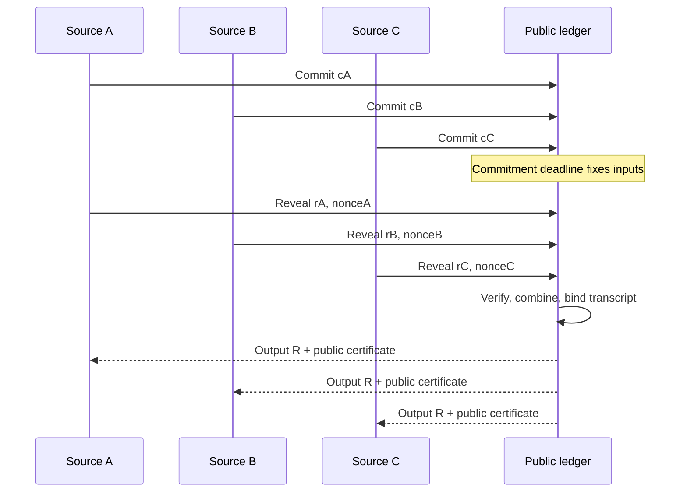

*A randomness claim should survive contact with instruments, compromised nodes, delayed messages, and a skeptical observer who can inspect the transcript. Illustration generated for this essay.*

## The number on the wall

In a windowless operations room, a monitor prints sixty-four hexadecimal characters. Cooling fans push warm air over the racks. An engineer points at the value and says, “No one could have known that.”

Across the table, a cryptographer folds her arms. “No one—or you?”

That gap contains the entire randomness problem. A value can look noisy while remaining predictable to somebody who knows the seed, the device state, the hidden correlation, or the moment at which an operator chose to abort. Statistical messiness is not the same as adversarial unpredictability.

The careless version of this essay would ask whether thousands of AI agents, bouncing messages through a network, could create randomness through complexity alone. They cannot. If every initial state and every deterministic transition is known, the transcript adds no information-theoretic entropy. Interaction rearranges what already exists.

The defensible question is more interesting:

> Can a distributed protocol combine heterogeneous, partly independent observations so that its output remains unpredictable when an unknown subset of participants, sources, or trust assumptions fails?

I call this **interaction-derived unpredictability**. The phrase names an engineering target, not a new source of nature. It shifts attention from “Is this number truly random?” to “Under exactly which attacker knowledge and source assumptions is this output hard to predict or bias?”

## Start with the entropy ledger

At the laboratory bench, entropy enters through physical measurements: oscillator jitter, thermal noise, photon detections, device timing, or another characterized source. In a network, it may enter through independently held secret values. A deterministic random bit generator can stretch a short secret seed into a long stream suitable for cryptographic use, but its security rests on the seed and algorithm.

NIST separates these jobs. [SP 800-90B](https://nvlpubs.nist.gov/nistpubs/specialpublications/nist.sp.800-90b.pdf) addresses entropy sources and their validation; [SP 800-90A](https://csrc.nist.gov/pubs/sp/800/90/a/r1/final) specifies deterministic random bit generators. The distinction should remain visible in any distributed design.

The useful quantity is often **min-entropy**, which focuses on an adversary’s best guess. For a random variable $X$:

$$
H_{\infty}(X) = -\log_2\left(\max_x \Pr[X=x]\right)
$$

If one value has probability $1/2$, then $X$ has only one bit of min-entropy, however dramatic its histogram looks. In security work, the more relevant form conditions on side information $E$: what uncertainty remains for the attacker who owns a compromised sensor, sees the network, or holds a correlated register?

That is the ledger. Every claimed bit must come from an assumption about uncertainty that survives conditioning on what the attacker knows.

## A taxonomy of claims

On a whiteboard beside the network diagram, the word *random* should be replaced by a specific guarantee.

| Mechanism | Where uncertainty enters | What it can offer | What breaks the claim |
|---|---|---|---|
| Ordinary PRNG | Seed | Reproducible simulation stream | Seed recovery; not designed for adversaries |
| CSPRNG / DRBG | Secret high-entropy seed | Computational unpredictability and expansion | Weak seed, state compromise, algorithm failure |
| Physical entropy source | Measured physical process | Fresh empirical entropy under a source model | Sensor tampering, model error, hidden correlation |
| Commit–reveal | Secret participant contributions | Bias resistance if at least one contribution stays hidden until commitments fix | Last-revealer abort, collusion, weak contributions |
| Threshold randomness beacon | Distributed secret shares and threshold assumptions | Publicly verifiable output without one holder controlling the key | Threshold compromise, protocol or implementation failure |
| VDF layer | Sequential computational work | Delayed predictability under a hardness assumption | Faster-than-assumed evaluation or broken construction |
| Interaction-derived layer | Several of the above plus independent observations | Resilience across a declared set of failures | Shared hidden causes, adaptive corruption, selective abort, overstated independence |

Distributed randomness is not an empty field. Blum’s [coin-flipping protocol](https://www.cs.cmu.edu/~mblum/research/pdf/coin/) showed how mutually distrustful parties could construct a fairer shared result through cryptographic commitments. Modern public beacons such as [drand](https://docs.drand.love/docs/cryptography/) use distributed key generation and threshold signatures to emit publicly verifiable randomness. Verifiable delay functions add a different assumption: a result requires a prescribed amount of sequential work, while remaining quickly checkable; the original construction agenda is set out by Boneh, Bonneau, Bünz, and Fisch in [“Verifiable Delay Functions”](https://theory.stanford.edu/~dabo/abstracts/VDF.html).

The research opportunity is therefore not “invent distributed randomness.” It is to study **assumption diversity and failure composition** without turning a pile of sources into an unjustified claim of independence.

## The smallest honest protocol

Imagine four institutions around the operations table. Each draws a secret value $r_i$ from a locally validated source and commits to it before seeing the others:

$$
c_i = H(\text{domain} \parallel i \parallel r_i \parallel n_i)
$$

Here $n_i$ is a fresh nonce and `domain` binds the contribution to one protocol round. After the commitment window closes, participants reveal their values and nonces. Valid contributions are combined:

$$
R = H(r_1 \oplus r_2 \oplus \cdots \oplus r_m \parallel \text{transcript})
$$

If at least one $r_i$ is independently unpredictable to the adversary and remains hidden until all adversarial contributions are fixed, the XOR can retain that unpredictability. The hash does not conjure entropy; it compresses and binds the combined material.

```python
# Illustrative protocol sketch — not production cryptography.
def commit(round_id, participant_id, contribution, nonce):
    return H(round_id, participant_id, contribution, nonce)

commitments = collect_until_deadline()
reveals = collect_reveals(commitments)

valid = [
    r for r in reveals
    if commit(r.round_id, r.participant_id, r.value, r.nonce)
       == commitments[r.participant_id]
]

if not quorum(valid):
    record_abort_reason()
    abort_round()

output = H(xor(r.value for r in valid), canonical_transcript(valid))
publish(output, commitments, valid)
```

The dangerous line is `abort_round()`. Suppose a malicious last revealer sees that the combined result is unfavorable and withholds its value. If publication depends on the attacker’s choice, the attacker may bias which rounds survive. A monitor that quarantines “suspicious” sources after peeking at their contributions can leak through the same door.

This is the **selective-abort problem**. A serious protocol must precommit its acceptance rules, quantify abort behavior, or use a threshold construction that can finish without the holdout. “We publish only good rounds” is not a neutral sentence.



## From one guarantee to an assumption lattice

The memory excerpt that sharpened this essay proposed a useful methodological change: stop arranging randomness sources in a prestige ladder. Arrange them in an **assumption lattice**.

A physical source may depend on a thermal model and untampered instrumentation. A threshold beacon depends on fewer than $t$ compromised participants and the hardness of its signature scheme. A VDF depends on sequential hardness. A human or environmental observation may be independent of one device yet correlated with another through a shared clock or upstream feed.

For each family $F_j$, record:

1. the entropy or hardness claim;
2. adversarial side information;
3. dependencies and shared causes;
4. commitment and reveal timing;
5. health tests and what they can actually detect;
6. the condition under which its guarantee must be withdrawn.

Then state a disjunctive target carefully: the output should remain useful if **at least one specified trust model** remains intact. Proving one fixed output secure under a disjunction of models is hard. Combining individually reasonable components does not automatically prove the composition.

That difficulty is a feature of the method. It forces the document to show its seams.

## The experiment I would run

In a rack with five cheap machines and two instrumented physical sources, construct a reproducible testbed. Each node receives a different mix of local sensor readings, message delays, secret contributions, and public data. Then attack it.

The protocol should face a matrix, not a victory lap:

| Fault injection | What the test asks | Evidence to retain |
|---|---|---|
| Recover one node’s state | Does one compromise reveal past or future rounds? | State snapshots, prediction advantage |
| Correlate two “independent” sensors | Does the entropy estimate notice a shared cause? | Raw traces, conditional estimates |
| Delay the last reveal | Can a participant choose which outputs are published? | Complete abort transcript |
| Replace a source with a deterministic replay | Do health tests detect repetition before output? | Detection latency, false alarms |
| Compromise a threshold of nodes | At which exact threshold does the guarantee disappear? | Signed participant set, certificate status |
| Manipulate network latency | Does timing become a bias channel or merely noise? | Packet trace and output distribution |

Do not begin by running frequency tests on the final bytes. First try to predict the next output with every piece of side information the threat model grants. Measure attacker advantage, abort-conditioned bias, min-entropy lower bounds under the declared model, and recovery after state compromise.

The testbed needs a reference oracle. For simple commit–reveal rounds, the oracle checks that all adversarial inputs were fixed before the honest reveal and that at least one contribution meets the assumed entropy bound. For harder heterogeneous-source claims, the honest output may be **no certificate**. A protocol that withdraws its guarantee at the correct boundary has passed an important test.

## Four research questions that can be separated

At a long table, four groups could work without pretending they are solving the same theorem.

1. **Adversarial side information:** Which extractor or combiner remains valid when the attacker holds quantum or correlated information about source families?
2. **Disjunctive composition:** Can one output carry a meaningful certificate under several alternative trust models?
3. **Adaptive corruption and abort:** What changes when nodes are compromised after partial reveals, or when quarantine decisions depend on observed data?
4. **Causal dependence:** How can experiments detect a hidden common cause that makes several sources fail together?

The fourth question belongs as much to causal inference as cryptography. Two sensors on opposite shelves may share a power supply. Two institutions in different cities may consume the same data feed. A network diagram is not evidence of independence.

## An invitation to attack the testbed

I am looking for collaborators who would rather break this framework than decorate it. A first joint project needs only a small cluster, two source families, a public transcript format, and a preregistered adversary matrix.

| Collaborator | First shared artifact |
|---|---|
| Applied cryptographer | A composable threat model for commitment, adaptive corruption, and selective abort |
| Randomness-extraction or quantum-information researcher | A defensible conditional min-entropy statement and the boundary where it fails |
| Causal-inference researcher | A dependency graph plus attacks built from shared hidden causes |
| Security or infrastructure team | De-identified timing, outage, and compromise traces for replay in the testbed |
| University laboratory | An independently operated source node and reproducible calibration record |

The shared output should include failed rounds, withdrawn certificates, and attack code. A partner does not need to endorse the architecture. Finding that a simpler threshold beacon dominates it, or that two supposedly distinct sources share one cause, would be a useful result.

## How the research could spread without hype

Randomness is invisible to most people until a lottery, jury selection, game draw, or public allocation feels rigged. The social object should therefore be the **verifiable round**, not a brand promise.

Publish a small daily beacon with its commitments, reveals, source-health declarations, aborts, and a one-page certificate that explains which assumptions were active. Let university labs contribute independently operated nodes. Give students an “attack the round” notebook that attempts seed recovery, last-revealer bias, replay, and correlation attacks. Maintain a public failure archive where broken assumptions remain visible instead of being deleted from the demo.

This creates several paths for diffusion:

- researchers can reproduce a round from raw transcripts;
- classrooms can fork the adversary models;
- civic technologists can inspect a public selection mechanism;
- security teams can contribute failure cases rather than endorsements;
- non-specialists can verify that their local contribution was committed before anyone saw it.

The spread mechanism is participation plus auditability. If the method is sound, people should be able to carry it into another room without carrying the original team’s authority with it.

## What would falsify the idea

The program fails if its heterogeneous sources collapse onto the same hidden cause; if certificates remain unreadable or unverifiable outside the originating lab; if abort behavior introduces more bias than the additional sources remove; if a simple threshold beacon offers the same resilience with fewer assumptions; or if entropy estimates cannot be defended against the side information in the threat model.

It also fails rhetorically the moment it calls deterministic interaction “true randomness.” The fans, wires, clocks, photons, and human decisions in the room may contribute uncertainty. The message traffic does not create it by applause.

## A number with a receipt

Back in the operations room, the next hexadecimal value appears. This time the engineer does not point at its visual noise. She opens the public transcript: four commitments arrived before the deadline; three threshold shares completed the round; one physical source passed its declared health test; one node was unavailable; no reveal-conditioned quarantine occurred.

The cryptographer leans closer. “What does the certificate claim?”

“Computational unpredictability under the threshold assumption, with one independently monitored source in the pool.”

That sentence is less glamorous than “true random.” It is also something another person can try to break.

### A narrow bridge to Aegis

This research question remains an independent cryptography and distributed-systems project. I also plan to test whether its threat-model discipline can strengthen [Aegis](/ideas/aegis-ai-strategy/): evidence bundles could record which entropy, signing, timing, and quorum assumptions protect an audit event, then withdraw a trust claim when those assumptions fail. The benefit to Aegis is sharper evidence integrity—not a claim that Aegis itself solves the randomness problem.

## References

- NIST, [SP 800-90A Rev. 1: Recommendation for Random Number Generation Using Deterministic Random Bit Generators](https://csrc.nist.gov/pubs/sp/800/90/a/r1/final).
- NIST, [SP 800-90B: Recommendation for the Entropy Sources Used for Random Bit Generation](https://nvlpubs.nist.gov/nistpubs/specialpublications/nist.sp.800-90b.pdf).
- Manuel Blum, [“Coin Flipping by Telephone: A Protocol for Solving Impossible Problems”](https://www.cs.cmu.edu/~mblum/research/pdf/coin/), 1981.
- drand, [Cryptography documentation](https://docs.drand.love/docs/cryptography/).
- Boneh, Bonneau, Bünz, and Fisch, [“Verifiable Delay Functions”](https://theory.stanford.edu/~dabo/abstracts/VDF.html), 2018.

## Related essays

- [Simulation Engineering for AI](/blog/simulation-engineering-ai/) explains why a testbed should expose where a guarantee stops.
- [A New Protocol Stack for AI Agents](/blog/agent-protocol-stack/) examines coordination and trust between autonomous systems.
- [Wax Seal Cybersecurity](/blog/wax-seal-cybersecurity/) explores visible provenance and tamper evidence.
