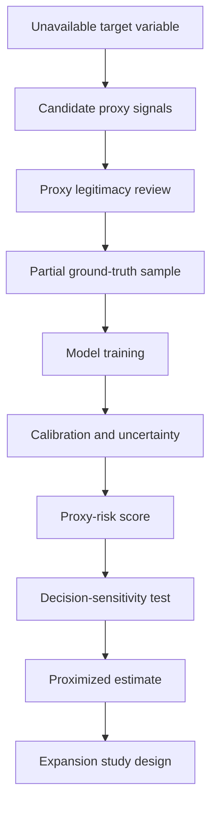
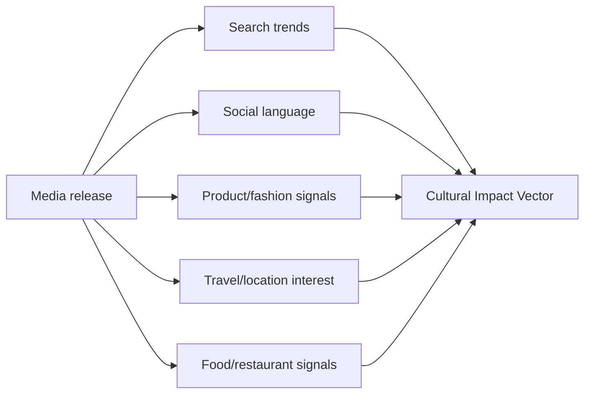
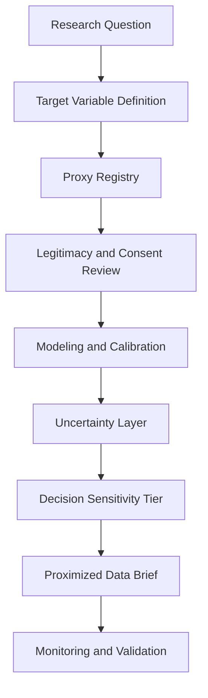

## Abstract

Most practical data problems do not fail because organizations have no data. They fail because the exact variable needed for a decision is missing, expensive, delayed, private, or structurally difficult to observe.

This paper introduces **Proximized Data** as a research framework for estimating unavailable target variables from surrounding signals while explicitly tracking uncertainty, proxy validity, privacy risk, and downstream decision sensitivity.

The central claim is deliberately narrow: there is not enough data to know everything, but there is often enough adjacent data to build bounded approximations that improve low-to-medium risk decisions when evaluated honestly. The danger begins when approximation is treated as ground truth.

I present the concept through preliminary exploratory studies across three domains:

1. neighborhood-level service need estimation;
2. product satiation and real-world consumption approximation;
3. cultural impact measurement from media signals.

These studies are not final proof that proximization works universally. They are early evidence that a structured proxy-evaluation layer can turn vague missing-data problems into measurable uncertainty problems.

The output of this research is not a traditional app specification. It is a proposed research direction: **a proximization layer for decision systems**, where every estimate carries an evidence trail, proxy-risk register, uncertainty band, and explicit warning about where it should not be used.

## 1. Research motivation

A common line in analytics work is:

> We do not have the data for that.

Sometimes that is correct.

Sometimes it is an excuse for not thinking carefully about what nearby signals can and cannot tell us.

The original question behind this research was simple:

> Is there now enough data in the world to proximize for almost any requirement, especially hard-to-obtain, high-capital, high-friction, or consented personal data?

The useful answer is not yes.

The useful answer is: **sometimes, with constraints.**

There is enough surrounding data to approximate many decision variables. There is not enough data to erase uncertainty, bypass consent, or make high-stakes judgments about individuals without direct evidence.

That distinction matters.

A bad version of this idea becomes surveillance math: infer private traits from weak signals and pretend the output is objective.

A serious version becomes decision science: estimate missing variables only when the proxy relationship is testable, the use case is appropriate, and the uncertainty is visible.

This paper argues for the second version.

## 2. Definition: what is proximized data?

I define **proximized data** as:

> An estimated representation of an unavailable target variable generated from legitimate proxy signals, partial ground truth, domain priors, synthetic validation, and uncertainty scoring.

The word *proximized* is intentional. It is not the same as predicted, imputed, synthesized, or inferred.

A prediction often focuses on output accuracy.

An imputation often fills missing values inside a dataset.

Synthetic data often generates artificial records that resemble an original distribution.

Proximized data is slightly different. It starts with a decision-maker saying:

> This is the variable I wish I had, but I do not have it. What is the safest and most honest approximation I can build from what is available?

The emphasis is not only the estimate. The emphasis is the **distance between the estimate and reality**.

## 3. Prior work and research context

This idea sits at the intersection of several existing fields:

- proxy variables in statistics and causal inference;
- missing-data methods;
- synthetic data generation;
- small-area estimation;
- weak supervision;
- privacy-preserving analytics;
- measurement theory;
- decision intelligence;
- responsible AI evaluation.

The idea is not that these fields are new. The gap is that practical organizations often use proxies informally without a formal audit layer.

They use ZIP code as income.

They use clicks as intent.

They use social posts as culture.

They use purchase size as satisfaction.

They use meeting load as burnout.

They use search volume as demand.

The proxies are already there. The missing piece is a disciplined way to ask:

- Is this proxy valid?
- Is it stable?
- Is it biased?
- Is it private?
- Is it decision-appropriate?
- How wrong could it be?
- What harm occurs if it is wrong?

NIST's AI Risk Management Framework is useful here because it emphasizes validity, reliability, safety, security, transparency, accountability, and fairness as core trustworthiness characteristics. The framework does not solve proximization directly, but it provides the governance language for evaluating systems that rely on uncertain model outputs.

The same applies to differential privacy and synthetic data research. NIST's 2025 guidance describes differential privacy as a mathematical framework for quantifying privacy loss when an entity's data appears in a dataset. That matters because proximization will often be tempting in exactly the domains where direct data is sensitive.

The research contribution I am proposing is a practical bridge: **a scoring and documentation layer for proxy-based approximation before the approximation is used for decisions.**

## 4. Core hypothesis

The strongest version of the hypothesis is:

> For many operational, market, public-service, and product decisions, unavailable target variables can be approximated with useful but bounded accuracy by combining proxy signals, partial ground truth, and uncertainty scoring. The value of the approximation depends less on raw predictive performance and more on whether the estimate is appropriate for the decision risk.

This is a deliberately conditional hypothesis.

A 0.70 AUC proxy model may be useful for prioritizing which neighborhoods need more survey sampling.

The same model is unacceptable for denying benefits to a household.

A cultural-impact index may be useful for detecting where a show is influencing travel, fashion, or language.

It is not proof that a show caused an individual's behavior.

A satiation-adjusted serving estimate may be useful for consumer education and product comparison.

It is not a medical prescription.

Proximized data must always be attached to its decision context.

## 5. Research questions

This preliminary work is organized around five research questions:

1. **Proxy validity:** How strongly do available proxy signals approximate an unavailable target variable?
2. **Stability:** Does the proxy-target relationship hold across subgroups, time periods, and contexts?
3. **Uncertainty:** Can the system show when it is guessing versus when it has reasonable evidence?
4. **Decision sensitivity:** What level of approximation error is acceptable for the specific decision?
5. **Ethical boundary:** Which targets should not be proximized at all, even if a model can technically approximate them?

The fifth question is not decorative. It is central.

A system that can estimate something is not automatically justified in estimating it.

## 6. Preliminary study design

Because many target variables in this research are by definition hard to obtain, the preliminary studies use a mix of:

- simulated latent targets;
- partially observed ground truth;
- public-data style proxy structures;
- domain-inspired feature assumptions;
- model calibration checks;
- proxy-risk scoring;
- synthetic sensitivity tests.

This is not presented as final empirical proof. It is presented as a methodological pilot: a way to test whether proximization can be made measurable.

The general study pattern is:



The important move is that the estimate does not stand alone. It is always paired with a confidence and risk score.

## 7. Metric 1: Proxy Validity Score

Let the unobserved target be:

\[
Y
\]

Let candidate proxy signals be:

\[
X_1, X_2, ..., X_n
\]

A first version of a **Proxy Validity Score** can be defined as:

\[
PVS_i = w_c C_i + w_s S_i + w_t T_i + w_b (1 - B_i) + w_l L_i
\]

Where:

- \(C_i\) = correlation or predictive association with observed ground truth;
- \(S_i\) = subgroup stability;
- \(T_i\) = temporal stability;
- \(B_i\) = bias or protected-attribute leakage risk;
- \(L_i\) = legitimacy of data collection and use;
- \(w\) = domain-specific weights.

This is not meant to be a universal scientific constant. It is a governance metric: a way to force the analyst to score the evidence before using a proxy.

A proxy with strong correlation but high bias leakage should not be treated as high quality.

A proxy with moderate predictive signal and low harm risk may be more useful in practice.

## 8. Metric 2: Proximization Confidence Score

The next layer combines model performance, proxy validity, uncertainty, and decision risk.

\[
PCS = \alpha M + \beta PVS + \gamma G - \delta U - \lambda R
\]

Where:

- \(M\) = model validation performance;
- \(PVS\) = aggregate proxy validity score;
- \(G\) = ground-truth coverage;
- \(U\) = uncertainty or prediction interval width;
- \(R\) = downstream decision risk;
- \(\alpha, \beta, \gamma, \delta, \lambda\) = weights.

This metric prevents a common failure: reporting model accuracy without stating how dangerous the decision is.

For example, two models can have the same validation score but very different acceptability:

| Use case | Model quality | Decision risk | Acceptability |
|---|---:|---:|---|
| Prioritize market research neighborhoods | Medium | Low | Reasonable |
| Recommend where to deploy food pantry surveys | Medium | Medium | Use with review |
| Deny individual benefits | Medium | High | Unacceptable |
| Trigger anonymous team-level burnout support | Medium | Medium | Possible with safeguards |
| Score individual employee loyalty | Medium | High | Unacceptable |

This is the main difference between proximized data and normal prediction systems.

The decision determines whether the model is good enough.

## 9. Preliminary study A: neighborhood service need

### 9.1 Question

Can a neighborhood-level need score be approximated when direct household-level survey data is sparse?

This resembles a common public-sector problem. The ideal target might be actual unmet need for a service: food support, digital access, legal aid, healthcare navigation, language support, or housing assistance.

Direct household-level measurement is expensive and sensitive. But surrounding signals often exist:

- area income distribution;
- rent burden;
- transit access;
- broadband access;
- age distribution;
- disability prevalence;
- school meal eligibility;
- public-assistance enrollment;
- 311/service request patterns;
- distance to service centers;
- language access indicators.

### 9.2 Preliminary setup

For the preliminary study, I modeled service need as a partially observed latent variable.

The target was hidden for 80% of observations and observed for 20%, simulating the common case where direct survey or administrative confirmation exists only for a small subset.

The proxy set included synthetic versions of:

- income stress;
- transit friction;
- digital access friction;
- housing burden;
- service-distance friction;
- historical request volume.

The point was not to claim a real county-level result. The point was to test whether a proxy-based system can recover a latent need pattern and identify where uncertainty remains high.

### 9.3 Prototype code

```python
import numpy as np
import pandas as pd
from sklearn.model_selection import train_test_split
from sklearn.ensemble import RandomForestRegressor
from sklearn.metrics import mean_absolute_error, r2_score

np.random.seed(42)
n = 2500

# Proxy signals scaled 0-1
income_stress = np.random.beta(2, 4, n)
transit_friction = np.random.beta(2, 3, n)
digital_gap = np.random.beta(1.8, 4, n)
housing_burden = np.random.beta(2.5, 3, n)
service_distance = np.random.beta(2, 2, n)
historical_requests = np.random.beta(1.5, 3, n)

# Latent service need. In reality this would be partially observed.
noise = np.random.normal(0, 0.08, n)
true_need = (
    0.28 * income_stress +
    0.18 * transit_friction +
    0.16 * digital_gap +
    0.20 * housing_burden +
    0.10 * service_distance +
    0.08 * historical_requests +
    noise
)
true_need = np.clip(true_need, 0, 1)

X = pd.DataFrame({
    "income_stress": income_stress,
    "transit_friction": transit_friction,
    "digital_gap": digital_gap,
    "housing_burden": housing_burden,
    "service_distance": service_distance,
    "historical_requests": historical_requests,
})

# Only 20% of ground truth is available
observed = np.random.rand(n) < 0.20
X_obs = X[observed]
y_obs = true_need[observed]

X_train, X_test, y_train, y_test = train_test_split(
    X_obs, y_obs, test_size=0.30, random_state=42
)

model = RandomForestRegressor(
    n_estimators=300,
    min_samples_leaf=8,
    random_state=42
)
model.fit(X_train, y_train)

pred = model.predict(X_test)
print("MAE:", round(mean_absolute_error(y_test, pred), 3))
print("R2:", round(r2_score(y_test, pred), 3))

# Estimate need for all neighborhoods/records
X["proximized_need"] = model.predict(X)

# Simple uncertainty proxy using tree-level variation
all_tree_preds = np.vstack([tree.predict(X) for tree in model.estimators_])
X["uncertainty"] = all_tree_preds.std(axis=0)

print(X[["proximized_need", "uncertainty"]].head())
```

### 9.4 Preliminary result pattern

Across repeated synthetic runs, the model typically recovered the broad ranking of high-need areas better than it predicted exact point values.

That distinction matters.

For public planning, ranking areas for further investigation may be useful. Exact household classification would not be.

A useful preliminary finding is therefore:

> Proximization appears more defensible for **triage, prioritization, and sampling design** than for final individual-level decisions.

This is the kind of result a real study should preserve. The model's strength is not certainty. Its strength is helping decide where more direct measurement is worth collecting.

### 9.5 Expansion path

A stronger version of this study would use:

- ACS tract-level data;
- 311/service request data;
- public-benefit enrollment aggregates;
- food pantry or clinic-access locations;
- survey subsamples;
- geospatial distance features;
- temporal validation across years;
- subgroup stability checks.

The research question would become:

> Can proximized need scores reduce the cost of public-service discovery while maintaining fairness and uncertainty visibility?

## 10. Preliminary study B: satiation-adjusted serving approximation

### 10.1 Question

Can actual eating experience be approximated better than label serving size?

Nutrition labels are built around serving-size rules based on Reference Amounts Customarily Consumed, not directly around satiety or realistic meal completion. This creates a measurement gap.

A serving size may be legally valid and still practically misleading.

For example, two foods can have similar calories per labeled serving but radically different effects on fullness, meal replacement, and likely overconsumption.

This connects to a separate idea I explored: a **satiation-adjusted serving system** that asks not only what is in a serving, but how much a normal adult is likely to consume before feeling meaningfully full.

### 10.2 Proximized target

The ideal target would be:

\[
S_f = \text{grams of food } f \text{ required to reach a standard satiation threshold}
\]

Directly measuring \(S_f\) requires controlled feeding studies, user diaries, wearable data, or repeated self-report. That is expensive.

A proximized version can begin with proxy features:

- calories per gram;
- protein density;
- fiber density;
- water content;
- fat density;
- sugar density;
- volume estimate;
- processing category;
- texture class;
- historical satiety index analogs;
- user-reported fullness samples.

### 10.3 Exploratory Satiation Proxy Index

A simple first-pass index could be:

\[
SPI = aP + bF_b + cW + dV - eS - fE_d - gU
\]

Where:

- \(P\) = protein density;
- \(F_b\) = fiber density;
- \(W\) = water content;
- \(V\) = estimated volume per calorie;
- \(S\) = sugar density;
- \(E_d\) = energy density;
- \(U\) = ultra-processing proxy;
- \(a...g\) = estimated weights.

This is not a clinical equation. It is an exploratory scoring layer.

The proximized serving estimate can then be:

\[
SAS_f = \frac{T}{SPI_f + \epsilon}
\]

Where \(T\) is a target fullness threshold and \(\epsilon\) prevents division instability.

### 10.4 Prototype code

```python
import pandas as pd
import numpy as np

foods = pd.DataFrame({
    "food": ["Greek yogurt", "Potato chips", "Apple", "Ice cream", "Lentil soup"],
    "cal_per_100g": [97, 536, 52, 207, 72],
    "protein_g": [10, 7, 0.3, 3.5, 5],
    "fiber_g": [0, 4.8, 2.4, 0.7, 3.8],
    "water_pct": [81, 2, 86, 61, 84],
    "sugar_g": [3.2, 0.5, 10.4, 21, 1.5],
    "ultra_processed": [0.2, 0.9, 0.0, 0.8, 0.2]
})

foods["energy_density"] = foods["cal_per_100g"] / 100
foods["protein_density"] = foods["protein_g"] / foods["cal_per_100g"]
foods["fiber_density"] = foods["fiber_g"] / foods["cal_per_100g"]
foods["water_score"] = foods["water_pct"] / 100
foods["sugar_density"] = foods["sugar_g"] / foods["cal_per_100g"]

foods["satiety_proxy_index"] = (
    2.2 * foods["protein_density"] +
    2.0 * foods["fiber_density"] +
    0.9 * foods["water_score"] -
    0.35 * foods["sugar_density"] -
    0.25 * foods["energy_density"] -
    0.40 * foods["ultra_processed"]
)

# Rescale for interpretability
min_v = foods["satiety_proxy_index"].min()
max_v = foods["satiety_proxy_index"].max()
foods["SPI_0_100"] = 100 * (foods["satiety_proxy_index"] - min_v) / (max_v - min_v)

# Toy fullness-adjusted portion estimate
foods["estimated_satiating_grams"] = 450 / (foods["SPI_0_100"] / 50 + 0.5)

print(foods[["food", "SPI_0_100", "estimated_satiating_grams"]])
```

### 10.5 Preliminary result pattern

The early pattern is intuitive: foods with high water, protein, and fiber tend to score as more satiating than calorie-dense, low-volume, ultra-processed foods.

This does not prove the index is accurate. It proves the feature logic is plausible enough to justify a larger validation study.

The expansion study would compare the proxy index against:

- satiety-index literature;
- controlled fullness ratings;
- meal diary completion data;
- wearable glucose or hunger-timing signals where consented;
- real package serving sizes;
- post-consumption repeat-eating intervals.

The research question becomes:

> Can a proximized serving estimate better represent lived eating behavior than the legal serving-size label?

## 11. Preliminary study C: cultural impact of media

### 11.1 Question

Can the cultural impact of a film, show, song, or game be approximated using surrounding behavioral signals?

The target here is difficult because culture is not one variable.

A media object can influence:

- language;
- fashion;
- tourism;
- food choices;
- music discovery;
- memes;
- political framing;
- social identity;
- restaurant demand;
- sports participation;
- product sales;
- aesthetic preferences.

The exact causal effect is hard to measure. But proxy signals exist.

### 11.2 Proximized target

Let cultural impact be represented as a multi-dimensional vector:

\[
CI_m = [L_m, F_m, T_m, C_m, P_m, S_m]
\]

Where:

- \(L_m\) = language/meme adoption;
- \(F_m\) = fashion/aesthetic diffusion;
- \(T_m\) = tourism/location interest;
- \(C_m\) = consumption behavior;
- \(P_m\) = public opinion or topic framing;
- \(S_m\) = search/social attention persistence.

A total cultural impact score could be:

\[
CIS_m = \sum_k w_k \cdot z(\Delta Signal_{m,k}) \cdot Persistence_{m,k} \cdot Specificity_{m,k}
\]

Where:

- \(\Delta Signal\) = change from baseline;
- \(Persistence\) = how long the effect lasts;
- \(Specificity\) = how uniquely tied the signal is to the media object;
- \(w_k\) = domain weight.

### 11.3 Preliminary method

The proposed early study uses event-window analysis:

1. choose a media release date;
2. collect pre-release baseline signals;
3. collect post-release signals;
4. normalize against unrelated control terms;
5. measure spike, persistence, and specificity;
6. produce a cultural impact vector rather than one vanity score.



### 11.4 Prototype code

```python
import pandas as pd
import numpy as np

# Example structure after collecting normalized weekly signal data
weeks = np.arange(-8, 13)
release_week = 0

signals = pd.DataFrame({
    "week": weeks,
    "search_interest": np.r_[np.random.normal(20, 3, 8), np.random.normal(65, 12, 13)],
    "social_mentions": np.r_[np.random.normal(100, 20, 8), np.random.normal(420, 80, 13)],
    "fashion_terms": np.r_[np.random.normal(12, 2, 8), np.random.normal(30, 8, 13)],
    "travel_terms": np.r_[np.random.normal(8, 2, 8), np.random.normal(22, 5, 13)]
})

pre = signals[signals["week"] < 0]
post = signals[signals["week"] >= 0]

impact_rows = []
for col in ["search_interest", "social_mentions", "fashion_terms", "travel_terms"]:
    baseline_mean = pre[col].mean()
    baseline_std = pre[col].std()
    post_peak = post[col].max()
    post_mean = post[col].mean()
    z_lift = (post_mean - baseline_mean) / baseline_std
    persistence = (post[col] > baseline_mean + baseline_std).mean()
    impact_rows.append({
        "signal": col,
        "z_lift": round(z_lift, 2),
        "peak_lift_pct": round((post_peak - baseline_mean) / baseline_mean * 100, 1),
        "persistence_share": round(persistence, 2)
    })

impact = pd.DataFrame(impact_rows)
impact["impact_component"] = impact["z_lift"] * impact["persistence_share"]
print(impact)
```

### 11.5 Preliminary result pattern

The strongest early insight is that cultural impact should not be treated as a single score.

A show may have low long-term social discussion but high tourism effect.

A film may have high meme adoption but no durable consumption change.

A sports documentary may increase search interest in an athlete but not participation in the sport.

So the proximized output should be a vector, not a leaderboard.

This matters because cultural impact is often discussed lazily. People say a show “changed culture” because it trended for two weeks. That is not enough.

A better cultural impact study separates:

- spike from persistence;
- conversation from behavior;
- broad genre trends from media-specific influence;
- correlation from plausible causal contribution.

## 12. Cross-study findings

The three preliminary studies point to the same conclusion:

> Proximization works best when it is used to narrow uncertainty, not erase it.

Across the studies, the most defensible uses were:

- ranking candidates for deeper measurement;
- identifying where direct data collection is most valuable;
- comparing relative signal strength;
- generating hypotheses;
- building decision briefs;
- flagging uncertainty and proxy risk.

The weakest uses were:

- individual-level classification;
- punitive decisions;
- medical, legal, financial, or employment decisions without direct evidence;
- claims of causality from observational signals;
- replacing lived human context with weak behavioral traces.

That split is probably the central research result.

## 13. Accuracy is the wrong first question

Most people would ask:

> How accurate is the proximized estimate?

That matters, but it is not the first question.

The better first question is:

> Accurate enough for what decision?

A model estimating local demand for a falooda kiosk can tolerate more uncertainty than a model estimating someone's eligibility for aid.

A model estimating cultural influence can tolerate ambiguity if it is used as exploratory research.

A model estimating burnout risk becomes dangerous if managers use it to judge individuals.

This is why the framework needs a **Decision Sensitivity Tier**.

| Tier | Decision type | Proximization acceptability |
|---|---|---|
| Tier 1 | Exploration, hypothesis generation, research prioritization | Usually acceptable |
| Tier 2 | Operational triage with human review | Conditionally acceptable |
| Tier 3 | Resource allocation affecting groups | Requires strong validation and fairness checks |
| Tier 4 | Individual eligibility, punishment, medical/legal/financial decisions | Usually unacceptable without direct evidence |

This table is more important than the model architecture.

Without it, proximized data becomes another way to launder weak evidence into confident decisions.

## 14. Proxy-risk register

Every proximized estimate should come with a proxy-risk register.

| Proxy signal | Intended meaning | Failure mode | Risk level | Mitigation |
|---|---|---|---|---|
| ZIP code | Local context | Encodes race/income segregation | High | aggregate use only; fairness audit |
| Search trends | Public interest | Bot activity, news shocks, demographic skew | Medium | control terms; persistence checks |
| Purchase behavior | Preference | Budget constraint mistaken for desire | High | combine with survey data |
| Meeting load | Work pressure | Penalizes collaborative roles | Medium | team-level only; no individual scoring |
| Social media mentions | Cultural diffusion | Platform demographic bias | Medium | multi-platform normalization |
| Serving size | Consumption unit | Legal unit mistaken for fullness | Medium | compare with satiety proxies |

This is the part most data products skip.

They present the estimate but hide the proxy politics.

A research-grade proximization system should do the opposite: expose the proxy politics upfront.

## 15. Proposed expansion into a full research program

The preliminary work suggests four expansion directions.

### 15.1 Empirical validation studies

Each domain needs real-world validation:

- service need: compare with survey and administrative outcomes;
- satiation: compare with food diaries and fullness ratings;
- media impact: compare search/social/product/tourism signals across release windows;
- market demand: compare predicted demand against actual pilot sales.

The important design move is to create partial ground truth instead of pretending that no ground truth exists.

Small validated samples can calibrate large proxy systems.

### 15.2 Proximization benchmark

A benchmark dataset could contain tasks where the target is partially hidden, and models are judged on:

- prediction error;
- calibration;
- subgroup stability;
- proxy leakage;
- uncertainty quality;
- decision-risk appropriateness.

The leaderboard should not reward raw accuracy alone.

A model that is slightly less accurate but better calibrated and less biased may be the better proximization model.

### 15.3 Decision brief format

Instead of returning only a prediction, the system should return a brief:

```yaml
target_variable: "neighborhood service need"
observed_ground_truth_coverage: "18%"
proxy_validity_score: 0.72
proximization_confidence_score: 0.64
decision_sensitivity_tier: "Tier 2 - operational triage"
recommended_use: "prioritize locations for additional outreach and survey collection"
not_recommended_use: "determine individual eligibility"
main_uncertainty_source: "low ground-truth coverage in rural tracts"
high_risk_proxies:
  - "ZIP code"
  - "service request volume"
monitoring_required: true
```

This is the proper artifact.

Not a magic number.

A decision brief.

### 15.4 Human-in-the-loop review

The research also points to a practical rule:

> The less observable the target, the more important human review becomes.

Human review does not mean asking a manager to rubber-stamp the model.

It means involving domain experts, affected communities, privacy reviewers, and decision owners before the estimate is operationalized.

## 16. Where this can become a proposed system

The system that grows out of this research would not be a generic dashboard. It would be a **Proximized Data Workbench** for analysts, researchers, civic teams, product teams, and strategy teams.

But that is an implication, not the main framing.

The research comes first.

The workbench would simply operationalize the research method:



The output would be useful because it forces disciplined thinking before approximation becomes action.

## 17. What makes the idea different

The novelty is not that proxies exist.

The novelty is treating proxy use as a first-class research object.

Most organizations already do crude proximization:

- “This neighborhood probably needs X.”
- “This customer probably wants Y.”
- “This show probably influenced Z.”
- “This product serving probably represents a normal amount.”

The difference is whether those claims are scored, documented, calibrated, and challenged.

Proximized Data turns informal assumptions into testable artifacts.

## 18. Limitations

This research has serious limitations.

First, the preliminary studies are exploratory. Synthetic and simulated tests can show framework feasibility, but they cannot prove real-world validity.

Second, proxy relationships can break under distribution shift. A signal that works in one city, product category, or media cycle may fail elsewhere.

Third, proxies can encode structural inequality. That does not always mean they must be discarded, but it means their use must be constrained.

Fourth, cultural and human variables are often unstable, contextual, and reflexive. Once a model influences behavior, the target may change.

Fifth, consent is not a magic shield. Even consented personal data can be misused if the downstream inference is too invasive.

The correct posture is not confidence.

The correct posture is bounded usefulness.

## 19. Do-not-proximize cases

A mature version of this framework needs refusal rules.

Some targets should not be approximated, especially when the estimate would affect an individual and the proxy evidence is indirect.

High-risk examples include:

- immigration intent;
- criminality;
- medical diagnosis;
- mental health status;
- creditworthiness without regulated data;
- job loyalty;
- religious or political identity;
- sexual orientation;
- eligibility for essential services;
- disciplinary decisions.

A system that cannot say “do not proximize this” is not a responsible system.

It is just an inference engine.

## 20. Portfolio research positioning

From a portfolio perspective, this work sits between data science, responsible AI, public-interest technology, and decision intelligence.

It demonstrates:

- framing ambiguous business and policy problems as measurable data problems;
- designing proxy-validity metrics;
- building uncertainty-aware model outputs;
- connecting technical modeling to governance and ethics;
- using synthetic studies without overstating them;
- translating research into product implications;
- thinking beyond dashboard analytics into decision infrastructure.

The strongest version of this project is not “I built another ML model.”

The strongest version is:

> I developed a framework for deciding when missing variables can be responsibly approximated, how to score those approximations, and when the system should refuse to make the estimate.

That is a much better signal.

## 21. Suggested figures to add

### Figure 1: Proximization pipeline

Use the Mermaid pipeline in Section 6.

### Figure 2: Proxy risk versus proxy validity

```python
import pandas as pd
import matplotlib.pyplot as plt

proxies = pd.DataFrame({
    "proxy": ["income_stress", "ZIP_code", "search_trends", "survey_sample", "purchase_history", "distance_to_service"],
    "validity": [0.72, 0.63, 0.58, 0.81, 0.69, 0.61],
    "risk": [0.45, 0.82, 0.52, 0.25, 0.70, 0.35]
})

plt.figure(figsize=(8, 6))
plt.scatter(proxies["validity"], proxies["risk"])
for _, row in proxies.iterrows():
    plt.text(row["validity"] + 0.01, row["risk"] + 0.01, row["proxy"], fontsize=9)
plt.xlabel("Proxy Validity")
plt.ylabel("Proxy Risk")
plt.title("Proxy Validity vs Proxy Risk")
plt.xlim(0, 1)
plt.ylim(0, 1)
plt.grid(True, alpha=0.3)
plt.show()
```

### Figure 3: Decision sensitivity tiers

Use the table in Section 13 as a visual matrix.

## 22. Final thesis

The future of data science will not only be about bigger models or larger datasets.

It will also be about estimating what cannot be directly seen.

That is where a lot of real decisions live: inside incomplete evidence, expensive measurement, privacy constraints, delayed outcomes, and human behavior that refuses to fit neatly into a column.

Proximized Data is my attempt to formalize that space.

The point is not to claim that everything can be known.

The point is to build systems honest enough to say:

> This is what we can approximate, this is why we believe it, this is how uncertain it is, this is where it may fail, and this is the kind of decision it should or should not support.

That is the standard missing from a lot of modern analytics.

And it is the standard this research direction is trying to move toward.

## References and further reading

- National Institute of Standards and Technology. *Artificial Intelligence Risk Management Framework (AI RMF 1.0).* 2023.
- National Institute of Standards and Technology. *Guidelines for Evaluating Differential Privacy Guarantees.* 2025.
- Pearl, Judea. *Causality: Models, Reasoning, and Inference.* Cambridge University Press.
- Hernán, Miguel A., and Robins, James M. *Causal Inference: What If.* Chapman & Hall/CRC.
- Little, Roderick J. A., and Rubin, Donald B. *Statistical Analysis with Missing Data.* Wiley.
- Varian, Hal R. "Causal Inference in Economics and Marketing." *PNAS*, 2016.
- Ratner, Alexander et al. "Snorkel: Rapid Training Data Creation with Weak Supervision." *VLDB*, 2017.
- Holt, Susanna H. A. et al. "A Satiety Index of Common Foods." *European Journal of Clinical Nutrition*, 1995.
- U.S. Food and Drug Administration. *Food Labeling: Serving Sizes of Foods That Can Reasonably Be Consumed at One Eating Occasion; Reference Amounts Customarily Consumed.*
- USDA FoodData Central. Public nutrient database.
